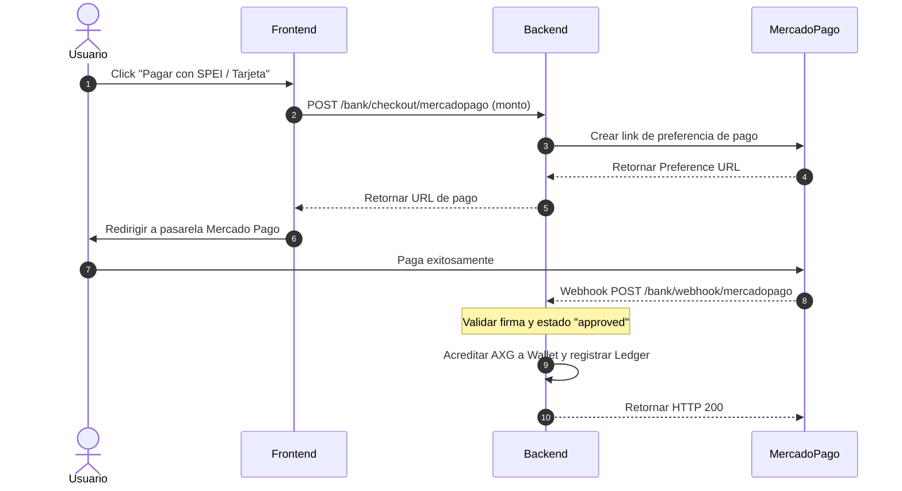
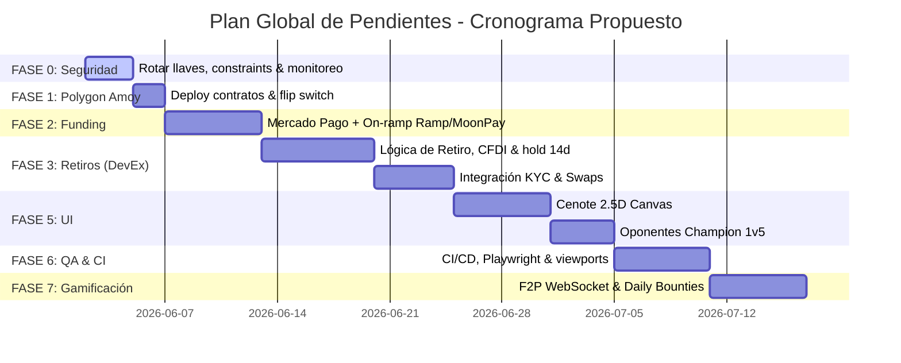

# 🦎 PLAN GLOBAL DE PENDIENTES — Ecosistema Axolotto

Este documento consolida y organiza la hoja de ruta integral de desarrollo del ecosistema **Axolotto**. Reemplaza y resume los **50 archivos históricos** de planificación (archivados en `docs/completed/`), estableciendo las prioridades actuales, el estado de implementación y un checklist detallado para las fases restantes.

> [!NOTE]
> **Revisión 2026-06-02 (corroboración contra código):** Se auditó el plan contra el codebase real. Varias mecánicas que estaban listadas como "pendientes" ya están implementadas (Card Melter, Fichas de Gashapón, Naturalezas, Clima Dinámico, F2P Espectador backend, upgrade de `simulate_universe`, rate limiting). Se reclasificaron y se incorporaron secciones que faltaban: seguridad pre-mainnet, fundamento económico/legal, on-ramp Ramp/MoonPay, modo F2P, y las propuestas creativas del Game Designer.
>
> **Decisión de Blockchain (2026-06-02):** Red de staging confirmada como **Polygon Amoy** (Chain ID 80002). Razones: gas ultra-barato, on-ramps LATAM excelentes (Ramp/MoonPay/Bitso), soporte nativo en Privy y viem, ecosistema gaming probado. Modelo de gas: la **treasury wallet absorbe todo el gas** — blockchain transparente para el usuario final. Cambios de código ya aplicados en `config.py`, `blockchain.ts`, `PrivyProviderWrapper.tsx`, `foundry.toml` y strings de UI. Para activar: cambiar `BLOCKCHAIN_MODE=polygon_amoy` en `backend/.env` y descomentar las vars de Amoy en `frontend/.env.local`, luego deployar contratos.

---

## 📊 Estado de Implementación del Proyecto

El análisis del codebase actual (backend en Python/FastAPI, contratos en Solidity y frontend en Next.js/TypeScript) revela el siguiente progreso:

### ✅ Completado y Sólido en Código
*   **Club VIP (Fase 4)**: Modelo de datos para Axolotito principal (`is_main`), guards de congelamiento por VIP expirado, descuentos y bonus en multijugador (`multiplayer_service.py`), marcos visuales VIP animados y Badges de Corner en el frontend (`VipModal.tsx`).
*   **Mecánicas e Utilidad de Estadísticas (Stats)**:
    *   **Focus**: Reduce fallas de marcado de casillas de lotería (`multiplayer_service.py`).
    *   **Charisma**: Aplica hasta un 10% de descuento en consumibles de la tienda (`shop_service.py`).
    *   **Agility**: Reduce a la mitad el enfriamiento de sueño (`sleep_expires_at`).
    *   **Wisdom**: Otorga hasta un +10% de rendimiento de staking pasivo de los tableros.
    *   **Strength**: Asegura estadísticas base élite al nacer Webitos Astrales.
    *   **Salinity**: Otorga costo de energía adicional por partida.
*   **Gashapón, Ruletas y Drops**: Drops balanceados con pre-check de legendarios (Webitos Astrales 0.1%, Foil Boosters 0.5%) y animaciones premium de unboxing en frontend (`Gashapon.tsx`).
*   **Tableros NPC (Bots)**: Bots con tableros reales que gradúan al pool de Gashapón de acuerdo a su experiencia acumulada (`NPC_BOARDS_PLAN.md`).
*   **Seguridad Transaccional**: Mitigación de dobles gastos mediante `SELECT FOR UPDATE`, tabla `ProcessedTransactions` anti-replay, CSPRNG en aleatoriedades, límites anti-sybil y cálculo de rachas diarias con zona horaria UTC-6.
*   **Flujo Corcholata (Landing & Onboarding)**: Canje de códigos promocionales únicos físicos con kit de bienvenida de 139 Axofichas + 1000 Frijolitos + Ítem exclusivo de lanzamiento (`promo_service.py` y `CodeEntryPanel.tsx`).
*   **Mecánica de Sobres Sellados y Especulación P2P**:
    *   Apertura y quema diferida de boosters con soporte Web3 ERC-1155.
    *   Mercado secundario P2P completo para compra-venta de sobres sellados y cartas individuales en `GAL` con comisiones de red cobradas a favor del tesoro y descuentos según tier de membresía VIP del comprador.
*   **Desarmado Seguro de Tablas**: Función de desarmado seguro (recuperación 16/16 cartas) cobrando 120 GAL en backend y actualizando frontend/smart-contracts.
*   **Card Melter (Crafteo y Fundición)**: Endpoints `/melter/melt` y `/melter/forge` (`shop.py:1021,1173`) para fundir 5 cartas duplicadas en fragmentos + carta superior, y forjar cartas específicas con fragmentos + GAL. Cubierto por `test_card_melter.py`. *(Antes listado como pendiente.)*
*   **Fichas de Gashapón (Tickets Gratuitos)**: Flag `use_ticket` en `shop.py:203` para tiradas/cápsulas gratis consumiendo fichas; se otorga 1 Ficha como bonus de racha del día 7. *(Antes listado como pendiente.)*
*   **Personalidades / Naturalezas (Natures)**: Asignación aleatoria al eclosionar de **6 naturalezas** (`methodical`, `lucky`, `hyperactive`, `shy`, `wise`, `glutton`) en `incubation.py:730`, afectando estadísticas e interacciones. *(Antes listado como pendiente con solo 3 naturalezas.)*
*   **Clima Dinámico de Xochimilco**: Motor `core/weather.py` con ciclos de 6 horas y eventos especiales (Helada Ártica, Ola de Calor, Rocío Vitalizador, Lluvia de Estrellas) basados en semilla determinista UTC-6. *(Antes listado como pendiente.)*
*   **Modo F2P Espectador (backend)**: `f2p.py` con `/egg-status` y `/watch-reward` — recompensas micro (GAL con cap diario) y fragmentos de huevo para espectadores sin Axolotito.
*   **Upgrade del Simulador del Universo**: `simulate_universe.py` modularizado en fases que cubren tickets (`phase_02b_tickets`), crafteo (`phase_06c_crafting`), desarme (`phase_06d_deconstruct`) y mercado P2P (`phase_06e_market`). *(Antes listado como pendiente.)*
*   **Endurecimiento de Seguridad**: Auditoría completa de seguridad (`SECURITY_AUDIT.md`) con **14 de 16 hallazgos SEV resueltos** (admin deposit gated, bypass de pago/auth eliminados, race conditions de escrow/market, CORS, CSPRNG en drops legendarios, secrets fuera de git). Rate limiting con slowapi (`core/limiter.py`).

### ❌ Pendientes y Trabajo Futuro
*   **Fase 0 (Seguridad Pre-Mainnet)**: Cerrar los hallazgos abiertos del `SECURITY_AUDIT` (rotación de `TREASURY_PRIVATE_KEY` a hardware wallet/KMS, auditoría externa de contratos, constraints `CHECK(balance>=0)`, monitoreo/alertas). **Bloqueante para flujos con dinero real.**
*   **Fase 1**: Migrar de Anvil Local (`chainId: 31337`) a **Polygon Amoy** (`chainId: 80002`). Código ya listo — solo falta el deploy de contratos y actualizar addresses en `.env`.
*   **Fase 2**: Rieles de entrada de fondos: pasarela fíat (**Mercado Pago**, AXG vía SPEI/Tarjetas/OXXO) y **on-ramp cripto Ramp/MoonPay** (USDT0 → wallet Privy; MoonPay widget ya implementado).
*   **Fase 3**: **Sistema de Retiros bancarios y cripto (DevEx / Cash-out)** con retención fiscal del 7%, CFDI de retenciones y **retención anti-fraude de 14 días** sobre AXG recibidos en P2P.
*   ~~**Fase 4 (Ajuste)**: Stock dinámico para el *Booster Foil* en base a las ventas mensuales en curso.~~ ✅ **Completado** — backend ya sobreescribe `total_sold` con ventas del mes y `max_supply: 100`; frontend ya muestra `Quedan X / 100`.
*   **Fase 5**: Renderizado de **El Nido Cenote 2.5D** y **Simulador CPU Multijugador** renderizando las 5 tablas enemigas al fondo.
*   **Fase 6**: Pipeline **CI/CD** (cobertura 70%) + **E2E Playwright** + reorganización de `tests/integration/` + smoke test de `forge script Deploy` + QA de viewports.
*   **Fase 7**: Retención secundaria pendiente: **Misiones Diarias (Daily Bounties)** y **WebSocket de espectador F2P en tiempo real** + loop de eclosión gratis. *(Card Melter, Fichas, Naturalezas y Clima ya implementados.)*
*   **Propuestas creativas (Game Designer)**: Cosmic Shell Auction, Nesting Guilds, Ink Stamping, Invasión de Predadores (ver §Propuestas).

---

## 🗺️ Hoja de Ruta Detallada con Prioridades

> [!IMPORTANT]
> **Prioridades de Desarrollo:**
> - **🔴 PRIORIDAD ALTA**: Integraciones Web3 productivas, pasarelas de pago y sistemas financieros.
> - **🟠 PRIORIDAD MEDIA**: Experiencia de juego interactiva, fidelidad visual de pantallas y pruebas automáticas.
> - **🟡 PRIORIDAD BAJA**: Sistemas de progresión secundaria, mecánicas inflacionarias y gamificación.

---

### 🧱 FUNDAMENTO ECONÓMICO Y LEGAL (Restricciones de Diseño No Negociables)

*Estas reglas son la base sobre la que se construyen las Fases 2 y 3. Provienen de `legal_y_liquidez.md`, `plan_financiero_operativo.md` y `token_prices_bible.md`.*

- **Modelo de Reserva 80/20**: De cada compra de AXG (neta de IVA y comisión de pasarela), el **80% va a una reserva líquida intocable** (recompra DevEx) y el **20% a tesorería operativa**. La reserva garantiza solvencia ante un *bank run*.
- **Spread de Recompra (DevEx)**: AXG se vende a precio X y se recompra a ~50% (modelo Roblox). El spread amortigua la especulación y financia la operación. El excedente alimenta el Fondo de Jackpots y el Fondo Anti-Fraude.
- **🔒 Regla de Oro — AXG nunca gratis**: AXG (Axogema) es estrictamente *utility token* de compra primaria. **Jamás se emite por gameplay.** Todas las recompensas de juego se pagan en **GAL** (Algas), sin respaldo en la reserva. Violar esto vacía la reserva.
- **Retención Anti-Fraude P2P (14 días)**: Todo AXG recibido por un vendedor vía mercado secundario P2P queda bloqueado **14 días naturales** antes de ser elegible para retiro/Cash-Out, para detectar contracargos de tarjetas robadas.
- **DevEx exclusivo + KYC**: El Cash-Out no es retractación de compra; solo aplica a AXG acumulado legítimamente en P2P. Requiere KYC y se estructura fiscalmente como **Régimen de Premios** (retención ~7%: 1% ISR federal + ~6% local).
- **Custodia de tesorería**: Cripto en **multisig Gnosis Safe (3-de-5)** con hardware wallets (Ledger/Trezor); 50% líquido / 50% en lending Aave v3 (solo stablecoins). Fíat en cuenta corporativa de Persona Moral (nunca personal) con reserva 80% en cuenta de inversión separada.
- **Régimen Fiscal (SAT/México)**: IVA 16% desglosado en cada compra de AXG; CFDI global con RFC genérico (`XAXX010101000`) para compras sin factura; CFDI de retenciones por premios en retiros.

---

### 🔴 FASE 0: Seguridad Pre-Mainnet (BLOQUEANTE)

*Del `SECURITY_AUDIT.md` (16 hallazgos): 14 ya resueltos. Lo que queda es obligatorio antes de manejar dinero real.*
- [ ] **SEV-15 — Rotar `TREASURY_PRIVATE_KEY`**: Reemplazar la llave de Anvil (`0xac09...`) por una llave gestionada en hardware wallet o KMS. La Anvil dev key NUNCA debe llegar a producción.
- [ ] **Constraints de BD**: Añadir `CHECK (gemas_alga >= 0)` y `CHECK (axogema >= 0)` en la tabla `Wallet` como red de seguridad contra saldos negativos.
- [ ] **Validación de formato `tx_hash`**: Aplicar `re.fullmatch(r"0x[0-9a-fA-F]{64}", tx_hash)` en el borde de la API (antes de cualquier verificación on-chain).
- [ ] **Auditoría externa de contratos**: Contratar un auditor de smart contracts de terceros antes de fondos reales en mainnet.
- [ ] **Monitoreo y alertas**: Configurar alertas (OpenZeppelin Defender / Tenderly) sobre: saldos negativos, llamadas a admin deposit, mints masivos y fallos de autenticación.
- [ ] **Verificación de despliegue**: Confirmar `PRIVY_APP_ID` activo con validación de firma/expiración/audiencia JWT end-to-end usando un token Privy real.

---

### 🔴 PRIORIDAD ALTA: Finanzas, Web3 y Flujo Transaccional

#### 1. Migración a Polygon Amoy Testnet
*Red de staging confirmada: Polygon Amoy (Chain ID 80002). Treasury wallet paga todo el gas — blockchain invisible para el usuario.*
- [x] **Configuraciones de Backend** (`config.py`): `POLYGON_AMOY_RPC_URL`, chain ID 80002, modo `polygon_amoy`. `.env` ya tiene `POLYGON_AMOY_RPC_URL` y `USDC_ADDRESS=0x41E94Eb019C0762f9Bfcf9Fb1E58725BfB0e7582`.
- [x] **Configuraciones de Frontend**: `NEXT_PUBLIC_CHAIN_ID=80002` y `NEXT_PUBLIC_RPC_URL` en `.env.local` (comentados, listos para descomentar). `blockchain.ts` importa `polygonAmoy` de viem. `PrivyProviderWrapper.tsx` con `defaultChain/supportedChains: polygonAmoy`.
- [x] **`contracts/foundry.toml`**: `[rpc_endpoints]` con `polygon_amoy` y `[etherscan]` para verificación.
- [x] **Strings de UI**: "Plasma" → "Polygon Amoy", `plasmascan.to` → `amoy.polygonscan.com` en 6 componentes.
- [ ] **Deploy de contratos en Amoy**: Correr `forge script Deploy.s.sol --rpc-url polygon_amoy --broadcast`. Requiere fondos POL en wallet treasury (faucet: faucet.polygon.technology).
- [ ] **Actualizar addresses post-deploy**: Copiar las 9 addresses del output a `backend/.env` y descomentar bloque Amoy en `frontend/.env.local`.
- [ ] **Flip del switch**: Cambiar `BLOCKCHAIN_MODE=polygon_amoy` en `backend/.env`.

#### 2. Pasarela de Pago Fíat (Mercado Pago Checkout Pro)
*Riel de entrada de dinero fíat en México mediante SPEI, Tarjetas de Crédito y tiendas de conveniencia.*

- [ ] **Módulo de Integración**:
  - [ ] Crear el módulo de servicio `backend/app/services/mercadopago_service.py` e integrar el SDK de Mercado Pago.
  - [ ] Configurar tabla fija de conversión de divisas (10 AXG = $20 MXN / $1.00 USD).
- [ ] **Rutas del API (Endpoints)**:
  - [ ] Implementar `POST /bank/checkout/mercadopago` para generar links de preferencia (Checkout Pro).
  - [ ] Implementar el webhook `POST /bank/webhook/mercadopago` para escuchar notificaciones de acreditación en segundo plano.
  - [ ] Implementar lógica atómica de acreditación de AXG a la cuenta del usuario y registro de la transacción en `TransactionLedger` al confirmarse el webhook.
- [ ] **Pantalla de Tienda**:
  - [ ] Añadir en `Store.tsx` la opción de pago "Pagar con SPEI / Tarjeta / OXXO" y manejar los estados de carga.

#### 2b. On-Ramp Cripto (Ramp Network / MoonPay → wallet Privy)
*Ruta complementaria a Mercado Pago: el jugador compra USDT0 con SPEI/OXXO/tarjeta y lo recibe directo en su wallet de Privy para pagar AXG con un clic. Detalle técnico en `ramp_onramp_plan.md`.*
- [x] **MoonPay widget standalone**: `useMoonPayWidget.ts` + botón en `CryptoCheckout.tsx` funcionando en sandbox (no requiere firma de URL en sandbox).
- [ ] **Ramp Network (recomendado para MX)**: Integrar `@ramp-network/ramp-instant-sdk` (`hooks/useRampFunding.ts`) — soporta SPEI/OXXO con comisión ~1-2% y KYC light. Bloqueado por obtener API key (en proceso) y confirmar asset code de USDT0 en la red elegida.
- [ ] **Firma de URL MoonPay para producción**: Endpoint `GET /bank/checkout/moonpay-sign` (HMAC-SHA256 con secret key en backend) + `MOONPAY_SECRET_KEY` en config.
- [ ] **`verify_usdc_payment` acepta USDT0**: Renombrar a `ACCEPTED_PAYMENT_TOKEN_ADDRESS` y verificar el contrato correcto (USDT0 usa 6 decimales como USDC, sin cambio numérico).
- [ ] **Privy Dashboard**: Habilitar funding y agregar la red soportada; `embeddedWallets.createOnLogin: 'all-users'`.

#### 3. Sistema de Retiros Bancarios y Cripto (DevEx / Cash-out)
*Flujo que permite a los creadores e inversores liquidar sus ganancias de AXG hacia sus cuentas bancarias locales o wallets cripto, cumpliendo con la legislación fiscal mexicana.*
- [ ] **Modelos de Datos y Base de Datos**:
  - [ ] Crear el modelo `WithdrawalRequest` (`id`, `user_id`, `amount_axg`, `partial_amount_axg`, `status`, `net_amount_mxn`, `tax_withheld`, `destination_type`, `destination_address`, `swap_used`, `swap_fee`, `cfdi_uuid`, `created_at`, `processed_at`).
  - [ ] Crear la tabla `swap_ledger` para auditar conversiones internas de balances (de crypto a fiat para retiro).
  - [ ] Crear la tabla `blacklisted_cards` para registrar hashes de cuentas bancarias y tarjetas sospechosas de fraude o contracargos.
  - [ ] Definir los balances segregados en tesorería (`crypto_fund_balance` y `fiat_fund_balance`).
- [ ] **Lógica Fiscal y Negocio (`withdrawal_service.py`)**:
  - [ ] Calcular retención fiscal del **7% (Régimen de Retención de Premios en México)** del monto bruto a retirar.
  - [ ] Integrar con Facturapi para emitir el CFDI de retenciones en PDF/XML de manera automática al aprobarse un retiro bancario.
  - [ ] Lógica de validación KYC dinámica basada en holdings: permitir retiro libre solo si el monto es menor o igual al **20% (configurable)** de los holdings totales del usuario, u obligar KYC si supera $10,000 MXN.
  - [ ] Implementar mecanismo de swap interno utilizando tasa spot mediante oráculo Uniswap (comisión de swap del 0.5% registrada en `TreasuryLedger`) y fallback manual si la liquidez es insuficiente.
  - [ ] Validar cooldown de retiros (espera obligatoria de 7 días entre transacciones) y retiro mínimo (100 AXG).
  - [ ] **Retención anti-fraude de 14 días**: marcar AXG recibido vía P2P como no-elegible para retiro durante 14 días naturales (ver §Fundamento Económico), para cubrir el riesgo de contracargos de la compra primaria.
- [ ] **Rutas de Aprobación Admin**:
  - [ ] Crear el endpoint de solicitud `POST /bank/withdraw`.
  - [ ] Desarrollar rutas administrativas `GET/PATCH /admin/withdrawals` para enlistar, auditar y procesar las solicitudes de retiro.
- [ ] **Interfaz del Usuario (Frontend)**:
  - [ ] Crear una pantalla de Retiros (`WithdrawalPage`) interactiva dentro del menú de Wallet.
  - [ ] Mostrar desglose detallado (monto bruto, swap, 7% de impuestos retenidos, neto estimado) y descargas para los CFDIs una vez procesados.

---

### 🟠 PRIORIDAD MEDIA: Gameplay, Interfaz Visual y Pruebas

#### 4. ~~Control de Tienda: Stock Dinámico en Booster Foil~~ ✅ COMPLETADO
- [x] **Backend** (`shop.py:81-91`): `GET /shop/items` detecta el Foil por nombre, consulta `TransactionLedger` filtrando por mes calendario UTC actual, sobreescribe `total_sold` con el conteo mensual y fuerza `max_supply: 100` en la respuesta. El límite de compra (`buy_item`) también rechaza si `monthly_sold >= 100`.
- [x] **Frontend** (`Store.tsx:883`): Muestra `Quedan: {booster.max_supply - vendidos} / {booster.max_supply}` con barra de progreso animada y badge "¡100 al Mes!". El `max_supply` que llega del API ya es `100` para el Foil — no hay `999999` visible en UI.

#### 5. Rediseño del Nido Cenote 2.5D e Interfaz del Simulador
- [ ] **Nido Cenote 2.5D**:
  - [ ] Modificar `Criadero.tsx` y `Santuario.tsx` para usar un canvas estructurado en múltiples capas CSS animadas (rayos solares difuminados, burbujas dinámicas ascendentes y cuevas como nichos de incubación).
  - [ ] Implementar keyframes CSS de nado ondulante para que los Axolotitos eclosionados naveguen de forma orgánica, activando hovers con estadísticas y estados.
  - [ ] Implementar capas de renderizado térmico en incubadoras: halo naranja brillante (incubadora activa) y bloque de hielo traslúcido (congelada por expiración del VIP).
- [ ] **Oponentes Múltiples en Simulador CPU**:
  - [ ] En `CpuSimScreen.tsx` para partidas del modo Champion (1v5), renderizar las 5 tablas CPU de fondo en escala reducida y con efecto blur de profundidad de campo, simulando una mesa de casino.
- [ ] **Detalles del Simulador de Juego**:
  - [ ] Incrementar el delay del frame de carta cantada (`CalledCard`) a 1.2 segundos para mejor lectura (actualmente corre a 800ms).
  - [ ] Implementar una advertencia visual `"⚠️ CPU cerca..."` en el simulador cuando un oponente de la CPU alcance el 70% de llenado de su tabla.
  - [ ] Registrar un event listener `popstate` para que los cambios en el historial de navegación eviten salir accidentalmente del PlayMode perdiendo el estado del Wizard.

#### 6. Pipeline de CI/CD, Cobertura y Pruebas E2E
- [ ] **Configuración de CI**:
  - [ ] Crear el pipeline de GitHub Actions en `.github/workflows/ci.yml`.
  - [ ] Configurar tareas para ejecutar suite de pruebas unitarias (`pytest`) sobre SQLite y testear contratos inteligentes con Foundry (`forge test`).
  - [ ] Integrar el reporteador de cobertura (`pytest-cov`), fallando el workflow si la cobertura de código cae por debajo del **70%** en `shop_service.py`, `bank_service.py` y `multiplayer_service.py`.
- [ ] **Pruebas Automatizadas de Extremo a Extremo (E2E)**:
  - [ ] Instalar Playwright en `frontend/` y configurar `playwright.config.ts`.
  - [ ] Escribir tests de interfaz para validar la tolerancia del frontend ante latencia de red, clics dobles repetidos (double-submit prevention) y caídas de la API (errores 500).
- [ ] **QA Visual y Responsivo (Viewports)**:
  - [ ] Verificar el comportamiento del wizard y todas las pantallas en móvil (375px) y escritorio (1280px), sin scroll horizontal ni overflow de `BottomSheet.tsx`/`ToastContext.tsx`.
- [ ] **Reorganización y Smoke Tests** *(de `plan_pruebas_y_simulacion.md` §9):*
  - [ ] Mover tests de integración (`test_concurrency_race_conditions`, `test_replay_attacks`, `test_blockchain_desync`, `test_escrow_integrity`, `test_jackpot_vault`) de `tests/unit/` a `tests/integration/`.
  - [ ] Crear smoke test que corra `forge script Deploy.s.sol --fork-url http://localhost:8545` sobre un Anvil efímero y valide las direcciones generadas.

> [!NOTE]
> El upgrade de `simulate_universe.py` (Fichas, Card Melter, Naturalezas, desarme con solvente y P2P de boosters) **ya está implementado** y modularizado en `app/scripts/simulation/phase_*.py`. La cobertura unitaria (224 tests) y de seguridad ya está completa; lo único pendiente de QA es CI + Playwright + viewports.

---

### 🟡 PRIORIDAD BAJA: Mecánicas de Retención y Gamificación

> [!TIP]
> **Ya implementadas** (no requieren trabajo): Fichas de Gashapón (`use_ticket`), Naturalezas (6 tipos en `incubation.py`), Card Melter (`/melter/melt` y `/melter/forge`) y Clima Dinámico (`core/weather.py`). Solo restan las siguientes:

#### 7. Modo F2P Espectador — Tiempo Real ("El Cenote de los Espejos")
*El backend de recompensas F2P ya existe (`f2p.py`: `/egg-status`, `/watch-reward`). Falta la capa interactiva en vivo (de `plan_f2p_espectador.md`).*
- [ ] **Canal WebSocket de espectador**: `ws://api/rooms/{room_id}/spectate` que retransmita cartas cantadas/marcadas a espectadores sin sobrecargar PostgreSQL.
- [ ] **Tabla Espejo y Patrocinio**: UI del lobby de espectador con tabla espejo aleatoria o "apoyar" a un Axolotito premium; taps interactivos y barra de porras (burbujas/emojis visibles para el dueño premium).
- [ ] **Loop de eclosión gratis**: acumular 100 "Fragmentos Astrales de Webito" (~5-7 días viendo) para forjar un Webito Común de Iniciación gratis; CTAs de conversión en rachas de victoria.
- [ ] **Eventos de porras / apuestas de predicción**: buff de aura cuando 10 espectadores apoyan al mismo Axo (+5% XP al premium); micro-apuestas de GAL F2P.

#### 8. Misiones Diarias (Daily Bounties)
- [ ] **Misiones**:
  - [ ] Implementar un panel de misiones diarias (retos simples como alimentar 2 veces o jugar 3 partidas) recompensando con fragmentos cosméticos y GAL extras.

---

## 📈 Resumen de Tareas Pendientes

---

## 💡 Propuestas Creativas del Game Designer

*Mecánicas de alto valor sugeridas en los reportes de diseño (recuperadas de `000_MAESTRO_PENDIENTES.md` y `checklist_pendientes.md`). No están planificadas aún, pero refuerzan retención y economía.*

1. **Mercado de Cascarones Cósmicos (Cosmic Shell Auction)**: Al eclosionar un Webito Astral se obtiene un *Cosmic Shell*. Juntar 5 e incinerarlos en el altar activa una *Lluvia de Meteoros* global de 1h que eleva +5% la pureza genética mínima de todos los huevos que nazcan. Fomenta cooperación y especulación de alto nivel.
2. **Nesting Guilds (Becas / Scholarship)**: Jugadores avanzados depositan Axolotitos/Tablas en una "Bóveda de Gremio"; los F2P los toman prestados gratis y el contrato reparte **30% de los GAL ganados al dueño/gremio y 70% al becado**. Elimina la barrera de entrada Web3.
3. **Ink Stamping (Holografía Temporal Foil)**: Consumible "Tinta Holográfica" (Gashapón) que aplica brillo Foil temporal de 7 días a una carta común; durante ese lapso el tablero recibe **+2.5% de staking pasivo**. Deja probar la estética premium.
4. **Invasión de Predadores (PvE Cooperativo)**: Evento global donde garzas/carpas invaden Xochimilco; se pausa el PvP y se abre "Defensa del Nido", una lotería PvE cooperativa donde *Strength* y *Wisdom* mitigan ataques de los predadores.

---

> [!TIP]
> **Próximo Paso Inmediato Recomendado:**
> Comenzar con la **FASE 0 (Seguridad Pre-Mainnet)** — es bloqueante para dinero real. La **Fase 1** (deploy en Polygon Amoy) puede hacerse en paralelo: código ya listo, solo falta el deploy de contratos y el flip de `BLOCKCHAIN_MODE`.
