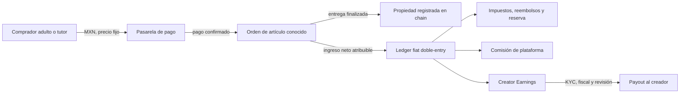

# ADR-001 — Modelo de producto sin apuestas

**Estado:** aceptado como arquitectura objetivo; migración técnica en curso  
**Fecha:** 15 de julio de 2026  
**Decisor:** fundador de Axolotto  
**Sustituye:** cualquier diseño donde una cuota de partida financie premios, jackpot o cashout.

## Contexto

Axolotto debe ser un juego y plataforma de artículos digitales, no un negocio de apuestas. El fundador todavía no opera mediante una sociedad constituida y no cuenta con permisos de juegos/sorteos, programa KYC/AML ni infraestructura de payouts.

Se desea conservar blockchain para transparencia y propiedad, permitir que creadores vendan artículos y considerar gobernanza DAO en el futuro. La cadena será la fuente de verdad de balances/propiedad on-chain.

## Decisión de producto

Axolotto adopta desde ahora estas reglas:

1. Las partidas son gratuitas. No hay buy-in, apuesta, pozo ni pérdida de AXF/FRJ por participar.
2. Ganar una partida no entrega dinero, creator earnings ni activos canjeables por dinero.
3. No existe jackpot monetario o tokenizado.
4. No se venden cajas, cápsulas, sobres o huevos de resultado aleatorio mientras el artículo resultante sea transferible, vendible o tenga valor económico.
5. Los artículos comerciales se venden a precio fijo y con contenido conocido antes de comprar.
6. Un creador solo genera una cuenta por pagar cuando otro usuario compra un artículo creado por él. No recibe rendimiento, premio, interés ni parte de cuotas de juego.
7. Tokens comprados, tokens ganados jugando y creator earnings son tres cosas distintas y nunca se convierten automáticamente entre sí.
8. Marketplace, creator payouts, transferencias P2P y pagos reales permanecen apagados hasta completar entidad, contratos, KYC/impuestos, términos y controles técnicos.
9. No se promete apreciación, liquidez, rendimiento, participación societaria ni valor futuro de AXF, FRJ, NFTs o una DAO.

## Modelo de ingresos elegido

Se adopta la parte de menor riesgo de Roblox/Minecraft/Fortnite:

- tienda de artículos digitales y cosméticos a precio fijo;
- programa de creadores con reparto del ingreso neto de su venta;
- suscripciones por conveniencia/contenido, no por multiplicar premios;
- juego gratuito y competitivo sin stake económico.

No se adopta como referencia el mercado abierto tipo CS para esta fase. Transferencia libre, mercados externos, skins con precio especulativo y cajas aleatorias vuelven a introducir riesgos de apuestas, menores, fraude, AML y manipulación.

## Separación de unidades de valor

| Unidad | Se obtiene | Se usa | Transferible | Cashout | Fuente de verdad |
|---|---|---|---:|---:|---|
| AXF — crédito cerrado | Compra directa aprobada; promociones limitadas | Artículos/servicios de precio fijo | No, salvo contratos del sistema | Nunca | Chain |
| FRJ — utilidad de juego | Actividad gratuita verificada | Progresión/cosméticos no revendibles | No | Nunca | Chain objetivo; DB solo proyección |
| Creator Earnings MXN | Venta real y confirmada de un artículo propio | Retiro fiat tras KYC/fiscal | No es token | Sí, sujeto a controles | Ledger fiat doble-entry |
| NFT/artículo | Compra o creación conocida | Uso/colección | Apagado inicialmente | No automático | Chain |
| Starter de práctica | Tutorial gratuito | Jugar CPU/progresión | No | No | DB; no es token, NFT ni artículo comercial |

Consecuencias:

- AXF no puede tratarse como inversión ni enviarse libremente entre jugadores.
- FRJ no se compra y no permite adquirir un activo revendible/canjeable.
- Creator Earnings no se mintea y no se financia con pérdidas o entradas de partidas.
- Una transferencia on-chain fuera de un pedido válido no crea una deuda de payout.
- AXF y FRJ ya rechazan transferencias usuario→usuario en contrato y operan por mint/burn del sistema.
- NFTs/cartas todavía conservan transferencias estándar; sus rutas API apagadas no bastan para impedir mercados externos. No se desplegarán públicamente hasta restringirlas.
- El starter gratuito es deliberadamente off-chain, no transferible y sin valor; por eso no contradice que chain mande sobre los activos que sí se emitan on-chain.

## Flujo económico permitido

Queda prohibido este flujo:

`entrada de jugador A → pozo → premio/cashout de jugador B`.

## Autoridad chain/DB objetivo

Esta sección es el protocolo que debe alcanzarse, no una descripción del backend actual. Hoy persisten wallets DB y outbox sin receipt/finality completo; la economía se mantiene apagada mientras se migra.

### La cadena manda para

- supply y balances de AXF/FRJ;
- propietario y estado transferible de NFTs/artículos;
- roles, caps, pausas y operaciones económicas finalizadas;
- IDs de operación consumidos para impedir replay.

### PostgreSQL manda para

- cuentas, edad/consentimiento, KYC y restricciones;
- catálogo, moderación, licencias y metadatos editables;
- órdenes, impuestos, invoices, chargebacks y refunds;
- Creator Earnings y payouts fiat;
- estado de partidas, progresión y telemetría no monetaria.

### PostgreSQL es una proyección para

- balances/propiedad on-chain usados por la UI;
- historial indexado de eventos y estado de confirmación.

### Protocolo de escritura

1. API valida usuario, edad, política, precio y límites.
2. DB crea una intención con `operation_id` idempotente; no acredita el activo.
3. Worker firma y difunde la transacción.
4. Estado: `created → broadcast → mined → finalized` o `failed/reverted`.
5. Solo después de finality se proyecta la propiedad/balance y se completa la orden.
6. Un indexador reconstruye la proyección desde eventos de chain.
7. Reconciliación compara chain, proyección, órdenes y ledger; toda diferencia pausa la economía.

No se permiten dual-writes “chain y luego DB” dentro de un request. Si chain/RPC no está disponible, la economía pasa a **read-only**; el juego gratuito puede continuar sin recompensas transferibles.

## Menores y separación de capacidades

La presencia de menores no se resolverá con un único checkbox. Se usarán bandas de edad y capacidades separadas, con revisión jurídica por país.

| Capacidad | Edad desconocida/menor | Adolescente con tutor | Adulto verificado |
|---|---:|---:|---:|
| Jugar gratis | Sí, con privacidad reforzada | Sí | Sí |
| Chat/UGC | Restringido y moderado | Moderado | Moderado |
| Comprar | No por defecto | Solo tutor, límites y recibos | Sí, tras controles |
| Wallet vinculada | No | No en fase inicial | Opcional tras challenge firmado |
| P2P/trading | No | No | Apagado inicialmente |
| Vender como creador | No | No en fase inicial | Tras KYC, fiscal y contrato |
| Cashout | No | No | Solo Creator Earnings elegibles |

Datos mínimos objetivo en `User`:

- `age_band`: `unknown | under_13 | teen_13_17 | adult_18_plus`;
- `age_assured_at` y método/proveedor, sin guardar más fecha de nacimiento de la necesaria;
- `guardian_consent_at` y versión de consentimiento;
- `commerce_status`: `disabled | pending_guardian | eligible | suspended`;
- `creator_status`: `ineligible | pending_review | approved | suspended`;
- `kyc_status`: `not_started | pending | verified | rejected`, separado del perfil público.

Los campos y guards iniciales ya existen, pero age assurance, cuenta parental, KYC y consentimiento verificable siguen pendientes. Hasta completarlos, compras, marketplace, creator payouts y vinculación de wallets permanecen deshabilitados.

## Administración y seguridad

El fundador conserva control de gobierno, pero ninguna credencial individual debe poder vaciar o mintear toda la economía.

Configuración inicial recomendada:

- Safe/multisig 2-de-3 como admin; al menos un firmante independiente y un recovery signer frío;
- llaves en hardware wallets distintas, backups offline y prueba trimestral de recuperación;
- roles separados: `DEFAULT_ADMIN`, `MINTER`, `BURNER`, `SETTLER`, `PAUSER`, `UPGRADER`;
- operator del backend con límites diarios y sin permiso administrativo;
- timelock de 48 horas para cambios de caps, direcciones y upgrades;
- pausa inmediata mediante rol limitado, sin capacidad de retirar fondos;
- caps de supply/emisión y límites por operación/día;
- treasury operativa con solo el saldo necesario; reserva/custodia separada;
- alertas por mint/burn/transfer/admin, cambios de rol y fallos de reconciliación;
- `operation_id`/nonce consumible una vez para toda acción económica;
- DAO pospuesta hasta contar con entidad, opinión legal/fiscal, modelo de voto y análisis de valores.

Una multisig con tres dispositivos del mismo fundador reduce pérdida de llave, pero no abuso/coacción. Para producción debe existir separación real de firmantes y procedimiento corporativo.

## Liabilities y reservas

Aunque no exista un fondo de premios, sí existen obligaciones:

`liability = AXF comprado no consumido + Creator Earnings + refunds/chargebacks + impuestos + entregas pendientes`.

Reglas iniciales:

- creator payout solo después de ventana de fraude/chargeback;
- reserva segregada para reembolsos e impuestos;
- no gastar balances de usuarios como ingreso reconocido antes de consumo según criterio contable;
- límites configurables por orden, día, creador y payout;
- revisión manual en primeros payouts y cualquier cambio de wallet/banco;
- reporte diario de liabilities, efectivo, órdenes pendientes y reconciliación.

## Pausas automáticas mínimas

La economía pasa a read-only cuando ocurra cualquiera:

- diferencia distinta de cero entre chain, proyección y ledger;
- pago confirmado sin entrega finalizada o entrega sin orden pagada;
- receipt revertido, chain ID/dirección/bytecode inesperado;
- RPC sin finality durante el umbral operativo;
- clave/rol administrativo cambiado fuera de una ventana autorizada;
- pico de mint, ventas, refunds, chargebacks o payouts por encima del límite;
- KYC/age/compliance requerido no disponible;
- webhook sin firma, replay o evento desconocido.

Los umbrales monetarios se fijarán después de modelar volumen y reservas; los invariants de integridad no tienen tolerancia.

## Implementación por fases

### Fase 0 — ahora

- flags fail-closed;
- apagar pagos, buy-ins/premios/jackpot, cashout, P2P, random paid rewards y client-reported rewards;
- corregir claims públicos;
- documentar contactos y decisiones.
- habilitar sólo CPU y tutorial gratuitos con starters de práctica sin valor.

### Fase 1 — integridad

- estados de finality/outbox/indexador/reconciliación;
- tokens restringidos y roles/caps/pause/multisig;
- separar Creator Earnings del wallet de tokens;
- age bands y commerce/creator gates.

### Fase 2 — creador piloto

- entidad, fiscal, términos, privacidad, KYC y pasarela;
- catálogo UGC moderado, licencias y precio fijo;
- adultos invitados, payouts manuales y límites bajos;
- sin trading ni artículos aleatorios.

### Fase 3 — expansión

- compras de tutores si counsel las aprueba;
- marketplace secundario solo tras análisis adicional;
- DAO únicamente después de resolver gobierno, valores, impuestos y protección al consumidor.

## Criterio de aceptación

Ninguna feature económica se habilita solo por cambiar una variable de entorno. Requiere evidencia de controles técnicos, legales y operativos, revisión de dos personas y un registro de aprobación versionado. Ese launch manifest y su enforcement todavía no están implementados.
