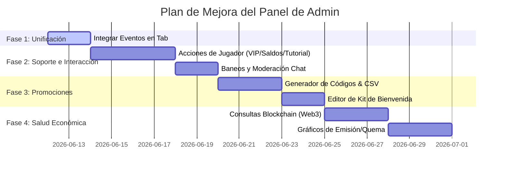
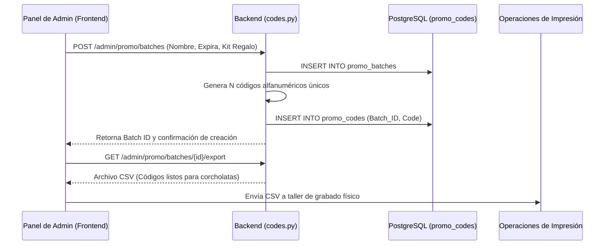

# Axolotto Admin Panel: Análisis, Comparativa y Plan de Mejora

Este documento contiene un análisis detallado del panel de administración actual de **Axolotto**, su comparación con las capacidades y requerimientos del sistema completo, y un plan integral para transformarlo en una herramienta operativa, de soporte y de simulación de primer nivel.

---

## 🔍 1. Arquitectura y Mapeo del Estado Actual

Actualmente, el panel de administración de Axolotto se divide en las siguientes áreas funcionales en el backend y frontend:

```mermaid
graph TD
    subgraph Frontend [Next.js App: /play/admin]
        MainPage[admin/page.tsx] --> Tab1[Resumen - AdminOverview.tsx]
        MainPage --> Tab2[Jugadores - AdminPlayerList.tsx]
        MainPage --> Tab3[Economía - AdminEconomyCharts.tsx]
        MainPage --> Tab4[Cartas - AdminCardDistribution.tsx]
        MainPage --> Tab5[Simulación - AdminSimReport.tsx]
        MainPage --> Tab6[Caos V2 - AdminChaosSimV2.tsx]
        
        EventsPage[admin/events/page.tsx] -->|Página Aislada| EventCRUD[Eventos de Modo Manual]
    end

    subgraph Backend [FastAPI: /api/v1/admin]
        AdminRouter[admin.py] --> OverviewEP[/overview]
        AdminRouter --> PlayersEP[/players]
        AdminRouter --> PlayerDetailEP[/players/player_did]
        AdminRouter --> EconomyEP[/economy/charts]
        AdminRouter --> SimEP[/simulation/run & /status & /report]
        AdminRouter --> ChaosEP[/simulation/chaos/run & /status & /report]
        AdminRouter --> CardsEP[/cards/distribution]
        
        EventsRouter[admin_events.py] -->|Prefijo /admin/events| EventsEP[CRUD & Broadcast de Eventos]
        DevRouter[dev.py] -->|Sólo Local| DevEP[Reset/Skip Tutorial & Fill Rooms]
    end
```

### 1.1 Mapeo de Pestañas y Componentes Existentes

1. **📊 Resumen (`AdminOverview.tsx`)**:
   - KPIs generales: Total de jugadores, Axofichas (AXF) y Frijolitos (FRJ) en circulación (con su equivalencia estimada en pesos MXN), saldo de tesorería (FRJ), jackpot actual, tablas activas, axolotitos y tasas de victoria globales.
   - Datos agregados de **Corcholatas** (códigos físicos canjeados, AXF/FRJ obsequiados).
   - Compras con cripto (órdenes completadas, AXF vendidos, USDC/USD recibidos).
   - Conteo de usuarios VIP activos por nivel (**Coral**, **Dorado**, **Axolite**).
   - *Simulador de Retiros y Solvencia (DevEx)*: Permite al admin ingresar una liquidez real ficticia en pesos y evalúa la solvencia del fondo en tres escenarios (70% bruto, 70% neto, y 50% base).
2. **👥 Jugadores (`AdminPlayerList.tsx` y `AdminPlayerDetail.tsx`)**:
   - Búsqueda y paginación de usuarios (por apodo, correo o DID).
   - Ordenamiento por saldos, partidas jugadas, win rate, fecha de registro y cantidad de axolotitos/tablas.
   - **Vista de Detalle (`AdminPlayerDetail`)**: Abre un panel lateral (Drawer) con la información del perfil del usuario, saldos detallados de su billetera (incluidos fragmentos de rareza), nivel y estadísticas de sus Axolotitos (salinidad, suerte, energía, etc.), información de sus Tablas de juego, historial de las últimas 50 transacciones monetarias y registro de sus últimos 20 juegos multijugador.
3. **💹 Economía (`AdminEconomyCharts.tsx`)**:
   - Gráficas de volumen diario de FRJ operado y cantidad diaria de partidas multijugador en los últimos 30 días.
   - Desglose detallado del gasto en la tienda (compras de huevos, sobres de cartas, activaciones VIP, giros de gashapón, etc.).
4. **🃏 Cartas (`AdminCardDistribution.tsx`)**:
   - Análisis de rareza del catálogo versus rareza real en circulación de las cartas de lotería.
   - Estadísticas de copias especiales Shiny y Primera Edición abiertas.
   - Tabla de inventario detallada por ID de carta para monitorear el suministro exacto.
5. **🧪 Simulación (`AdminSimReport.tsx`)**:
   - Ejecuta simulaciones de partidas locales y de progresión del juego para probar el balance de la economía y recolectar reportes en formato de texto.
6. **⚡ Caos V2 (`AdminChaosSimV2.tsx` con `AdminChaosLiveViz.tsx`)**:
   - Panel avanzado de simulación de estrés y vectores de ataque de seguridad (inyección de límites, condiciones de carrera, ataques de replay, bypass de cooldown, bypass de ID).
   - Muestra un visualizador en tiempo real de los hilos de simulación simulando partidas concurrentes y ataques, y despliega el reporte de auditoría de seguridad resultante.

---

## ⚖️ 2. Análisis de Brechas (Gaps) contra el Resto del Sistema

Al comparar el panel de administración actual con las mecánicas del juego, el flujo de corcholatas para el landing page, las reglas del VIP Club (`vip_club_design.md`) y la necesidad de soporte técnico, se detectan las siguientes limitaciones críticas:

### 🔴 Brecha A: Cero Interactividad en el Soporte al Jugador (Read-Only)
*   **Problema:** La vista `AdminPlayerDetail` es 100% de lectura. Si un usuario se queda atascado en el tutorial, si hay un fallo en una pasarela de pago y se le debe abonar saldo manualmente, o si abusa de los chats y necesita ser baneado, el administrador no tiene botones ni endpoints para hacerlo.
*   **Impacto:** El equipo de operaciones depende de scripts en la base de datos o consolas manuales de PostgreSQL para resolver problemas cotidianos de los usuarios.

### 🔴 Brecha B: Desconexión de Eventos del Modo Manual
*   **Problema:** Los Eventos del Modo Manual (donde el administrador programa torneos con costos específicos, premios, multiplicadores de drop, etc.) están en una ruta aislada (`/play/admin/events`) y no forman parte del menú de navegación unificado del panel de administración.
*   **Impacto:** Flujo operativo ineficiente y baja descubribilidad para los administradores del juego.

### 🔴 Brecha C: Falta de Gestión Activa de Corcholatas y Códigos Promocionales
*   **Problema:** En el flujo de "Corcholatas" (campaña física), el backend tiene un `promo_service.py` y endpoints para canjear (`/codes/redeem`), pero **no hay interfaz de administración** para generar nuevos lotes de códigos, exportarlos como archivo CSV (para impresión física de las corcholatas) ni configurar los contenidos del kit de bienvenida asociados a cada lote.
*   **Impacto:** El equipo de marketing/diseño no puede generar nuevos códigos sin pedir intervención directa a los programadores.

### 🔴 Brecha D: Entrada de Liquidez Manual en el Semáforo de Solvencia
*   **Problema:** El semáforo financiero calcula la solvencia asumiendo que el administrador ingresa manualmente el balance actual del fondo.
*   **Impacto:** Falta de automatización. El backend podría consultar directamente las billeteras calientes/frías del juego en la blockchain o pasarelas de pago fiat para reflejar la solvencia real en tiempo real.

### 🔴 Brecha E: Ausencia de Métricas Netas de Emisión y Quema (Mint vs Burn)
*   **Problema:** Los gráficos económicos muestran volumen acumulado, pero no la curva neta de balance de tokens (cuánto AXF/FRJ se crea mediante premios y recompensas vs. cuánto se quema o destruye en tarifas, compras de boosters y pérdida de partidas).
*   **Impacto:** Imposibilidad de evaluar si la economía del juego es inflacionaria o deflacionaria a simple vista.

---

## 📋 3. Plan de Mejora Integral (Fase por Fase)

Proponemos un plan estructurado en 4 fases de desarrollo para elevar la utilidad y robustez del panel de administración.



---

### 🎨 Diseño y Consolidación de la Interfaz (UI/UX)
Para cumplir con los estándares de diseño premium definidos en las directrices (colores HSL curados, gradientes oscuros, micro-interacciones, tipografía moderna y feedback dinámico), aplicaremos un estilo consistente en cada nuevo componente de administración, empleando colores bioluminiscentes para acentuar elementos interactivos importantes:
*   **Fondo General:** `#060610` (Negro abisal)
*   **Componentes de Contenido:** `#0D0D1F` con bordes sutiles `border-white/5`
*   **Destacados Interactivos:** Rosa mexicano (`#E4007C` / `#FF8DA1`) y Morado neón (`#9333EA`)
*   **Acentos de Éxito/Mina:** Verde jade/esmeralda (`#10B981`) y Oro/Ámbar (`#F59E0B`)

---

### 🛠️ Fase 1: Integración de Experiencia y Unificación de Navegación
**Objetivo:** Consolidar todas las funciones administrativas en una sola pantalla.

1.  **Modificar `frontend/app/play/admin/page.tsx`**:
    - Agregar `eventos` a la constante `TABS`.
    - Renderizar un nuevo subcomponente `AdminEvents` (basado en el código de `admin/events/page.tsx`, pero rediseñado con la estética bioluminiscente del panel principal).
    - Redirigir el acceso de la antigua ruta `/play/admin/events` hacia la pestaña de eventos del panel unificado.
2.  **Visualización de Partidas y Reportes en Vivo**:
    - Integrar un acceso directo en la pestaña de Eventos para consultar las estadísticas en tiempo real de los torneos activos (partidas registradas, comisiones recaudadas).

---

### 🛠️ Fase 2: Panel de Moderación y Soporte Interactivo
**Objetivo:** Permitir que los administradores alteren el estado de los jugadores directamente desde la interfaz de usuario.

#### Endpoints backend a implementar (en `backend/app/api/v1/endpoints/admin.py`):
```python
# 1. Ajustar saldos
@router.post("/players/{player_did}/adjust-balance")
def adjust_player_balance(
    player_did: str,
    currency: str,  # "axf" o "frj"
    amount: float,  # Puede ser positivo o negativo
    reason: str,
    session: Session = Depends(get_session),
    admin_id: str = Depends(require_admin)
):
    # Lógica para modificar Wallet y registrar en TransactionLedger
    ...

# 2. Asignar suscripción VIP
@router.post("/players/{player_did}/grant-vip")
def grant_player_vip(
    player_did: str,
    tier: str,  # "coral", "dorado", "axolite"
    duration_days: int,
    session: Session = Depends(get_session),
    admin_id: str = Depends(require_admin)
):
    # Actualiza User.vip_tier, User.vip_expires_at y reinicia o suma beneficios
    ...

# 3. Resetear o Brincar Tutorial (Adaptación de dev.py segura para producción)
@router.post("/players/{player_did}/tutorial-override")
def override_player_tutorial(
    player_did: str,
    action: str,  # "reset" o "skip"
    session: Session = Depends(get_session),
    admin_id: str = Depends(require_admin)
):
    # Ejecuta el flujo seguro de tutorial
    ...

# 4. Estado de Cuenta (Bloqueo/Baneo)
@router.post("/players/{player_did}/toggle-status")
def toggle_player_status(
    player_did: str,
    is_active: bool,
    session: Session = Depends(get_session),
    admin_id: str = Depends(require_admin)
):
    # Habilita o deshabilita al usuario
    ...
```

#### Cambios en Frontend (`AdminPlayerDetail.tsx`):
*   Agregar una barra de herramientas de acciones rápidas para el jugador:
    *   **Botón 🪙 Ajustar Saldo**: Despliega un modal flotante con entrada para monto (positivo o negativo), selector de moneda (AXF/FRJ) y campo de justificación obligatoria.
    *   **Botón 👑 Otorgar VIP**: Despliega un modal para seleccionar el nivel y la vigencia.
    *   **Botón 🎓 Reset/Skip Tutorial**: Permite al soporte liberar a un jugador cuyo navegador se haya quedado bloqueado a la mitad del flujo interactivo inicial.
    *   **Botón 🚫 Banear Jugador**: Permite bloquear el acceso a partidas o chat en caso de comportamiento hostil o bots.

---

### 🛠️ Fase 3: Portal de Gestión de Corcholatas y Promociones
**Objetivo:** Permitir que marketing/diseño configure los regalos de la campaña física y exporte códigos listos para impresión.



#### Endpoints backend a implementar (en `backend/app/api/v1/endpoints/admin.py`):
```python
# 1. Crear lote de códigos promocionales
@router.post("/promo/batches")
def create_promo_batch(
    name: str,
    quantity: int,
    axf_amount: float,
    frj_amount: float,
    expires_days: int = 365,
    special_item_id: Optional[int] = None,
    session: Session = Depends(get_session),
    admin_id: str = Depends(require_admin)
):
    # Crea el lote en promo_batches y genera 'quantity' registros alfanuméricos
    # únicos de 12 caracteres en la tabla promo_codes.
    ...

# 2. Listar lotes de códigos
@router.get("/promo/batches")
def list_promo_batches(
    session: Session = Depends(get_session),
    admin_id: str = Depends(require_admin)
):
    ...

# 3. Exportar códigos de un lote a CSV
@router.get("/promo/batches/{batch_id}/export")
def export_promo_batch_csv(
    batch_id: int,
    session: Session = Depends(get_session),
    admin_id: str = Depends(require_admin)
):
    # Genera una descarga de archivo CSV con los códigos generados
    ...
```

#### Cambios en Frontend (Nueva Pestaña `Promociones`):
*   Crear el componente `AdminPromos.tsx`:
    *   **Formulario de Generación de Lotes**: Campos para nombre de campaña (ej: *Lanzamiento Verano 2026*), cantidad de códigos a generar (ej: 1,000 corcholatas), cantidad de AXF y FRJ de regalo, y vigencia en días.
    *   **Tabla de Lotes Activos**: Lista los lotes creados, porcentaje de códigos ya reclamados (ej: 120 / 1000 canjeados), y botón para **📥 Exportar CSV**.

---

### 🛠️ Fase 4: Automatización de Liquidez y Gráficos de Mint & Burn
**Objetivo:** Mejorar la precisión del análisis económico para analistas de la economía del juego.

1.  **Lectura Automatizada de Liquidez Web3**:
    - El backend consultará el saldo en USDC/Tokens de la dirección del contrato de Tesorería (`MarketEscrow` o billetera fría del juego) usando `web3_service.py` y lo inyectará en la respuesta del endpoint `/overview` como `real_onchain_reserve_mxn`.
    - En el frontend, el semáforo financiero utilizará este balance real por defecto, manteniendo el campo de texto editable por si el administrador desea simular escenarios especiales de caja.
2.  **Gráfico de Emisión vs Quema (Mint vs Burn)**:
    - En la pestaña de **Economía**, agregar un gráfico comparativo de áreas apiladas o barras donde el eje X muestre los últimos 30 días, y el eje Y muestre:
        - **Flujo Positivo (Emisión):** AXF y FRJ creados (recompensas de lotería, reclamo de corcholatas, compras directas fiat/crypto).
        - **Flujo Negativo (Quema):** AXF y FRJ consumidos (pérdidas de partidas en el lobby, comisiones cobradas, compra de sobres en la tienda, upgrades de VIP).
        - **Línea Neta (Salud Monetaria):** Emisión menos Quema. Si la línea neta se mantiene cerca de cero, el juego es económicamente sostenible y autodeflacionario.

---

## 🚀 Conclusión e Impacto Esperado

La implementación de este plan de mejoras resolverá el problema del "panel administrativo pasivo" (que solo sirve para ver gráficas y reportes) y lo convertirá en el **centro neurálgico de operaciones de Axolotto**.

| Área | Estado Actual | Con Plan de Mejora | Impacto de Negocio |
| :--- | :--- | :--- | :--- |
| **Soporte al Usuario** | Lectura de datos pasiva. Acciones requieren intervención en DB. | Botones de ajuste de saldos, reinicio de tutoriales y asignación VIP. | Reducción de tiempo de respuesta de soporte de horas a segundos. |
| **Campañas de Marketing** | Inserción manual de códigos. Configuración estática. | Generador de códigos físicos con exportación CSV para grabado en corcholatas. | Autonomía total de marketing para lanzar promociones físicas. |
| **Diseño del Lobby** | Menú separado. | Navegación integrada de eventos del modo manual. | Operación simplificada para crear eventos los fines de semana. |
| **Monitoreo Financiero** | Datos manuales ingresados por el admin para calcular solvencia. | Lectura de balance on-chain y desglose neto de quema de tokens. | Prevención temprana de insolvencia y control inflacionario automático. |

> [!NOTE]
> Para proceder con este plan, se recomienda comenzar por la **Fase 1** (unificación de eventos del modo manual en el panel) y la **Fase 2** (acciones de moderación en el detalle de jugador), ya que representan el mayor valor inmediato para el equipo de desarrollo y soporte.
