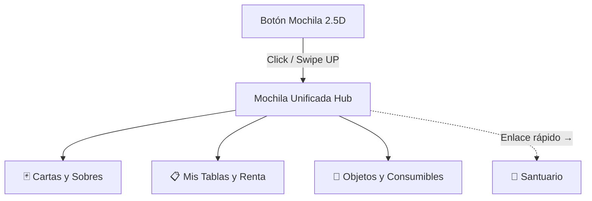

# Plan de Rediseño de la Mochila (Unified Backpack & Inventory Dashboard)

**Documento ID:** DOC-LOT-043  
**Estado:** Planificación  
**Autor:** AGY (Game Designer & UX Expert)  
**Proyecto:** Axolotto Web3 Metaverse Lottery

---

## 1. Visión General del Concepto

Actualmente, la "mochila" en el HUD flotante abre de forma separada las vistas de "Mis Cartas" o "Mis Tablas", obligando al jugador a cerrar un panel para abrir el otro. Esto fragmenta la experiencia de juego, satura el flujo de navegación y dificulta la introducción de nuevos elementos de inventario.

Proponemos la **Mochila Multidimensional (Unified Satchel)**: una interfaz centralizada y modular en formato de panel de pestañas unificado (*Glassmorphic Dashboard*). El jugador abre la mochila una sola vez y navega fluidamente por secciones. Esto no solo mejora el flujo de juego, sino que establece las bases para futuras expansiones del inventario (consumibles, accesorios de Axolotitos, decoraciones de la cueva, etc.).

> **Nota de diseño:** Los Axolotitos viven en el **Santuario** (tab Nido), no en la Mochila. La Mochila es para ítems transportables: cartas, tablas y objetos consumibles. La mochila incluye un enlace rápido de navegación al Santuario.

---

## 2. Pilares de Diseño UX y Estética Premium

Para lograr un efecto **WOW** inmediato en el jugador, el sistema utilizará las siguientes directrices estéticas y de micro-interacciones:

### 2.1. El Botón de la Mochila (HUD Flotante 2.5D)
*   **Diseño:** Un render vectorizado o animado de una mochila de explorador estilo Axolotto (tonos rosa `#E4007C` y azul cian).
*   **Físicas de Rebote (Jiggle Physics):** Al pasar el cursor (hover), la mochila realiza un micro-rebote elástico en su eje Y (`scale-y-110 scale-x-95` en transición rápida).
*   **Efecto "Looting" (Captura de Recompensa):** Cuando el jugador compre o consiga un objeto/carta, se generará una estela de partículas de luz desde la zona de obtención hasta la mochila. Al "entrar" en la mochila, esta emitirá una onda expansiva de brillo radial y saltará de forma elástica, indicando visualmente que el inventario se actualizó.

### 2.2. Entrada y Salida (Transiciones Inmersivas)
*   **Efecto de Dimensiones:** Al hacer clic, el fondo del juego se desenfoca sutilmente (`backdrop-blur-md bg-slate-950/40`).
*   **Animación Portal:** El panel central se despliega desde la posición del botón flotante expandiéndose con un efecto elástico (`cubic-bezier(0.34, 1.56, 0.64, 1)`).
*   **Glow Dinámico:** Cada pestaña modificará suavemente el color del gradiente de fondo y del brillo exterior (Glow) del panel para reflejar su naturaleza:
    *   *Cartas:* Azul índigo y rosa cyberpunk (`from-indigo-600/20 to-pink-500/10`).
    *   *Tablas:* Verde esmeralda y menta (`from-emerald-600/20 to-teal-500/10`).
    *   *Objetos:* Púrpura cósmico y ámbar (`from-purple-600/20 to-amber-500/10`).
*   **Enlace al Santuario:** Footer fijo con botón "Ir al Santuario 🦎" para navegar desde la Mochila directamente al Nido/Santuario donde viven los Axolotitos.

---

## 3. Arquitectura de las Pestañas (Tab System)

El panel principal de la mochila presentará una barra de navegación superior horizontal.

### Pestaña 1: 🃏 Mis Cartas y Sobres
*   **Contenido:**
    *   *Sección Superior:* Sobres cerrados (*Sealed Boosters*) disponibles para unboxing. Si hay sobres, se muestra un banner brillante animado animando a abrirlos.
    *   *Sección Inferior:* Cuadrícula del álbum de 54 cartas.
*   **Filtros Rápidos:** Botones rápidos para filtrar por rareza (Común, Raro, Legendario), cartas especiales (Shiny) y propiedad (Obtenidas vs Faltantes).
*   **Flujo Integrado:** El unboxing cinematográfico ocurre dentro del mismo contenedor de la mochila (mediante sub-vistas fluidas) para evitar modales disruptivos.

### Pestaña 2: 📋 Mis Tablas (Tablas de Lotería y Staking)
*   **Sub-Pestañas Internas (Deslizables):**
    1.  **Mis Tablas:** Visualización de las tablas 4x4 en staking, generación pasiva de FRJ y su nivel.
    2.  **Mercado de Rentas:** Integración del mercado para alquilar tablas de otros jugadores u ofrecer las propias.
*   **HUD de Staking Unificado:** Una barra superior fija que muestra los frijolitos acumulados en tiempo real y un botón premium de **"Cobrar Todo" (Claim All)** con partículas flotantes.
*   **Acceso al Editor:** Botón de "Diseñar Tabla" o "Crear Tabla Aleatoria" integrado, abriendo el editor de forma fluida.

### Pestaña 3: 🎒 Mis Objetos (Consumibles y Utilidades) - ¡NUEVA!
*   **Propósito:** Almacena todos los consumibles que actualmente están dispersos por el juego.
*   **Estructura de Cuadrícula:**
    *   **Gotas de Agua de Cenote:** Consumible para revitalizar o hidratar Axolotitos.
    *   **Lámparas de Calor:** Consumibles de incubación acelerada en el Criadero.
    *   **Escudos del Santuario:** Ítems de protección de cenote.
    *   **Accesorios/Cosméticos:** Futuros artículos para vestir o decorar Axolotitos.
*   **Acción Rápida:** Cada objeto tiene un botón de "Usar" que redirige inteligentemente al jugador a la zona correspondiente (ej: al hacer clic en "Usar Lámpara", la mochila se cierra de forma fluida y se navega a la zona de "Criadero").

### ~~Pestaña 4: 🦎 Mis Axolotitos~~ — ELIMINADA
> **Decisión de diseño (2026-06):** Los Axolotitos NO pertenecen a la Mochila. Ellos viven en el **Santuario** (tab Nido del dock). La Mochila es para ítems transportables. En su lugar se añade un botón de navegación rápida "Ir al Santuario 🦎" en el footer de la Mochila para que el jugador pueda acceder a sus Axolotitos desde ahí.

---

## 4. Plan de Implementación Técnica (Front-End)

Para materializar esto de forma limpia y mantener el rendimiento del sitio:

1.  **Refactor de `Inventory.tsx`:**
    *   Transformar `Inventory` en el contenedor unificado. Mover el control de `mode` (ahora interno en el componente o sincronizado con `tabActiva`) a un estado reactivo local.
    *   Crear una barra de navegación visualmente espectacular en la cabecera del componente con transiciones de color dinámicas en el borde e iluminación de fondo.
2.  **Crear el Componente `ItemGrid.tsx`:**
    *   Desarrollar la nueva vista para la pestaña "Objetos" que consuma los datos de inventario del backend (gotas de agua, lámparas de calor, etc.).
3.  **Animación de Apertura mediante Framer Motion / Tailwind v4:**
    *   Implementar transiciones elásticas en la apertura del panel.
    *   Configurar los gestos táctiles (`framer-motion` drag/swipe mechanics) para cambiar de pestaña en dispositivos móviles.
4.  **Actualizar `MochilaFloating.tsx`:**
    *   Rediseñar el botón flotante con las animaciones de rebote y actualización de loot.
    *   Simplificar el trigger para abrir directamente el Dashboard Unificado en la última pestaña visitada o en la seleccionada.

---

## 5. Estimación y Asignación de Tareas

*   **Identificador de la Tarea:** `LOT-050`
*   **Categoría:** `frontend`, `game`, `ux`
*   **Asignado a:** `@frontend-dev` (y supervisión de `@agy`)
*   **Impacto de la Tarea (Blast Radius):**
    *   `frontend/components/Inventory.tsx` (Alto - Modificación de la estructura principal)
    *   `frontend/app/play/page.tsx` (Medio - Ajuste en cómo se instancian las vistas de inventario y mochila)
    *   `frontend/components/world/hud/MochilaFloating.tsx` (Medio - Refactor del botón y sus micro-interacciones)
    *   `frontend/components/inventory/ItemGrid.tsx` (Nuevo - Creación del panel de consumibles)

---

## 6. Siguientes Pasos

1.  Crear la tarea en el Taskboard local.
2.  Validar la estructura del backend para la consulta de objetos/consumibles (validar que el API exponga correctamente la cantidad de lámparas, gotas y escudos).
3.  Iniciar la maquetación visual del Dashboard Unificado en Next.js.
