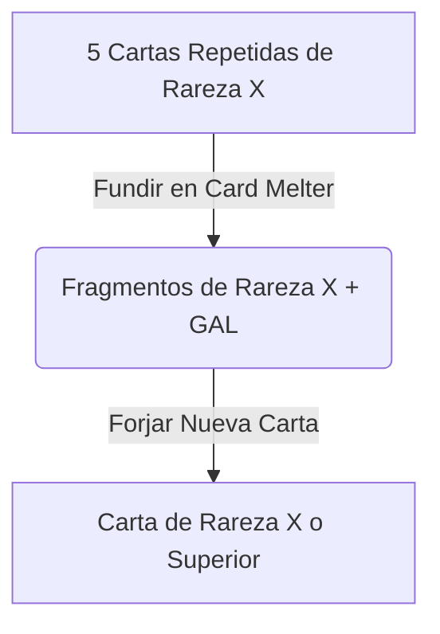

# Plan de Diseño y Gamificación: Gashapón, Naturalezas y Fundidor de Cartas (Fase 7)

Este documento detalla la planificación de diseño de juego (Game Design), economía de tokens y experiencia de usuario (UX) para la implementación de tres sistemas clave del ecosistema de retención de **Axolotto**:

1.  **Fichas de Gashapón**: Integración completa para obtener, acumular y consumir tiradas gratuitas en el Gashapón.
2.  **Personalidades (Natures)**: Genes de comportamiento que otorgan modificadores pasivos y únicos a cada Axolotito al nacer.
3.  **Fundidor de Cartas (Card Melter)**: Sistema de crafteo y quema de duplicados para mitigar la inflación de cartas en el mercado secundario.

---

## 🎟️ 1. Sistema de Fichas de Gashapón

Las **Fichas de Gashapón** son un activo digital (ERC-1155 en blockchain / fila en inventario en base de datos) que permite a los usuarios interactuar con la ruleta de accesorios y consumibles sin gastar sus gemas de alga (GAL/COR). Actúan como el principal motor de incentivos para eventos especiales y misiones diarias.

### ⚙️ Mecánicas de Economía y Backend
*   [x] **Modelo de Datos**: El catálogo de ítems (`ItemCatalog`) ya cuenta con la entrada `"Ficha de Gashapón"` con `item_type = ItemType.CONSUMABLE` y `price_axg = 0`.
*   [x] **Obtención**: Se otorgan como recompensa de inicio de sesión acumulado en el VIP Club, hitos de XP de Axolotitos, o drops míticos.
*   [x] **Uso (Giro Gratis)**: 
    *   [x] Modificar el endpoint `POST /shop/capsule/roll` para soportar `use_ticket` con costos escalados por tier (Cobre: 1 ficha, Plata: 2 fichas, Oro: 4 fichas).
    *   [x] Modificar el endpoint `POST /shop/capsule/triple-suerte` para soportar `use_ticket` cobrando 6 fichas (ahorrando 1 de la suma de las 3 individuales).
    *   [x] El backend verifica en `PlayerInventory` que el usuario tenga suficientes Fichas.
    *   [x] Deduce la cantidad correspondiente de fichas de la base de datos.
    *   [x] Genera el drop del Gashapón usando las probabilidades estándar de rareza y retorna el accesorio/consumible.

### 🎨 Experiencia de Usuario (UX/UI) en Frontend
*   [x] **Visualización**: En el panel de Gashapón (`Gashapon.tsx`), mostrar un indicador de inventario persistente en la esquina superior derecha: `🎟️ Fichas: {X}` con un shimmer animado.
*   [x] **Controles de Compra**:
    *   [x] **Botón A (GAL/COR)**: `Girar (250 COR)` / `Tirar Triple`.
    *   [x] **Botón B (Ficha)**: `Usar Ficha (1/2/4 req.)` o `Usar Fichas (6 req. en Triple)`. Estos botones se deshabilitan con un mensaje claro si el usuario no tiene la cantidad mínima requerida.
*   [x] **Animación de Giro**:
    *   [x] Al confirmar la tirada con ficha, se ejecuta `handleRoll(true)` o `handleTriple(true)` enviando `use_ticket: true` al backend.
    *   [x] El resultado se presenta mediante un overlay centrado usando `createPortal`, evitando el rediseño tosco de toda la pantalla.

---

## 🧠 2. Personalidades y Genes de Comportamiento (Natures)

Cada Axolotito eclosionado del Cenote recibirá un gen de comportamiento único (**Nature**) que modifica ligeramente sus estadísticas funcionales básicas. Esto introduce una capa de coleccionismo estratégico, donde ciertas personalidades son ideales para minería pasiva (staking) y otras para competir en loterías PvP de ritmo rápido.

### 📊 Tabla de Naturalezas y Efectos

| Naturaleza | Modificador Positivo | Modificador Negativo | Utilidad de Gameplay |
| :--- | :--- | :--- | :--- |
| **Metódico** (`methodical`) | **+10 Focus** | **-5 Stamina Max** | Ideal para partidas PvP de alta velocidad (reduce fallos de marcado). |
| **Suertudo** (`lucky`) | **+10 Luck** | **-5 Agility** | Maximiza la ganancia de GAL al ganar líneas o tablas. |
| **Hiperactivo** (`hyperactive`)| **+25% Velocidad de Sueño** | **-5 Focus** | Permite entrar en juego más veces al día al recuperarse rápido. |
| **Tímido** (`shy`) | **+10 Resistencia a Salinidad**| **-5 Charisma** | Reduce la pérdida de energía extra tras cada partida jugada. |
| **Wise (Sabio)** (`wise`) | **+10 Wisdom** | **-5 Charisma** | Aumenta el rendimiento de staking pasivo (+1% extra por nivel). |
| **Glotón** (`glutton`) | **+30% Energía por Comida** | **-5 Wisdom** | Reduce los costes de mantenimiento del Axolotito. |

### 🛠️ Cambios en Base de Datos y Backend
*   [x] **Modelo `Axolotito`**: Añadir la columna `nature` de tipo String (Enum de las 6 personalidades).
*   [x] **Lógica de Eclosión (`incubation.py`)**: Al procesar la ruta `/incubation/{id}/hatch`, se selecciona de forma aleatoria (`random.choice`) una de las 6 naturalezas y se guarda en el registro del Axolotito, aplicando los modificadores a las estadísticas de nacimiento.
*   [x] **Aplicación de Efectos**:
    *   [x] `game.py` y `multiplayer.py`: Reducción del 25% del tiempo de recuperación de sueño para los Hiperactivos.
    *   [x] `game.py`: Incremento del +30% de la energía obtenida al alimentar a Axolotitos con naturaleza Glotón.
    *   [x] `board.py`: Multiplicador adicional en el staking pasivo si el Axolotito principal es Sabio (`1.0 + (level * 0.01)`).

### 🎨 Experiencia de Usuario (UX/UI) en Frontend
*   [x] **Badge en Tarjeta**: Mostrar un ícono descriptivo al lado del nombre del Axolotito (ej: `🧠 Metódico`, `🍀 Suertudo`, `⚡ Hiperactivo`) en las tarjetas de inventario (`Inventory.tsx`) y del santuario (`Santuario.tsx`).
*   [x] **Panel de Estadísticas**: En el desglose de stats, pintar las estadísticas modificadas usando colores de soporte: **verde esmeralda** para valores potenciados y **rojo coral** para valores disminuidos, detallando el porqué en un tooltip al hacer hover/tap.

---

## 🌋 3. Fundidor de Cartas y Forja de Colecciones (Card Melter)

Para evitar la devaluación de las cartas en el mercado secundario y ofrecer un sumidero natural para las copias sobrantes (duplicados), los jugadores podrán "fundir" cartas comunes repetidas junto con una tasa de GAL para extraer fragmentos y forja cartas faltantes de rareza superior.

### ⚙️ Mecánicas de Fundición y Forjado

#### Reglas de Fusión (Melt)
El jugador deposita 5 copias duplicadas de la misma rareza y paga un fee en GAL:
*   [x] **Fusión Común**: 5 Cartas Comunes + 100 GAL ➔ 1 Carta Poco Común aleatoria + 10 Fragmentos Comunes.
*   [x] **Fusión Poco Común**: 5 Cartas Poco Comunes + 250 GAL ➔ 1 Carta Rara aleatoria + 10 Fragmentos Raros.
*   [x] **Fusión Rara**: 5 Cartas Raras + 500 GAL ➔ 1 Carta Épica aleatoria + 10 Fragmentos Épicos.
*   [x] **Fusión Épica**: 5 Cartas Épicas + 1500 GAL ➔ 1 Carta Legendaria aleatoria + 10 Fragmentos Legendarios.

#### Reglas de Forjado (Forge)
Permite canjear fragmentos acumulados por una carta específica que le haga falta al jugador para completar su colección (Álbum):
*   [x] **Forjar Común**: 50 Fragmentos Comunes + 100 GAL.
*   [x] **Forjar Rara**: 100 Fragmentos Raros + 500 GAL.
*   [x] **Forjar Épica**: 250 Fragmentos Épicos + 1000 GAL.
*   [x] **Forjar Legendaria**: 500 Fragmentos Legendarios + 3000 GAL.

### 🛠️ Cambios en Base de Datos y Backend
*   [x] **Wallet**: Columnas `frag_comun`, `frag_raro`, `frag_epico` y `frag_legendario` en la tabla `Wallet` mapeadas e incrementadas por fusión o reducidas por forja.
*   [x] **Endpoints de Fusión**:
    *   [x] `POST /shop/melter/melt`: Recibe el `card_id`, valida cantidad mínima, cobra fee, agrega fragmentos y entrega carta superior.
    *   [x] `POST /shop/melter/forge`: Recibe `target_card_id`, valida saldo y fragmentos, descuenta recursos e inyecta la carta forjada.

### 🎨 Experiencia de Usuario (UX/UI) en Frontend
*   [x] **Vista de Fusión (Card Melter)**: Altar premium interactivo ("Cenote Místico") integrado en `Store.tsx`.
*   [x] **Slot de Selección**: 5 ranuras que muestran las copias duplicadas floating y preparadas para la fusión.
*   [x] **Animación de Reveal**: Reveal modal elegante tras fundir o forjar una carta con efectos neón correspondientes a su rareza.

---

## 🧪 4. Desarmado Temático de Tablas: El Solvente de Pegamento (Board Deconstruction)

Para emular el proceso físico de desarmar una tabla donde las cartas de lotería fueron pegadas físicamente, los jugadores deben usar un **"Solvente de Pegamento" (Glue Solvent)** de alta calidad para removerlas de forma segura sin dañarlas.

### ⚙️ Mecánicas de Deconstrucción
*   [x] **Costo de la Operación**: El fee se incrementa de `50 GAL` a `120 GAL` (que representa la compra del Solvente de Pegamento).
*   [x] **Retorno 100% Intactas**: Garantiza la recuperación completa de las **16 cartas** de vuelta al inventario del jugador.
*   [x] **Restricción de Tablas NPC (Forjadas)**: Las tablas ganadas del Gashapón NPC se destruyen por completo al desarmarse para evitar la extracción de cartas gratis.

### 🛠️ Cambios en Backend y Smart Contracts
*   [x] **Smart Contract (`TablasLoteria.sol`)**: Método `dissolveBoardSafe` para liberar y retornar las 16 cartas en batch.
*   [x] **Servicio Web3 (`Web3Service`)**: Conexión on-chain para ejecutar disolución segura.
*   [x] **Endpoint (`DELETE /board/{board_id}`)**:
    *   [x] Descuenta `120 GAL`.
    *   [x] Retorna las 16 cartas y ejecuta disolución segura.

### 🎨 Experiencia de Usuario (UX/UI) en Frontend
*   [x] **Modal de Confirmación**: Rediseñado en `Inventory.tsx` para indicar el uso de solvente y la recuperación intacta de las 16 cartas.
*   [x] **Incentivos Visuales**: Acción renombrada a `💥 Desarmar con Solvente (120 COR)` con animación de carga `Despegando...`.
