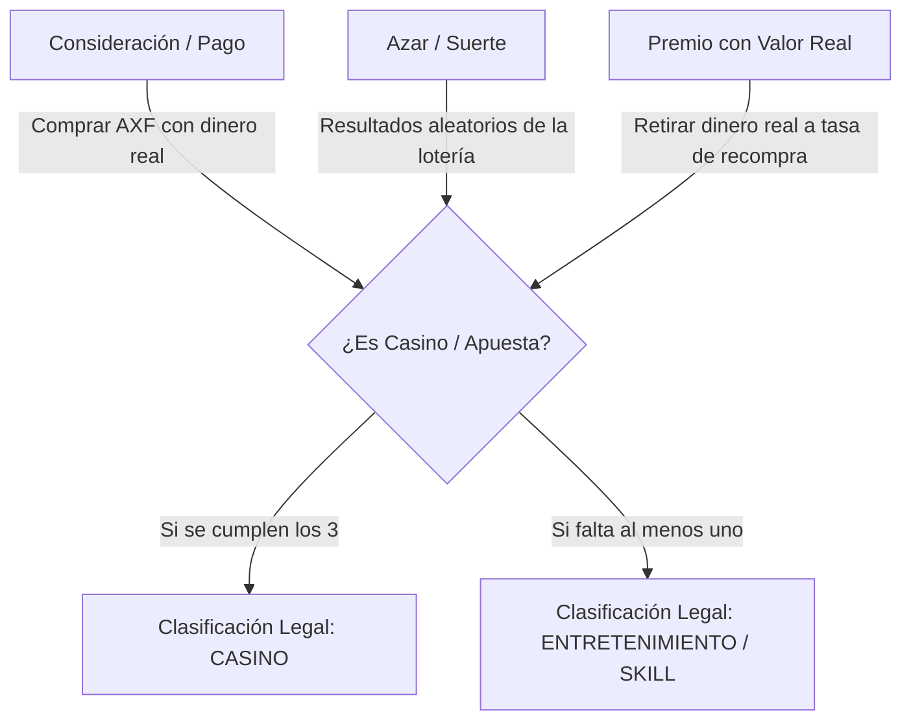

# Auditoría Legal y Financiera: Ecosistema Axolotto y Estructuración Corporativa (Tridyland)

> [!IMPORTANT]
> **ESTE DOCUMENTO CONTIENE UN ANÁLISIS DE RIESGO CRÍTICO.**
> La información descrita a continuación evalúa la legalidad, solvencia y estructura fiscal/corporativa del ecosistema Axolotto frente al SAT, la Secretaría de Gobernación (SEGOB), la CNBV (México), y la SEC / FinCEN (EE. UU.). Debe ser tratada con carácter confidencial y estratégico por los socios fundadores.
>
> **Documentos de Referencia Relacionados:**
> - [legal_y_liquidez.md](file:///home/monotr/axolotto/docs/completed/legal_y_liquidez.md)
> - [plan_financiero_operativo.md](file:///home/monotr/axolotto/docs/completed/plan_financiero_operativo.md)
> - [AXOLOTTO_BIBLE.md](file:///home/monotr/axolotto/docs/completed/AXOLOTTO_BIBLE.md)
> - [checklist_financiero.md](file:///home/monotr/axolotto/docs/completed/checklist_financiero.md)

---

## 1. Introducción y Propósito de la Auditoría

El presente documento analiza la propuesta de estructurar y unificar el ecosistema de **Axolotto** y **Tridyland** bajo una misma entidad legal registrada como empresa de "Bienes Digitales y Comercio Electrónico", operando un flujo de retiros (Cash-Out) basado en la recompra de la moneda premium **AXF (Axofichas)** a una tasa fija del **70% de su precio original de venta**.

El objetivo es determinar si esta estructura:
1. Es financieramente viable y solvente (análisis de insolvencia y *bank runs*).
2. Evita la clasificación legal como casino/casa de apuestas ante las autoridades reguladoras.
3. Protege las actividades comerciales legítimas de Tridyland frente a eventuales contingencias del juego.

---

## 2. Análisis de Viabilidad Financiera: La Trampa del Spread del 70%

El modelo propuesto establece que la única forma de retirar ganancias reales es revendiendo los tokens **AXF** a la plataforma a una tasa del **70% de su precio bruto original** (ej. si 100 AXF cuestan $200 MXN, se recompran por $140 MXN).

A continuación se realiza el análisis numérico del comportamiento de esta política bajo los dos rieles de pago activos en la plataforma:

### A. Riel Fíat (Mercado Pago + Impuestos de Ley)

Cuando un usuario compra AXF con dinero fíat en México, se aplican deducciones fiscales y comisiones de pasarela de pago que no se pueden recuperar en el flujo de retiro. El desglose por cada paquete de 100 AXF ($200.00 MXN bruto) es el siguiente:

| Concepto | Fórmula / Tasa | Impacto MXN | Impacto USD (Ref) |
| :--- | :--- | :--- | :--- |
| **Precio Bruto de Venta** | Entrada de dinero del usuario | **+$200.00** | **+$10.00** |
| **IVA (16% Retenido)** | Ley del IVA (Servicio Digital) | -$27.59 | -$1.38 |
| **Comisión de Mercado Pago** | 4.5% + $4.00 MXN + IVA | -$15.08 | -$0.75 |
| **Neto Recibido por la Empresa** | Dinero real en la cuenta bancaria | **+$157.33** | **+$7.87** |
| **Reserva de Recompra (80% del Neto)** | Asignado al Fondo de Respaldo | **+$125.86** | **+$6.30** |
| **Tesorería Operativa (20% del Neto)** | Fondos para desarrollo y marketing | **+$31.47** | **+$1.57** |

> [!WARNING]
> **El Déficit del 70%:** 
> - La obligación de recompra al **70% del valor bruto original** equivale a pagar **$140.00 MXN** ($7.00 USD).
> - Sin embargo, la reserva líquida solo cuenta con **$125.86 MXN** ($6.30 USD) respaldando ese token.
> - Esto genera un **déficit inmediato e insostenible de -$14.14 MXN (-$0.70 USD) por cada 100 AXF vendidas**.

#### El Escenario del Bank Run (Corridas Financieras)
Si el 100% de los usuarios decidiera retirar sus fondos al mismo tiempo (por pánico, desinterés o migración), la empresa sufriría una quiebra matemática:
* **Venta total:** 10,000 paquetes ($2,000,000 MXN brutos).
* **Reserva acumulada en bóveda:** $1,258,600 MXN.
* **Obligación total de retiro al 70%:** $1,400,000 MXN.
* **Déficit a cubrir de fondos propios:** **-$141,400 MXN**.

Para que la recompra al 70% bruto fuera solvente en Fíat, la empresa tendría que destinar el **89% de su flujo neto recibido a la reserva**, dejando únicamente un **11% neto para gastos operativos**, lo cual asfixiaría el desarrollo de Tridyland.

### B. Riel Cripto (USDC / USDT)

En el riel Web3, al no haber pasarelas de pago tradicionales ni retenciones de IVA transaccional inmediatas (asumiendo flujo directo al smart contract de tesorería), el cálculo es más favorable:

* **Pago del usuario:** 10.00 USDC.
* **Neto Recibido:** ~10.00 USDC (menos centavos de gas de red).
* **Reserva (80%):** 8.00 USDC.
* **Obligación de Recompra (70%):** 7.00 USDC.
* **Excedente de Reserva:** **+1.00 USDC**.

### C. Consecuencia Financiera: Contaminación Cruzada de Liquidez
Si se utiliza una sola bóveda líquida unificada, **los retiros del riel fíat consumirán la reserva generada por el riel cripto**. Los usuarios que compraron en pesos drenarán el USDC de los usuarios cripto para cubrir su déficit de $14.14 MXN por paquete, provocando insolvencia técnica en ambas reservas.

---

## 3. Análisis de Legalidad: ¿Es Posible Evitar la Clasificación de Casino?

La idea de registrar la empresa como una comercializadora de "Bienes Digitales y Comercio Electrónico" para evitar clasificar los premios como apuestas es una estrategia común, pero bajo una auditoría seria presenta vulnerabilidades críticas que un regulador detectará inmediatamente.

### A. El Principio de Primacía de la Realidad (Substance-over-Form)
Tanto las autoridades hacendarias (SAT) como las reguladoras de juegos (SEGOB en México, FinCEN/Estados en EE. UU.) operan bajo el principio de que **los actos jurídicos se juzgan por su naturaleza real y no por el nombre que las partes les otorguen**. 

Aunque los ToS (Términos de Servicio) declaren que la transacción es una "compraventa de tokens digitales y posterior recompra de bienes intangibles", si la operación real del sistema cumple con los criterios de juego de azar, se clasificará legalmente como tal.

### B. La Prueba de los Tres Elementos del Juego de Azar (Gambling)
En el derecho comparado (México, EE. UU. y la Unión Europea), un sistema se define como juego de azar y apuesta si reúne tres elementos simultáneos:



1. **Consideración (Consideration):** El jugador paga dinero real para obtener AXF y usarlas para participar.
2. **Azar (Chance):** El resultado depende en alguna medida del azar.
3. **Premio (Prize):** El jugador puede ganar un activo convertible de vuelta a dinero real.

En tu propuesta, al permitir que los jugadores normales compren AXF, las arriesguen en las partidas de lotería y luego retiren dinero real directamente vendiendo esas AXF a la plataforma, **se cumplen los tres elementos**. Esto convierte legalmente a Axolotto en un casino en línea sin licencia.

### C. El Factor "Destreza" (Skill Contest) vs. "Azar" (Lotto)
La defensa de Axolotto es que es un "Concurso de Destreza" (por la selección de Axolotitos, stats y estrategia de colocación de cartas). Sin embargo:
* **El nombre del juego:** Incluye la palabra **"Lotto"** (Lotería), lo cual es el ejemplo clásico universal de un juego de azar ante cualquier tribunal del mundo.
* **Mecánica central:** La extracción de números/cartas es puramente aleatoria. Ninguna cantidad de "estrategia" puede alterar las cartas que salen del bote de sorteo.
* **Jurisprudencia:** En México, la *Ley Federal de Juegos y Sorteos* prohíbe tajantemente los sorteos y juegos de azar con fines de lucro que no cuenten con permiso expreso de la SEGOB. Registrarse como "empresa de bienes digitales" no impide que la SEGOB clausure el servidor y multe a los fundadores penalmente si detecta apuestas encubiertas.

---

## 4. Regulación Financiera y Virtual Assets (VASP)

Al estructurar una bóveda que compra tokens (AXF) de vuelta por dinero fíat o stablecoins (USDC), Tridyland asume el rol de intermediario financiero:

1. **Clasificación VASP (Virtual Asset Service Provider):** Según el GAFI (FATF), al facilitar el intercambio entre activos virtuales y dinero fiat/cripto, la empresa es un proveedor de servicios de activos virtuales.
   * **En México:** Requiere registrarse ante el SAT bajo la Ley de Prevención de Lavado de Dinero (LFPIORPI) como "Actividad Vulnerable" (Art. 17, Frac. XVI). Obliga a solicitar identificación completa a los usuarios (KYC) y a enviar reportes mensuales de transacciones sospechosas.
   * **En EE. UU.:** Se clasifica como un **Money Transmitter** a nivel federal por FinCEN y a nivel estatal. Las multas por operar un transmisor de dinero sin licencia (*unlicensed money transmitter*) son de carácter penal.
2. **Riesgo de "Security" (Contrato de Inversión):** Al garantizar un valor de recompra fijo del 70% sobre el token emitido, el token AXF adquiere características de un pagaré u obligación financiera emitida por Tridyland. La SEC (EE. UU.) o la CNBV (México) podrían argumentar que se está captando dinero del público con una promesa de reembolso, lo cual requiere una licencia bancaria o de captación financiera.

---

## 5. El Riesgo Corporativo de Unificar Tridyland con Axolotto

Tu propuesta menciona: *"me voy a registrar como empresa de bienes digitales o algo asi, porque tridyland es la que sera registraa y mato 2 pajaros de un tiro pudiendo asi tambien vender mis cosas de tridyland en linea."*

Si bien esta unificación simplifica la contabilidad y los trámites notariales en un inicio, crea una **vulnerabilidad corporativa crítica (Bomba de Tiempo)**:

> [!CAUTION]
> **Riesgo de Contaminación Cruzada y Cierre Total:**
> Si la Secretaría de Gobernación (SEGOB) o la CNBV detectan que Axolotto está operando un juego de azar o captando dinero de manera ilegal, el procedimiento estándar es el **congelamiento preventivo de todas las cuentas bancarias vinculadas al RFC de la empresa**. 
>
> Al estar unificada bajo la misma entidad legal de Tridyland, **toda la operación comercial legítima de e-commerce se detendrá al instante**: las cuentas de Mercado Pago, Stripe, Shopify y los balances corporativos quedarán bloqueados indefinidamente por las autoridades de forma preventiva, destruyendo ambos negocios simultáneamente.

---

## 6. Plan de Acción Integral: Puntos a Corregir y Mejorar

Para hacer viable el ecosistema financiero, mantener la legalidad y proteger a Tridyland, se propone el siguiente plan de reestructuración obligatoria dividida en cuatro pilares:

```
                  ┌──────────────────────────────────────────────┐
                  │          ENTIDAD HOLDING OFFSHORE            │
                  │    (Emite Token, Custodia Bóveda USDC)       │
                  └──────────────────────┬───────────────────────┘
                                         │
                                         ├────────────────────────┐
                                         ▼                        ▼
                       ┌──────────────────────────┐    ┌────────────────────┐
                       │    TRIDYLAND NACIONAL    │    │  MARKETPLACE P2P   │
                       │    (E-commerce Fíat)     │    │   (DevEx KYC)      │
                       └──────────────────────────┘    └────────────────────┘
```

### Pilar I: Firewall Corporativo (Separación Absoluta)
1. **Dos Empresas Distintas:**
   * **Tridyland S.A. de C.V. (México):** Dedicada exclusivamente al e-commerce físico y digital legítimo, venta de artículos de diseño, modelado 3D y servicios tradicionales. Esta empresa no toca dinero de Axolotto, ni de los retiros, ni del smart contract de juego. Cuenta bancaria 100% limpia de riesgos de juego.
   * **Entidad Operadora del Juego (Offshore o Especializada):** Constituida idealmente en una jurisdicción favorable para Web3/Crypto (ej. Delaware LLC, Panamá, Islas Vírgenes Británicas, o Costa Rica). Esta entidad internacional será la dueña de la propiedad intelectual de Axolotto, la que firme el smart contract y custodie la bóveda de USDC.
2. **Contrato de Licenciamiento:** La entidad del juego puede subcontratar a Tridyland México para el soporte de desarrollo y marketing, pagándole facturas comerciales ordinarias que justifiquen la entrada de flujo lícito a la empresa mexicana.

### Pilar II: Reestructuración de la Recompra para Garantizar Solvencia (70% Neto)
Para eliminar el déficit de la reserva en el riel de pesos (fíat), se deben ajustar las reglas matemáticas de recompra:
1. **Tasa sobre el Neto Recibido:** El 70% de recompra debe calcularse sobre el valor neto de la transacción (después de deducir IVA y Mercado Pago), no sobre el valor bruto. 
   * *Ejemplo:* Si el usuario paga $200.00 MXN, el neto es $157.33 MXN. El 70% de recompra real es de **$110.13 MXN** (lo que equivale a un spread del 45% sobre el bruto). La reserva de $125.86 MXN cubre esto holgadamente y deja un excedente de $15.73 MXN en la plataforma.
2. **Establecer un "Lock" de Retorno:** Prohibir la conversión directa e inmediata de AXF compradas a cash. Debe implementarse la regla de que **solo las AXF ganadas a través de transacciones secundarias en el Marketplace P2P (venta de cartas, rentas, servicios en el juego) son elegibles para retiro**. Esto destruye el argumento de "retractación bancaria inmediata" y valida el uso comercial del token.

### Pilar III: Romper la Cadena del Azar (Cumplimiento Regulatorio)
Para blindar a Axolotto de ser clasificado como casino en línea, se debe modificar el flujo del juego para romper la prueba de los tres elementos (Consideración, Azar, Premio):
1. **El Gameplay es F2P o con Moneda Blanda (FRJ):**
   * Las partidas de lotería se juegan utilizando únicamente **FRJ (Frijolitos)**, una moneda blanda sin valor de retiro ni respaldo financiero.
   * Al eliminar el uso de la moneda con valor real (AXF) en el gameplay directo del sorteo, **se elimina el elemento de la Consideración en el juego de azar**.
2. **El Marketplace P2P es el Único Generador de AXF:**
   * Los jugadores usan sus habilidades para criar Axolotitos valiosos, conseguir cartas de tableros legendarios u ofrecer servicios de renta de salas.
   * Venden estos activos a otros jugadores en el Marketplace a cambio de **AXF**.
   * Esto encuadra el retiro bajo la doctrina **Roblox DevEx**: la plataforma no paga premios por ganar sorteos; la plataforma recompra tokens a creadores y jugadores que aportaron valor comercial al mercado P2P del juego. El flujo es de comercio secundario, no de apuestas.

### Pilar IV: Implementación de KYC y Prevención de Lavado de Dinero (AML)
No se puede permitir ningún retiro de fondos (fiat o stablecoins) sin verificar la identidad de los usuarios:
1. **KYC Dinámico y Obligatorio:**
   * Retiros menores a $1,500 MXN (~$75 USD) acumulados mensuales: Verificación básica (correo, teléfono y wallet vinculada).
   * Retiros mayores a $1,500 MXN o transacciones sospechosas: Integración con API de verificación biométrica (INE/Pasaporte) y firma de formulario de origen de fondos.
2. **Periodo de Retención Anti-Fraude:** Mantener estrictamente el bloqueo de 14 días naturales para cualquier AXF recibida por P2P para blindar la reserva contra contracargos de tarjetas clonadas procesadas en Mercado Pago.

---

## 8. Estimación de Costos de Formalización e Incorporación

Para llevar a cabo este plan de manera segura y profesional, se deben presupuestar los siguientes gastos de incorporación legal, registro de marca y cumplimiento de cumplimiento (compliance):

### A. Estructura Nacional en México (Tridyland S.A. de C.V. / S.A.P.I. de C.V.)
Esta empresa se dedicará puramente al comercio electrónico lícito, facturación local y venta de productos tradicionales de Tridyland, libre de riesgos de juego.

| Concepto | Costo Estimado (MXN) | Costo Estimado (USD Ref) | Frecuencia | Descripción |
| :--- | :--- | :--- | :--- | :--- |
| **Constitución ante Notario o Corredor Público** | $12,000 – $18,000 | $600 – $900 | Pago único | Redacción de estatutos, acta constitutiva con objeto social amplio y registro público. |
| **Registro de Marca ante el IMPI** | $9,378 | $470 | Cada 10 años | Registro de "Tridyland" y "Axolotto" en 3 clases clave: Clase 9 (Software/App), Clase 35 (E-commerce), Clase 41 (Juegos en línea). |
| **Oficina Virtual (Domicilio Fiscal)** | $500 – $1,200 | $25 – $60 | Mensual | Requerido por el SAT si no cuentas con una oficina física propia. |
| **Contabilidad Corporativa Externa** | $2,500 – $5,000 | $125 – $250 | Mensual | Declaraciones de impuestos, IVA, ISR corporativo y timbrado de CFDI globales e individuales. |
| **Total Inicial Estimado (México):** | **$21,378 – $27,378** | **$1,070 – $1,370** | | |

### B. Estructura Offshore (Para la Entidad del Juego y Reserva Web3)
Se recomiendan dos alternativas principales dependiendo del presupuesto inicial y la facilidad de mantenimiento:

#### Opción 1: Delaware LLC (EE. UU.) - *Recomendado por menor costo inicial y facilidad operativa*
* **Costo de Constitución Inicial:** **$400 – $600 USD** (incluye agente registrado y registro del estado).
* **Mantenimiento Anual:** **$450 USD** ($300 USD de impuesto de franquicia fija + $150 USD de agente registrado).
* **Ventajas:** No paga impuestos federales en EE. UU. si no opera físicamente ahí ni tiene empleados estadounidenses (flujo de no residentes). Proceso 100% digital en 3-5 días.

#### Opción 2: Panamá Sociedad Anónima (S.A.) - *Excelente reputación para reservas estables y Web3*
* **Costo de Constitución Inicial:** **$1,500 – $2,200 USD** (incluye honorarios de abogados locales, agente residente calificado, escritura pública en el registro y primer año de tasa única).
* **Mantenimiento Anual:** **$600 – $700 USD** ($300 USD de Tasa Única anual + $300 USD de Agente Residente calificado).
* **Ventajas:** Jurisdicción con alto nivel de confidencialidad y ley territorial (los ingresos obtenidos fuera de Panamá están exentos de impuestos locales). Ideal para albergar la bóveda cripto de USDC.

### C. Servicios de Cumplimiento Legal y Tecnológico (Global)
* **Redacción de Términos de Servicio (ToS) y Política de Privacidad:** **$1,500 – $3,000 USD** (abogado especialista en Fintech y Web3 para estructurar el modelo DevEx y evitar la clasificación de apuesta).
* **Auditoría de Smart Contracts:** **$3,000 – $6,000 USD** (revisión de seguridad por terceros antes de manejar fondos de mainnet).
* **Proveedor de API KYC (ej. Sumsub o Jumio):** **$500 USD** de depósito/integración inicial + **$1.50 – $2.50 USD** por cada usuario validado exitosamente.

---

## 9. Checklist de Implementación del Plan de Acción

A continuación se enlistan las tareas críticas para corregir el ecosistema técnico y legal, enlazando los archivos correspondientes para su modificación en la base de código:

### Contratos e Infraestructura Cripto
- [ ] **Configurar Multisig 3-de-5:** Crear la wallet multifirma con hardware wallets Ledger/Trezor para la custodia de las reservas en USDC.
- [ ] **Desplegar contratos en Polygon Amoy:** Ejecutar los scripts de deploy en la red Amoy usando la configuración establecida en [base_sepolia_migration_plan.md](file:///home/monotr/axolotto/docs/completed/base_sepolia_migration_plan.md) como referencia de migración de red.
- [ ] **Resolver la bypass de USDC en producción:** Asegurar que `verify_usdc_payment` en [web3_service.py](file:///home/monotr/axolotto/backend/app/services/web3_service.py) solo admita mocks en entornos locales y valide el formato del `tx_hash` para evitar vulnerabilidades de doble gasto.

### Base de Datos y Backend de Retiros
- [ ] **Crear Modelo `WithdrawalRequest`:** Crear el modelo de datos en el backend con campos para retención fiscal (7% o comisión correspondiente), hash de KYC, y estatus detallado (ver [checklist_pendientes.md](file:///home/monotr/axolotto/docs/completed/checklist_pendientes.md#L11)).
- [ ] **Implementar Cola de Retenciones (14 días):** Programar el validador en el servicio de retiros para verificar el periodo de bloqueo de 14 días de las AXF obtenidas en transacciones P2P antes de permitir el checkout de fondos.

### Integración Legal y Términos de Servicio
- [ ] **Redactar ToS con Enfoque de Servicio Digital:** Los Términos de Servicio deben estipular explícitamente que la compra de AXF constituye una adquisición de servicios de entretenimiento no reembolsables por el canal de origen, y que la recompra (DevEx) es una facilidad discrecional sujeta a KYC para el fomento del mercado de creadores digitales de la plataforma.
