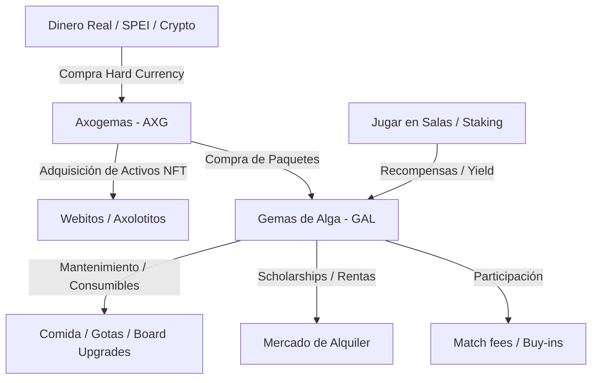

# Game Design Document (GDD) - Axolotto

Axolotto es un juego de lotería play-to-earn y bot-friendly desarrollado con Next.js (frontend), FastAPI (backend), PostgreSQL (base de datos) y smart contracts integrados en blockchain (EVM). Los jugadores crían Axolotitos, arman tableros personalizados de lotería con cartas coleccionables, los rentan o los ponen en staking para obtener rendimientos pasivos, y envían a sus Axolotitos a competir automáticamente en salas de juego para ganar recompensas en tiempo real.

---

## 1. Bucle Central y Economía Dual

El juego se rige por un bucle económico cerrado que equilibra la inyección de capital real con el esfuerzo de juego (grinding):

### Monedas del Juego

1.  **Axogemas (AXG) — Moneda Premium "Hard":**
    *   **Propósito:** Representa el valor externo y protege contra la inflación del juego.
    *   **Obtención:** Comprada con dinero real (Fiat o Crypto).
    *   **Usos:** Compra de activos permanentes (Webitos/Eggs, Tablas Premium NFT, slots permanentes de nidos/tablas) y paquetes de Gemas de Alga en la tienda.
2.  **Gemas de Alga (GAL) — Moneda de Utilidad "Soft":**
    *   **Propósito:** Combustible del bucle de juego activo.
    *   **Obtención:** Jugando partidas de lotería, ganando Jackpots, cobrando rentas o mediante el staking pasivo de tableros.
    *   **Usos:** Pago de inscripciones a salas (Buy-ins), compra de alimentos consumibles (Pellets, Brine Shrimp), desmontaje de tablas, tarifas de alquiler, y consumibles comunes del criadero.

### Paquetes de Intercambio (Cambio AXG a GAL)
Para facilitar la conversión a los jugadores que desean avanzar más rápido, el banco de Axolotto ofrece paquetes de GAL comprados con AXG:
*   **Paquete Alga Común:** 10 AXG ➔ 100 GAL
*   **Paquete Alga Abundante (+20% gratis):** 50 AXG ➔ 600 GAL
*   **Paquete Alga Imperial (+50% gratis):** 100 AXG ➔ 1,500 GAL
*   **Súper Carga de Alga (+60% gratis):** 250 AXG ➔ 4,000 GAL

---

## 2. Axolotitos (Personajes)

Los Axolotitos nacen de Webitos (huevos) incubados mediante cuidados diarios. Tienen características físicas únicas (genes) y estadísticas funcionales que determinan su desempeño en el juego.

### Estados del Axolotito
*   `"idle"` (Disponible): Listo para jugar, ser alimentado o dormir.
*   `"playing"` (En Juego): Participando activamente en una partida o encolado en un lobby multijugador.
*   `"sleeping"` (Durmiendo): Recuperando energía en un cooldown de sueño.
*   `"waiting_settlement"` (Listo para Reporte): El bot del Axolotito ha terminado su ciclo de juego (por límites o falta de fondos/energía) y espera a que el jugador haga el corte de caja.

### Atributos Físicos (Genes)
Piel, Branquias, Ojos, Expresión, Aleta, Marca y Extremidades. El color de la piel y los tipos de rasgos se guardan on-chain como un DNA de tipo `uint256`.

### Estadísticas Funcionales
*   **Salinidad (Salinity):** Factor de mala suerte en las partidas.
*   **Suerte (Luck):** Aumenta el multiplicador de premios críticos y probabilidades de drops raros.
*   **Concentración (Focus):** Reduce la probabilidad de que el Axolotito pierda de vista una carta cantada durante el juego (evita fallos de marcado).
*   **Estamina (Stamina):** Determina su capacidad máxima de energía.
*   **Carisma (Charisma):** Otorga descuentos en la tienda del criadero.
*   **Agilidad, Sabiduría y Fuerza:** Resistencia ante inclemencias climáticas de la incubadora y eventos negativos en salas avanzadas.

---

## 3. Tableros de Lotería (Tablas)

Los tableros son cuadrículas de 4x4 formadas por 16 cartas únicas del catálogo maestro de 54 cartas.

*   **Creación:**
    *   *Tabla Aleatoria*: Cuesta **25 GAL**. Toma 16 cartas al azar del inventario.
    *   *Diseño Manual*: Cuesta **50 GAL**. Permite posicionar las cartas de forma personalizada.
*   **Staking Pasivo:** Los tableros que no están en juego pueden ponerse en staking para generar GAL/hora. A mayor nivel del tablero (ganado con XP por jugar), mayor es la tasa de retorno de GAL.
*   **Desarmado (Burn/Dissolve):** Cuesta **50 GAL** y destruye de forma aleatoria 1 carta de las 16 del tablero. Las 15 restantes regresan al inventario.
*   **Mercado de Becas (Scholarships):** Los dueños de tableros pueden rentarlos en el mercado fijando un costo en GAL y un porcentaje de distribución de premios por victoria durante un período fijo de 24 horas.

---

## 4. Modo de Juego Multijugador (Lotería en Tiempo Real)

El juego simula partidas de lotería tradicional mexicana de forma automatizada por bots utilizando los tableros equipados por los Axolotitos.

### Estructura de Lobbies y Matchmaking
*   **Cupo de Salas:** Cada sala se limita a un máximo de **30 tableros** para mantener equilibradas las probabilidades y duración de la partida.
*   **Matchmaking Timeout:** Una vez que se inscribe el primer tablero, se inicia un temporizador de 30 segundos. Si expira el tiempo y hay al menos 4 tableros inscritos, la partida inicia de inmediato.
*   **Relleno con Bots:** Si al expirar el tiempo hay menos de 4 tableros humanos inscritos, el sistema genera tableros virtuales (bots de relleno) hasta completar un mínimo de 4 para que la partida pueda arrancar.

### Distribución de la Bolsa de Premios (Pots)
Por cada partida, la bolsa total acumulada por las cuotas de entrada (ej: 30 tableros * 10 GAL = 300 GAL) se distribuye de la siguiente forma:
*   **Premio 1 (Hito 1 - Línea o Cuadrito):** **35%** de la bolsa total. Se entrega al primer tablero en marcar una línea de 4 cartas (horizontal, vertical, diagonal) o un "cuadrito" de 2x2 casillas adyacentes.
*   **Premio 2 (Hito 2 - Tabla Llena):** **55%** de la bolsa total. Se entrega al primer tablero en marcar sus 16 casillas. Finaliza la partida.
*   **Jackpot de Oro:** **5%** se acumula en un pozo común global.
*   **Comisión de la Casa (Tesorería):** **5%** se destina a la tesorería del juego para financiar el re-sembrado del Jackpot.

### El Jackpot de Oro (El "Golpe" de Suerte)
Es un acumulado global que inicia con una semilla de **1000 GAL**.
*   **Activación:** Se gana si un jugador real logra completar el Hito 1 (Línea o Cuadrito) en tiempo récord: **dentro de las primeras 4, 5 o 6 cartas cantadas**.
*   **Restricción de Bots:** Solo los Axolotitos de jugadores humanos pueden reclamar el Jackpot. Si lo hace un bot, el pozo no se activa y continúa acumulándose.
*   **Filtro Humano:** Para evitar abusos, la partida debe contar con al menos **5 tableros humanos pertenecientes a un mínimo de 2 jugadores diferentes**.
*   **Distribución:** El ganador reclama el **90%** del pozo. El **10%** restante se queda como semilla del siguiente pozo. Si la semilla remanente es inferior a 1000 GAL, se rellena desde la Tesorería.

---

## 5. Ciclo de "Liquidación y Agradecimiento" (Settlement)

Cuando un Axolotito está jugando en segundo plano (bot-play), su sesión se detiene y entra en `"waiting_settlement"` cuando:
1.  Alcanza su **Límite de Pérdidas (Stop-Loss)**.
2.  Alcanza su **Límite de Ganancias (Take-Profit)**.
3.  Se queda sin energía (menor a 10 puntos) o sin fondos suficientes en su depósito de custodia para pagar la siguiente inscripción.

### Flujo de Reporte:
*   En la interfaz, el Axolotito aparece marcado como **"¡Listo para Reporte!"**.
*   El jugador hace clic y se despliega una boleta con estadísticas completas del rendimiento neto de GAL y XP ganada.
*   El jugador hace clic en **"¡Gracias por el esfuerzo! ❤️"**:
    *   Los GAL acumulados en el depósito de custodia (`escrow_balance_gal`) se transfieren de vuelta a la cartera del usuario.
    *   El Axolotito recibe **Puntos de Lealtad (Loyalty Points)** (5 puntos base + 1 punto extra por cada 10 GAL de ganancia neta).
    *   El Axolotito se va a dormir (`"sleeping"`) para restaurar su energía al 100%.

---

## 6. Lista de Pendientes (Roadmap Checklist)

### 🚀 Fase 1: Sincronización y Feedback en Tiempo Real (En desarrollo por Claude Code)
- [x] Crear tabla/modelo `MultiplayerGameLog` para registrar los resultados de partidas individuales off-chain.
- [x] Integrar escritura de logs en `simulate_multiplayer_match` calculando costos, premios y ganancias netas de cada Axolotito humano.
- [x] Crear el endpoint de FastAPI `GET /unread-logs` para consumir y marcar notificaciones como leídas.
- [x] Crear el endpoint de FastAPI `GET /activity` para obtener el historial global de compras en la tienda.
- [x] Implementar polling rápido (4s) en el frontend para el stock de tienda y feed de compras (FOMO).
- [x] Diseñar Toasts premium neón flotantes en el frontend para alertar sobre el regreso de Axolotitos (Victorias/Derrotas).

### 💰 Fase 2: Compra de Paquetes de GAL con AXG (Divisas)
- [x] Modificar enum `ItemType` para incluir `CURRENCY_PACK`.
- [x] Actualizar script `seed_catalog.py` para sembrar los 4 paquetes de GAL (Común, Abundante, Imperial, Súper Carga).
- [x] Modificar la función `buy_item` en `shop_service.py` para procesar intercambios de moneda:
  - [x] Validar pago en AXG y realizar la quema on-chain (`burn_axogemas`).
  - [x] Acreditar GAL correspondientes a la cartera del usuario y acuñarlas on-chain (`mint_gal`).
  - [x] Registrar movimiento en el Ledger y evitar inserciones en `PlayerInventory`.
- [x] Crear la sección **"Banco de Algas (Intercambio)"** en la interfaz de la tienda (`Store.tsx`) con diseño neon y porcentajes de bono.

### 🛡️ Fase 3: Despliegue Local e Integración Solidity (Foundry/Anvil)
- [x] Configurar Foundry en el directorio `contracts/` y crear `foundry.toml`.
- [x] Programar contratos maestros de tokens:
  - [x] `GemaAlga.sol` (ERC-20 de juego)
  - [x] `Axogema.sol` (ERC-20 premium)
  - [x] `Webitos.sol` (ERC-721 con metadatos de fase)
  - [x] `Axolotitos.sol` (ERC-721 con DNA de rasgos e historial de stats)
  - [x] `CartasLoteria.sol` (ERC-1155, 54 cartas)
  - [x] `TablasLoteria.sol` (ERC-721 con layout de 16 cartas en escrow)
  - [x] `Consumables.sol` (ERC-1155, comida y lámparas)
- [x] Programar orquestador `GameController.sol` con permisos de acuñado/quema sobre los contratos de tokens.
- [x] Refactorizar `web3_service.py` en Python para cargar ABIs dinámicamente y realizar llamadas on-chain reales en Anvil.
- [x] Configurar orquestación de simulación limpia levantando y matando procesos de Anvil en background en `simulate_universe.py`.

### 👥 Fase 4: Salas Multijugador Completas y Lobbies Reactivos
- [x] Implementar la vista del lobby multijugador (`MultiplayerLobby.tsx` en frontend) conectada al endpoint `/lobby`.
- [x] Mostrar visualmente los Axolotitos sentados en las mesas y los temporizadores de matchmaking descendentes.
- [x] Diseñar el panel animado del Jackpot de oro, mostrando la bolsa acumulada y el historial de últimos ganadores reales.
- [x] Agregar vista interactiva detallada para el historial de partidas pasadas de los Axolotitos del jugador.

### 🏪 Fase 5: Mercado P2P de Renta/Venta y Gashapón de Accesorios
- [x] Modificar base de datos (`PlayerBoard` y `Axolotito`) para soportar banderas de venta (`is_listed_for_sale`, `sale_price_gal`).
- [x] Crear la entidad `PlayerAccessory` en base de datos para registrar los gorritos, lentes y ropa de los Axolotitos (mapeado de forma integrada a `PlayerInventory` y catálogo de accesorios).
- [x] Modificar smart contracts `TablasLoteria.sol` y `Axolotitos.sol` con funciones de transferencia administrativa (`transferBoard`/`transferAxolotito`) por el controller.
- [x] Crear endpoints en FastAPI para publicar, cancelar y comprar en el mercado P2P de Tablas, Axolotitos, Cartas y Accesorios.
- [x] Implementar el endpoint del Gashapón `/gashapon/roll` consumiendo GAL para otorgar accesorios aleatorios.
- [x] Rediseñar la sección de Mercado en el frontend (`Store.tsx` ampliado con la pestaña "Mercado P2P" y "Gashapón" desbloqueado en el hub inferior de navegación) para soportar tanto Renta por días como Venta definitiva de Tablas y Axolotitos con estética premium.
- [x] Permitir la compra/venta de Boosters sellados en el mercado (Resuelto: los boosters se auto-abren instantáneamente al comprarse para asegurar flujo de cartas, evitar el hoarding y mantener la velocidad de circulación).

### ⛓️ Fase 6: Confirmación de Blockchain en todo el Flujo
- [x] Ejecutar la simulación completa de eclosión, transacciones, acuñamiento de cartas y jugabilidad off-chain/on-chain en Anvil sin errores.
- [ ] Expandir el script de simulación para verificar transferencias on-chain de NFT en la venta y renta de Axolotitos/Tablas en el mercado secundario.

---

## 7. Propuestas de Gamificación y Experiencia Master

Para llevar a Axolotto a un nivel premium y adictivo, se proponen las siguientes mecánicas avanzadas de diseño de juego:

### A. Rarezas Visuales y Cartas Brillantes (Foil Cards)
*   **Mecánica:** Introducir una probabilidad (ej. 3%) de que al abrir un sobre, una carta sea **Brillante / Holográfica** (con un efecto visual de sombreador CSS de arcoíris brillante).
*   **Gamificación:** Los tableros que contengan cartas brillantes obtienen un bonus permanente al yield de Staking de GAL (+5% por carta brillante en el tablero, acumulable hasta +80%). Esto fomenta el coleccionismo y la búsqueda de cartas en el mercado secundario.

### B. Personalidades de Axolotitos (Character Natures)
*   Al nacer un Axolotito, se le asigna una personalidad aleatoria que modifica levemente su comportamiento en las simulaciones:
    *   **Metódico:** +15% Focus (menos fallos de marcado), pero consume 10% más energía por partida.
    *   **Suertudo:** +15% Suerte (mayor probabilidad de premios críticos), pero reduce un 5% su agilidad.
    *   **Hiperactivo:** Recupera energía 20% más rápido al dormir, pero tiene 10% de probabilidad de fallar cartas (Focus).
*   *Efecto:* Aporta profundidad táctica. Los jugadores buscarán emparejar Axolotitos "Metódicos" con salas de dificultad alta (Fosa del Campeón) y Axolotitos "Suertudos" para recolectar GAL en salas fáciles.

### C. Sistema de Crafteo y Fusión (Card Melter)
*   **Mecánica:** Permitir quemar cartas duplicadas comunes de baja demanda junto con una tarifa en GAL para crear cartas de mayor rareza (ej. 5 cartas Comunes + 20 GAL ➔ 1 carta Rara aleatoria).
*   **Gamificación:** Funciona como un excelente sumidero de GAL y de cartas comunes, manteniendo saludable el mercado y evitando la devaluación de las cartas básicas.

### D. Misiones Diarias y Retos Express (Daily Bounties)
*   Un tablero diario de 3 misiones rápidas, por ejemplo:
    1.  *Alimenta a tu Axolotito 2 veces con Brine Shrimp.* (Recompensa: 10 GAL)
    2.  *Inscribe un Axolotito en la Fosa del Campeón.* (Recompensa: 15 GAL)
    3.  *Marca 100 cartas en total hoy.* (Recompensa: 1 fragmento de carta Rara)
*   *Efecto:* Aumenta el índice de retención diaria (D1/D7) obligando al usuario a interactuar con el criadero y la tienda con regularidad.

### E. Clima y Plagas en el Criadero (Hatchery Disasters)
*   **Mecánica:** De forma aleatoria, el criadero puede sufrir condiciones climáticas extremas en el servidor (ej: "Ola de Frío" o "Infección de Alga Tóxica").
*   **Gamificación:** Los Webitos en incubación ralentizan su progreso o pierden pureza genética si no se les protege. Aquí es donde entran los consumibles protectores como las **Gotas Anti-Escarcha** o la **Lámpara Infrarroja Pro** (comprada con AXG). Esto crea urgencia y estimula el uso estratégico de consumibles.
