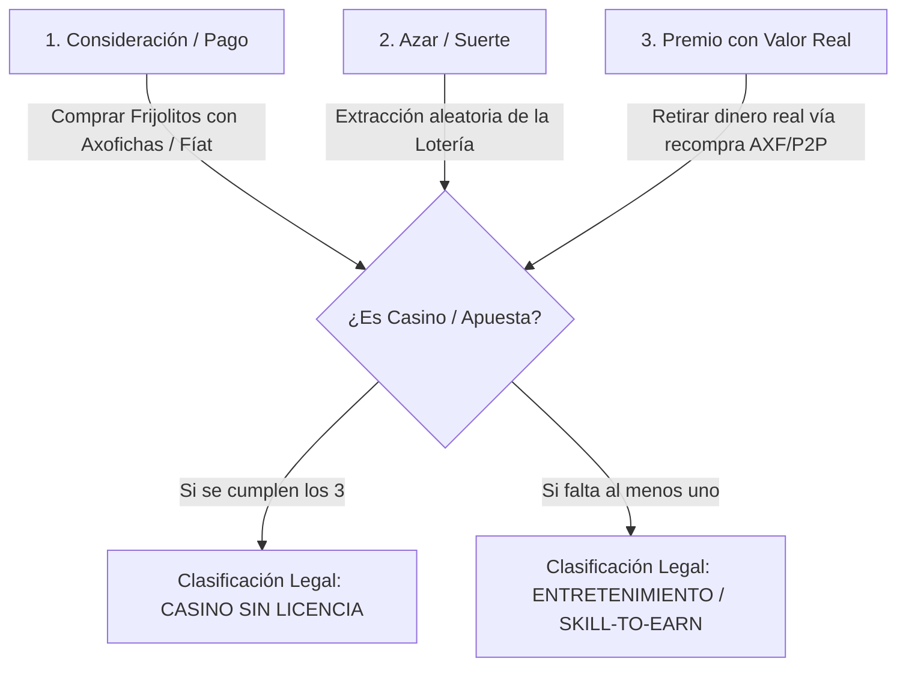

# Plan de Pivote Económico y Legal: Transición de Casino a Modelo F2P y Staking

> [!IMPORTANT]
> **DOCUMENTO DE TRABAJO ESTRATÉGICO**
> Este documento describe la transición del ecosistema de **Axolotto** para remover el riesgo legal de clasificación como casino/apuesta ante la SEGOB y la CNBV (México) y reguladores internacionales. Se mantendrá actualizado conforme avancen nuestras discusiones.

---

## 1. Confirmación de Blindaje Legal y el Loop de Ganancia F2P

La principal vulnerabilidad de Axolotto en su diseño previo residía en la coexistencia de los tres elementos que definen legalmente un **Juego de Azar y Apuesta (Gambling)**:

### ¿Por qué este cambio nos libra de problemas legales?

Al **eliminar por completo la compra directa de Frijolitos (FRJ) usando Axofichas (AXF)** (dinero real / token premium), rompemos el pilar de la **Consideración (Pago)** en el bucle del azar:

1. **Sin Consideración:** El jugador no puede depositar dinero real para "comprar fichas de juego" (Frijolitos). Los Frijolitos se vuelven una **moneda blanda de juego (Soft Currency)** que solo se obtiene jugando, por lealtad (Daily Claim), o por staking pasivo de activos NFT previamente poseídos.
2. **El Loop F2P de Earning Real (Modelo DevEx):** 
   * Los jugadores F2P usan sus Frijolitos gratuitos (diarios y de misiones) para jugar a la lotería básica y ganar más Frijolitos.
   * Usan esos Frijolitos en el **Gashapón** para obtener ítems consumibles o **cosméticos/cartas raras**.
   * Venden estos ítems raros en el **Marketplace P2P** a cambio de **Axofichas (AXF)** a otros jugadores que quieren optimizar su juego o coleccionar.
   * Finalmente, el jugador F2P solicita el Cash-Out de esas Axofichas acumuladas de vuelta a Fíat o Stablecoins.
   
> [!TIP]
> **Veredicto Legal:** Este loop es idéntico al modelo de **Roblox (DevEx)** y **Steam (Community Market)**. Al ser un comercio secundario de bienes virtuales entre usuarios, la plataforma no actúa como casino sino como un intermediario comercial. Rompe completamente la clasificación de juego de azar.

---

## 2. Límites de Uso de Frijolitos vs. Axofichas: ¿Qué se puede comprar con qué?

Para asegurar la sostenibilidad económica y mantener el blindaje legal intacto, definimos claramente qué se puede adquirir con Frijolitos (Soft Currency) y qué con Axofichas (Premium Currency):

### A. ¿Es legal comprar Boosters, Webitos o usar el Marketplace con Frijolitos?
**Sí, es 100% legal.** El uso de Frijolitos para comprar estos ítems no infringe la ley porque:
* El jugador **no puede comprar Frijolitos con dinero real**. Por lo tanto, cualquier adquisición realizada con Frijolitos proviene puramente del "tiempo y esfuerzo" del jugador (esfuerzo F2P).
* Al igual que en *World of Warcraft* o *Hearthstone*, comprar un sobre de cartas o un ítem con oro del juego (obtenido gratis) es una mecánica estándar de videojuego y no un juego de azar regulado por SEGOB.

### B. Distribución del Catálogo y Formas de Pago

| Ítem / Actividad | ¿Se compra con FRJ? | ¿Se compra con AXF? | Razón de Diseño / Estatus Legal |
|---|---|---|---|
| **Jugar Lotería** | **Sí** | No | **Obligatorio para Legalidad.** Solo se permite apostar/jugar con FRJ para evitar el elemento de "Consideración". |
| **Gashapón** | **Sí** | No | Se utiliza como el sumidero (sink) principal de Frijoles para F2P. |
| **Sobres (Boosters)** | **Sí** (Precio alto) | **Sí** (Precio base) | Legal con ambos. Permite que los F2P consigan cartas con Frijoles y que los compradores de AXF aceleren su colección. |
| **Webitos (Eggs / NFT)** | No | **Sí** | **Exclusivos de AXF.** Los Webitos fundan el criadero y son la base del valor NFT. Limitarlo a AXF mantiene su escasez y valor comercial. |
| **Marketplace P2P** | **Sí** (Barter) | **Sí** (Earning) | Legal con ambos. Los jugadores pueden listar sus Axolotitos o Tablas a cambio de FRJ o AXF. Los F2P listarán por AXF para retirar dinero real. |
| **Cosméticos y Aspectos** | **Sí** | **Sí** | Compra directa de skins y complementos cosméticos. |
| **Membresías VIP** | No | **Sí** | Producto de suscripción premium comprable solo con AXF. |

---

## 3. El Nuevo Modelo de Emisión de Frijolitos (FRJ)

Rediseñaremos las fuentes de emisión de Frijolitos para que dependan del **tiempo, la lealtad y los activos del jugador**:

### A. Recompensas por Entrar a Jugar (Daily Login Rewards)
Diariamente, los jugadores recibirán una dotación de Frijolitos gratis simplemente por iniciar sesión. Esto asegura que todos puedan jugar un poco cada día de forma gratuita.
* **Jugadores Gratuitos (F2P):** **+15 FRJ diarios** (suficiente para jugar 1-2 partidas básicas).
* **Bono de Racha (Streak):** Incrementar +5 FRJ adicionales por cada día consecutivo de login (hasta un tope de +30 FRJ/día en el día 7). Si se interrumpe, vuelve a iniciar en 15 FRJ.

### B. Staking de Tablas (Tablas Activas) y Topes de Staking
* **Fórmula Actual:** $\text{FRJ/hora} = (\sum \text{Bono Rareza de Cartas}) \times (1 + \frac{\text{Nivel Tabla}}{10})$
* **Valores por Carta:** Común (+0.05), Rara (+0.15), Épica (+0.40), Legendaria (+1.00).

> [!IMPORTANT]
> **Tope de Staking en Tablas (Cap de 24 Horas):**
> Para obligar a los jugadores a iniciar sesión de manera constante, las tablas tendrán un límite de almacenamiento de recompensas de **24 horas**. Si el jugador no reclama sus Frijolitos acumulados en ese plazo, la tabla **deja de acumular yield** hasta que se libere el espacio reclamando.

### C. Nuevo Staking de Axolotitos y Topes de Staking
Proponemos añadir un sistema donde los Axolotitos generen Frijolitos pasivamente mientras estén en estado `"studying"` o `"resting"` en el Cenote (Cueva). La recompensa por hora dependerá de la **rareza de su piel (skin)**, el nivel y sus partes:

$$\text{FRJ/hora (Axolotito)} = \text{Multiplicador Skin} \times \left(1 + 0.1 \times \text{Nivel}\right) + \sum \text{Bono Partes}$$

#### 1. Multiplicador de Skin (Color de Piel)
* Común (Pink, Gray): **0.05 FRJ/h**
* Rara (Cyan, Purple): **0.15 FRJ/h**
* Épica (Neon, Coral): **0.40 FRJ/h**
* Legendaria (Gold): **1.00 FRJ/h**
* Astral (Astral): **2.50 FRJ/h**

> [!IMPORTANT]
> **Tope de Staking en Axolotitos (Cap de 12 Horas):**
> Los Axolotitos tendrán un límite de acumulación de **12 horas**. Esto incentiva a los usuarios a entrar al menos dos veces al día para reclamar sus recompensas y mantener sus axolotitos activos y produciendo.
>
> **Slots Disponibles** = $\text{cave\_level} + 1$ (ej. nivel 1 tiene 2 slots, nivel 5 tiene 6 slots). Esto incentiva el uso de Axofichas (AXF) para expandir la cueva.

---

## 4. Prevención de Abuso y Multi-Cuentas (Anti-Sybil)

Dado que un jugador está limitado a un máximo de **7 u 8 Axolotitos por cuenta** (tope de espacio de la cueva), existe el riesgo de que intente crear 50 o 100 cuentas "bomba/granjas" gratuitas para explotar el Staking de Axolotitos comunes (1-2 por cuenta) o los Daily Claims. Para evitar esto, implementaremos las siguientes reglas estrictas de control:

1. **Requisito de Actividad (Play-to-Stake):**
   El Staking (tanto de Tablas como de Axolotitos) **solo se mantendrá activo si el usuario ha completado al menos 1 partida de Lotería en las últimas 24 horas**. Si la cuenta se vuelve inactiva, la acumulación de staking se congela a las 24 horas del último gameplay y no vuelve a activarse hasta que jueguen otra partida.
2. **Tope de Desbloqueo del Marketplace (Nivel 3+):**
   Las cuentas nuevas tienen prohibido listar ítems a la venta en el Marketplace P2P. Deben completar el tutorial, jugar al menos 5 partidas y alcanzar el **Nivel de Cuenta 3** para poder vender. Esto desalienta a bots automatizados que transfieren ítems instantáneamente.
3. **KYC / Verificación de Umbral de Retiro:**
   Cualquier cuenta que acumule un retiro acumulado mayor a 50 AXF (equivalente a ~$10 USD) requerirá una verificación de número telefónico único (SMS) o verificación de identidad (KYC) básica. Esto previene que una sola persona retire ganancias de docenas de cuentas granja.

---

## 5. Ventajas para VIPs y Compradores de Axofichas (AXF)

El juego debe seguir siendo rentable. Los usuarios que compren Axofichas o adquieran el VIP Club tendrán ventajas significativas para conseguir Frijolitos, pero de forma **indirecta y legal** (compra de servicios y activos, no de fichas de casino):

### A. Limitar el Premio Diario VIP ("Use it or Lose it")
Como modificación a la propuesta original, **el premio diario VIP ya no se acumula hasta por 2 días**. 
* **Regla Estricta:** El claim diario VIP expira a la medianoche UTC de cada día. Si el usuario no inicia sesión y reclama su bono en ese día, los Frijolitos correspondientes a ese día se pierden permanentemente. Esto incrementa drásticamente la retención y la disciplina de login diario para los suscriptores.

### B. Propietarios de Activos Raras (Compradores de Webitos/Boosters con AXF)
Los jugadores que usan AXF para comprar Webitos (Eggs) y Boosters de cartas obtienen cartas y axolotitos legendarios/épicos. Estos activos, al ser stakeados, generan pasivamente una cantidad de Frijolitos drásticamente superior a la de un usuario gratuito. 

### C. Multiplicadores y Boosters de Staking (AXF)
Implementar items consumibles en la tienda comprables únicamente con AXF que aceleran el staking temporalmente:
* **"Super-Alimento de Cenote" (Cuesta 10 AXF):** Duplica la generación de Frijolitos de todos los Axolotitos stakeados durante 24 horas.
* **"Solvente de Fricción" (Cuesta 15 AXF):** Aumenta +25% el yield de staking de tablas por 3 días.

---

## 6. Plan de Acción Técnico para el Pivote

Para ejecutar esta reestructuración, dividiremos el trabajo en 4 fases de código:

### Fase 1: Desactivar los Paquetes de Divisas (AXF a FRJ)
* **Acción:** Marcar como inactivos (`is_active = False`) los ítems `"Paquete Alga Común"`, `"Paquete Alga Abundante"`, `"Paquete Alga Imperial"` y `"Súper Carga de Alga"` en `seed_catalog.py`.
* **API:** Asegurar que si un usuario intenta llamar a `/shop/buy` con un item de tipo `CURRENCY_PACK`, el servidor retorne un error de prohibición legal.

### Fase 2: Implementación de Recompensas Diarias Base (Daily Logins) y Ajuste VIP
* **Acción:** Crear un servicio `DailyRewardService` que gestione un login diario para usuarios F2P.
* **Acción:** Modificar el scheduler diario de VIP para eliminar la acumulación de 2 días. El valor de `vip_pending_gal` (ahora `vip_pending_frj`) se reiniciará/sobreescribirá cada medianoche si no fue reclamado.
* **API:** Crear endpoint `/api/v1/rewards/daily-claim` para que usuarios no-VIP reclamen su racha diaria de Frijolitos.

### Fase 3: Staking de Axolotitos con Topes y Play-to-Stake
* **Acción:** Agregar lógica en `Axolotito` para rastrear su estado de staking, calcular su acumulación de Frijolitos por hora y congelar la producción si llega a las **12 horas acumuladas**.
* **DB:** Agregar columna `last_staking_claim` y `accrued_unclaimed` en la tabla `Axolotito`.
* **Play-to-Stake:** Al momento de calcular el yield acumulado, verificar que `last_played_at >= datetime.utcnow() - timedelta(hours=24)`. Si no cumple, detener la acumulación.

### Fase 4: Cambios en el Frontend (UI/UX)
* **Acción:** Eliminar los paquetes de algas/frijoles de la tienda.
* **Acción:** Diseñar el panel de Staking de Axolotitos en el Cenote con el indicador de límite de 12 horas.
* **Acción:** Diseñar el botón de "Reclamar Frijoles Diarios" en la pantalla principal para usuarios F2P.
