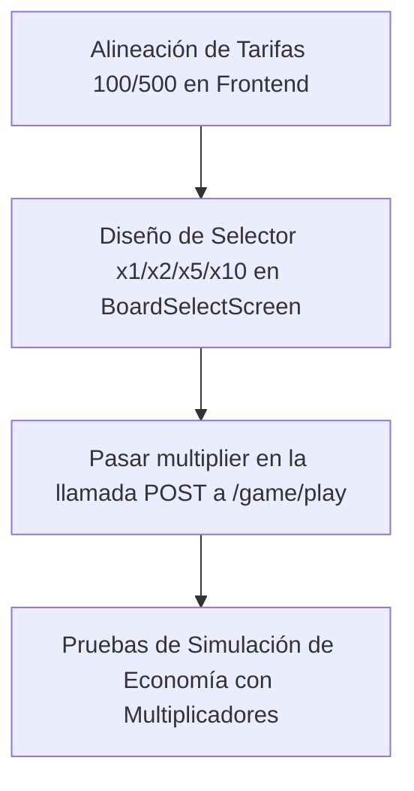

# Análisis de Apuestas Variables y Balance Económico (Juego vs CPU)

Este reporte evalúa la propuesta de introducir apuestas variables en las partidas contra la CPU de **Axolotto**, analiza el impacto que tendría en la economía del juego (AXF/FRJ), y propone soluciones para la discrepancia actual en las tarifas de las salas (100/500 FRJ en backend vs. 10/50 FRJ en frontend).

---

## 1. Discrepancia en Tarifas de Salas (100/500 vs. 10/50)

### El Estado Actual
Actualmente, existe un desacoplamiento entre el backend y el frontend:
* **Backend (`backend/app/core/prices.py`):** Define las tarifas de entrada y los premios con valores de:
  * **Rookie (Novatos):** Entrada `100.0 FRJ` | Victoria `160.0 FRJ` | Consolación `20.0 FRJ`.
  * **Champion (Campeones):** Entrada `500.0 FRJ` | Victoria `2900.0 FRJ` | Consolación `50.0 FRJ`.
* **Frontend (`frontend/components/screens/BoardSelectScreen.tsx`):** Muestra al usuario:
  * **Rookie:** Entrada `10 FRJ` | Victoria `16 FRJ`.
  * **Champion:** Entrada `50 FRJ` | Victoria `290 FRJ`.

### Análisis y Recomendación
1. **El modelo económico del backend (100/500) es el correcto:**
   * La economía secundaria está diseñada con escalas de miles de Frijolitos (ej. el Kit de Bienvenida otorga `1000 FRJ`, un Booster Foil cuesta `800 FRJ`, un alimento común cuesta `30 FRJ` y los giros de Gashapón van de `1,500` a `22,500 FRJ`).
   * Si las salas cobraran `10` y `50` FRJ, la jugabilidad de la lotería sería virtualmente gratuita e infinita, ignorando los sumideros (sinks) de la economía de juego. Además, los premios de victoria (`16 FRJ`) no alcanzarían ni para comprar un alimento común (`30 FRJ`), rompiendo el ciclo de juego.
2. **Propuesta:** Actualizar el frontend para reflejar fielmente las tarifas de entrada del backend (**100 FRJ** y **500 FRJ**) con sus premios correspondientes (**160 FRJ** y **2900 FRJ**).

---

## 2. Viabilidad de Apuestas Variables vs. CPU

La idea de permitir apuestas variables es **excelente y viable**, ya que aumenta la diversión, recompensa a los jugadores más experimentados y aprovecha la infraestructura técnica que ya existe.

### La infraestructura del Backend ya está lista
El endpoint `/game/play` y el servicio `GameService.play_match` ya soportan un campo `multiplier` en la solicitud del cliente:
```python
if multiplier not in (1, 2, 5, 10):
    raise HTTPException(status_code=400, detail="Multiplicador no soportado...")
```
Este multiplicador escala linealmente la tarifa de entrada, el premio de victoria y el de consolación:
```python
entry_fee        = room["fee"] * multiplier
win_prize        = room["prize"] * multiplier
loss_consolation = room["consolation"] * multiplier
```

### El Peligro de Apuestas Libres (Inputs Arbitrarios)
**No se debe permitir que el jugador ingrese cualquier cantidad arbitraria para apostar** (ej. "Apostar 23,450 FRJ"). Permitir esto expone la economía a dos vulnerabilidades graves:
1. **Ataques de Racha de Suerte (Lucky Streak):** Un jugador con un Axolotito de alto nivel y estadística de concentración al máximo (`Focus = 100%`) tiene una probabilidad de ganar de **71% en Rookie (1v1)** y **21.8% en Champion (1v5)**. Esto genera un **House Edge negativo (ventaja del jugador)** de `-19.4%` y `-34.2%` respectivamente.
2. **Hiperinflación de FRJ:** Si un jugador con ventaja matemática apuesta cantidades masivas en una racha ganadora, el sistema acuñará (mint) cientos de miles de FRJ en minutos (ya que las ganancias de lotería se emiten vía `mint_gal` en la blockchain). Esto devaluaría la moneda blanda, saturaría el Gashapón y desestabilizaría el valor de los NFT en el mercado P2P.

### Recomendación de Diseño
* **Limitar a Multiplicadores Fijos:** Mantener los multiplicadores definidos por el backend (`1x, 2x, 5x, 10x`). 
* **UI Premium en Frontend:** Implementar un selector visual elegante en la pantalla de selección de tabla, permitiendo elegir el multiplicador de la apuesta (por ejemplo, con chips deslizables o botones segmentados `x1, x2, x5, x10`).

---

## 3. Impacto Económico y Payouts Máximos

### Simulación de Premios con Multiplicador `10x`

| Sala | Entrada Base | Entrada 10x | Premio Base (1x) | Premio Máx (1x)* | Premio Base (10x) | Premio Máx (10x)* |
|---|---|---|---|---|---|---|
| **Rookie** | 100 FRJ | 1,000 FRJ | 160 FRJ | 264 FRJ | 1,600 FRJ | **2,640 FRJ** |
| **Champion** | 500 FRJ | 5,000 FRJ | 2,900 FRJ | 4,785 FRJ | 29,000 FRJ | **47,850 FRJ** |

*\* El Premio Máximo incluye los multiplicadores de racha de victorias (streak) y bonos de suerte, topado en $1.65\times$ del premio base por código en el backend.*

### Análisis de Riesgo
Un premio máximo de **47,850 FRJ** en Champion `10x` es un monto extremadamente grande (equivale a **124 días** de staking pasivo ininterrumpido de una tabla legendaria completa). 

Para balancear este riesgo, contamos con los siguientes mitigadores naturales y de diseño:
1. **Riesgo Proporcional:** Para ganar un premio de 10x, el jugador debe arriesgar `5,000 FRJ`. Si pierde (lo cual ocurre el 78.2% de las veces incluso para un experto), solo recibe una consolación de `500 FRJ`, resultando en una **pérdida neta de 4,500 FRJ**.
2. **Capacidad de Energía:** Las partidas contra la CPU consumen **10 puntos de energía** del Axolotito (esto no escala con el multiplicador). Por lo tanto, un Axolotito está limitado a 10 juegos antes de necesitar dormir (cooldown de tiempo) o comer (lo que cuesta FRJ y AXF en la tienda).
3. **Escalado de Experiencia (XP) acelerado:** Actualmente, la XP escala linealmente (`win_xp_axo * multiplier`). Esto significa que un juego de 10x otorga `500 XP` al Axolotito y `400 XP` a la tabla, subiéndolos de nivel casi instantáneamente.
   * *Recomendación:* Considerar hacer que la ganancia de XP de las tablas y los Axolotitos sea sub-lineal (ej. `XP = XP_base * sqrt(multiplier)` o un límite diario) para evitar progresiones instantáneas no deseadas.

---

## 4. Plan de Acción y Tareas de Implementación

Hemos registrado la tarea de planificación en el Taskboard (**`task-1780759181-23`**). A continuación, se detalla el plan de acción para las fases subsiguientes:



### Cambios Requeridos
1. **Frontend - Actualización de Tarifas y Premios (`BoardSelectScreen.tsx`):**
   * Cambiar los valores de visualización de Rookie de `10 / +16` a `100 / +160`.
   * Cambiar los valores de visualización de Champion de `50 / +290` a `500 / +2900`.
2. **Frontend - Selector de Apuestas (`BoardSelectScreen.tsx` y `PlayMode.tsx`):**
   * Crear un estado para `multiplier` en `PlayMode.tsx` (default: 1).
   * Renderizar un componente de control segmentado (chips) para elegir `1x, 2x, 5x, 10x`.
   * Mostrar de forma dinámica la tarifa y premio final calculados: `Tarifa x Multiplicador` y `Premio x Multiplicador`.
3. **Frontend - Payload de API (`CpuSimScreen.tsx`):**
   * Modificar la petición POST de `/game/play` para incluir el `multiplier` seleccionado por el usuario en lugar de omitirlo.
4. **Backend - Ajuste en XP (Opcional - Balance Económico):**
   * Modificar la asignación de XP en `game_service.py` si se prefiere evitar la nivelación instantánea a altos multiplicadores.
