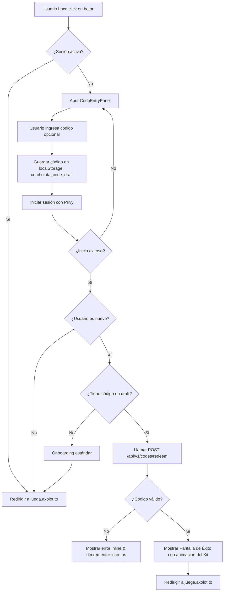

# Plan de Implementación: Flujo Corcholata (Landing Page & Onboarding)

Este documento describe el plan para implementar el **Flujo de Corcholata** física para el landing page de Axolotto, permitiendo a nuevos usuarios unirse al juego reclamando un kit de bienvenida con un código único de una corcholata física.

---

## 1. Experiencia de Usuario (UX)

El landing page tendrá tres llamadas principales a la acción para iniciar el juego:

1.  **Botón "Iniciar Sesión" (Header)**: Abre el selector de Privy directo (Google/Apple/Email). Sin opciones manuales. Redirige a `juega.axolot.to`.
2.  **Botón "Únete Ahora" (Hero/Principal)**: Abre el modal `CodeEntryPanel` con el login de Privy prominente en la parte superior y un campo de código opcional abajo.
3.  **Botón "Canjear mi Corcholata" (Secundario/Acción Física)**: Abre el mismo modal `CodeEntryPanel` pero con el campo de código prominente en la parte superior y el botón de login de Privy abajo.

### Comportamiento del Modal `CodeEntryPanel`
*   **Persistencia**: Si se ingresa un código pero no se ha autenticado aún, el código se guarda en `localStorage` con la clave `corcholata_code_draft` para no perderlo.
*   **Sesión activa**: Si el usuario ya inició sesión y hace clic en cualquiera de estos botones, se le redirige directo a `juega.axolot.to` sin pasar por el modal.
*   **Post-Autenticación**:
    *   **Usuario nuevo + código válido**: Se le asigna el kit de bienvenida. Se muestra una pantalla de éxito detallando el contenido del kit (con botón para continuar) y luego se le redirige.
    *   **Usuario nuevo sin código**: Flujo de onboarding clásico y redirección.
    *   **Usuario existente (con o sin código)**: Se le redirige directamente (los usuarios existentes no pueden reclamar kits de bienvenida de corcholatas).
    *   **Código inválido**: Error visual, se decrementa el contador de intentos restantes (máximo 3 intentos).

---

## 2. Flujo de Control Lógico



---

## 3. Modelo de Base de Datos y Lote (Schema)

Actualmente existe la tabla `promocode` en la base de datos. Para soportar lotes y configuraciones dinámicas con snapshots, se refinará el modelo para reflejar la relación Lotes-Códigos:

### Lotes de Promociones (`promo_batches`)
*   `id`: UUID / Integer (Primary Key)
*   `name`: `VARCHAR(100)` (ej. "Lanzamiento Verano 2026")
*   `kit_config`: `JSONB` (Snapshot de las recompensas, ej. `{"axf_amount": 139, "frj_amount": 1000, "items": [{"id": 5, "qty": 1}]}`)
*   `expires_days`: `INT` (Días de validez tras generación, default 365)
*   `created_at`: `TIMESTAMP`

### Códigos Únicos (`promo_codes`)
*   `id`: UUID / Integer (Primary Key)
*   `code`: `VARCHAR(12) UNIQUE` (ej. `AXOL-K7M3-R8`)
*   `batch_id`: FK -> `promo_batches.id`
*   `redeemed_by`: FK -> `user.privy_did` (Nullable)
*   `redeemed_at`: `TIMESTAMP` (Nullable)
*   `expires_at`: `TIMESTAMP` (Fecha exacta de expiración)

---

## 4. Recompensas del Kit de Bienvenida (Variables de Referencia)

Por defecto, el kit del primer lote de lanzamiento contendrá:
*   `axf_amount = 139` (Axofichas). *Nota: Diseñado para retener al jugador; tras 13 partidas fáciles de 10 AXF, sobran 9 AXF, lo cual requiere otra recarga o ganar partidas.*
*   `frj_amount = 1000` (Frijolitos).
*   `special_item_id = 5` (Item exclusivo de lanzamiento).
*   `special_item_qty = 1`.

---

## 5. Implementación Backend

### Endpoint `POST /api/v1/codes/redeem`
*   **Autenticación**: Obligatoria (Privy JWT).
*   **Cuerpo (Request Body)**:
    ```json
    {
      "code": "AXOL-XXXX"
    }
    ```
*   **Validaciones**:
    1.  El código existe en la base de datos.
    2.  No ha expirado (`now() < expires_at`).
    3.  No ha sido canjeado previamente (`redeemed_by IS NULL`).
    4.  El usuario autenticado es nuevo (se verifica si tiene historial de juego o registro previo).
    5.  El usuario no ha superado el rate limit (máximo 3 intentos fallidos por IP/user_id).
*   **Acciones**:
    1.  Marcar código como canjeado por el `user_id` y estampar `redeemed_at`.
    2.  Otorgar Axofichas y Frijolitos a la cartera ([Wallet](file:///home/monotr/axolotto/backend/app/models/economy.py#L32)).
    3.  Añadir el ítem de lanzamiento al inventario ([PlayerInventory](file:///home/monotr/axolotto/backend/app/models/items.py#L67)).
    4.  Registrar transacciones en [TransactionLedger](file:///home/monotr/axolotto/backend/app/models/economy.py#L76).
    5.  Añadir al usuario a la lista blanca ([WhitelistEntry](file:///home/monotr/axolotto/backend/app/models/items.py#L125)).

---

## 6. Implementación Frontend

### Modificaciones en el Landing
*   Implementar el modal `CodeEntryPanel` reutilizable en el landing page.
*   Controlar los estados de carga al validar el código.
*   Mostrar indicador visual de intentos de rate-limit (ej. bolitas indicadoras: `● ● ●` -> `● ● ○` -> `● ○ ○`).
*   Guardado del código en `localStorage` antes de gatillar la pantalla de Privy.
*   Pantalla de éxito (`SuccessScreen`) con animación premium mostrando los tokens y el ítem especial obtenidos.

---

## 7. Criterios de Aceptación (Test cases)
- [ ] Un usuario con sesión iniciada que hace click en "Canjear" es redirigido de inmediato.
- [ ] Un código inválido reduce la cantidad de intentos restantes e impide el canje.
- [ ] Un código ya canjeado no puede volver a usarse (debe lanzar error 409).
- [ ] El kit de bienvenida se asigna de forma atómica (todas las transacciones en base de datos ocurren bajo una sola transacción SQL).
- [ ] La pantalla de éxito muestra correctamente la cantidad exacta de Axofichas (139) y Frijolitos (1000).
