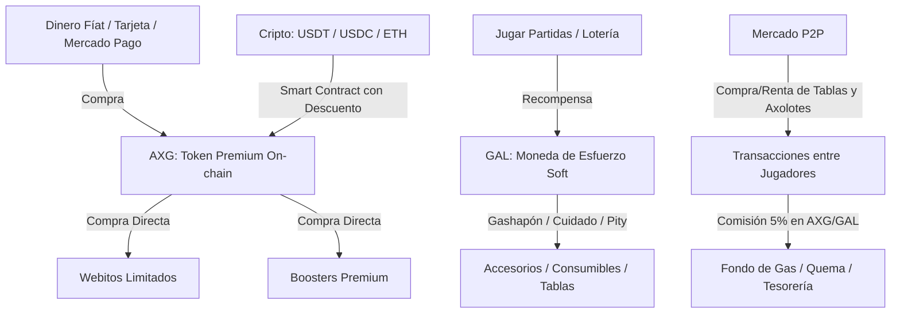

# Axolotto: Monetización, Pasarelas y Tokenomics

Este documento presenta una propuesta detallada para la arquitectura económica de **Axolotto**, combinando flujos de dinero tradicional (Fíat), pasarelas criptográficas y diseño económico para evitar los colapsos clásicos de la era Play-to-Earn (P2E).

---

## 1. El Dilema de la Doble Moneda: AXG (Axogemas) vs GAL (Gemas de Alga)

Axolotto utiliza un modelo híbrido indispensable para la sostenibilidad:



### ¿Sirve de algo recolectar GAL (Algas) como creador?
**No directamente en fíat, pero sí para la salud del juego.**
Las algas (GAL) son una *moneda de esfuerzo* (Soft Currency). Sirven como amortiguador para que los jugadores jueguen gratis y progresen. Si tú como desarrollador cobras comisiones (fees) en GAL:
- **No te sirve tenerlas acumuladas en tu cartera** porque no tienen valor de respaldo directo (a menos que las listes en un Exchange, lo cual es extremadamente peligroso, ver Sección 4).
- **El único uso real de tus GAL es la QUEMA (Burn):** Al retirar GAL del mercado mediante comisiones del Marketplace P2P (ej. 5% de fee en GAL), reduces la oferta circulante de GAL, combatiendo la inflación y haciendo que los ítems del juego retengan su valor.

---

## 2. Pasarelas de Pago: Fíat y Cripto

Para maximizar ingresos, Axolotto debe ofrecer dos rieles de pago, pero limitados **únicamente a la venta primaria de Axogemas (AXG)**:

### A. Pasarela Fíat (Web2) - Solo para Venta Primaria
*   **Herramienta recomendada:** **Mercado Pago API** (para LatAm/México) o **Stripe**.
*   **Funcionamiento:**
    *   El usuario selecciona un "Paquete de Axogemas" (ej. 100 AXG por $10 USD / equivalente en MXN).
    *   Mercado Pago procesa el pago vía tarjeta, SPEI o pago en OXXO.
    *   Tras recibir el webhook de pago exitoso (`payment.authorized`), el servidor backend de Axolotto firma una transacción on-chain que acuña o transfiere los tokens **AXG** a la wallet del usuario en Plasma Chain.
*   **Exclusión del P2P:** Mercado Pago **no se utilizará directamente en el Marketplace P2P** para transacciones entre jugadores. Esto elimina el riesgo de contracargos masivos por fraude P2P y evita problemas de regulación de custodia de divisas (como la Ley Fintech). Todas las transacciones en el Marketplace P2P son estrictamente en AXG o GAL.

### B. Pasarela Cripto con Smart Contract (Web3)
*   **Herramienta:** Un contrato inteligente de **Token Sale** en la red Plasma.
*   **Funcionamiento:**
    *   El contrato acepta stablecoins (`USDT` o `USDC`) o el token nativo de la red (`ETH`/`MATIC`).
    *   El usuario interactúa directamente con el contrato desde su MetaMask o wallet integrada (Privy).
    *   El contrato calcula la tasa de conversión y transfiere los **AXG** automáticamente.
*   **El Gancho del Cripto-Descuento (5% a 10%):**
    *   Dado que en cripto no pagas comisiones de agregadores fíat ni sufres contracargos, puedes transferir ese ahorro al usuario en forma de descuento.
    *   *Ejemplo:* Si 100 AXG cuestan $10 USD en Mercado Pago, en el Smart Contract cuestan $9.00 USDT. Esto incentiva la adopción Web3 de manera orgánica.

---

## 3. Modelo de Reserva 80/20 y Recompra (Spread y DevEx)

Para garantizar la estabilidad del sistema y la confianza del usuario de forma financieramente viable, Axolotto implementa un modelo de reserva respaldada sobre ingresos netos:

```
[Usuario paga $10.00 USD Bruto]
        │
        ├──> IVA (16%): $1.38 USD ─────────────> [SAT (Impuestos)]
        ├──> MP Fee (4.5%): $0.45 USD ─────────> [Mercado Pago (Comisiones)]
        └──> Neto Recibido: $8.17 USD
                  │
                  ├──> 80% ($6.54 USD) ──> [Reserva Líquida de Respaldo]
                  │                              │
                  │                              └─── (En caso de retiro/DevEx) ──> Paga $5.00 al jugador
                  │                                                               └── Excedente de $1.54
                  └──> 20% ($1.63 USD) ──> [Tesorería Operativa (Gastos/Ganancia)]
```

### A. Dinámica Económica de la Reserva
*   **Aportación Inicial:** Por cada paquete de gemas vendido (ej. a un costo al público de **$10.00 USD / $200.00 MXN** bruto), se desglosa el 16% de IVA ($1.38 USD) para el SAT y se cobra la tarifa de procesamiento de Mercado Pago (~4.5% o $0.45 USD). Del neto recibido de **$8.17 USD**, el **80% ($6.54 USD)** se deposita automáticamente en la reserva líquida de respaldo y el **20% ($1.63 USD)** se destina a la tesorería de operaciones.
*   **Tasa de Recompra (Suelo de Valor):** La plataforma ofrece una tasa de recompra garantizada a **$5.00 USD ($100.00 MXN)** por cada gema (o equivalente a 50% de su precio de venta bruto) a través del programa de retiro oficial (DevEx).
*   **Solvencia Matemática del 100% (Protección contra Bank Run):** Como cada gema en circulación está respaldada por $6.54 USD de reserva activa y la recompra obliga a pagar $5.00 USD, el sistema es matemáticamente solvente. Ante un pánico de retiros del 100% de los usuarios, la reserva cubre la totalidad de la deuda sin que el desarrollador deba inyectar capital de su presupuesto operativo.
*   **Destino del Excedente de $1.54:** Por cada ciclo de compra-recompra (round-trip), queda un remanente neto de **$1.54 USD** en la reserva. Este excedente se distribuye de la siguiente forma:
    1.  **50% ($0.77 USD) al Fondo de Crecimiento y Jackpots:** Se utiliza para comprar GAL a la economía del juego para alimentar el Jackpot global de lotería y fonear torneos especiales, inyectando valor real al esfuerzo de juego.
    2.  **50% ($0.77 USD) al Fondo de Prevención de Fraude:** Funciona como un colateral para absorber pérdidas por contracargos (chargebacks) o reclamos fraudulentos que ocurran en las pasarelas fíat.

### B. Emisión Cero por Gameplay: Salvaguarda del Fondo
*   **Regla Fundamental:** El token **AXG no se emite gratis como recompensa de juego (gameplay)**. Su emisión es estrictamente primaria (sólo se acuña cuando entra dinero de compra real).
*   Las recompensas del juego son exclusivamente en **GAL (Algas)**, la cual es una moneda blanda inflacionaria y no canjeable directamente en la reserva de recompra.
*   Esto asegura que la cantidad de AXG circulantes nunca supere el valor total respaldado por la reserva de liquidez.

### C. El Mecanismo de "Desbloqueo de Reservas" (Reserve Unlocking)
*   **Cómo funciona:** Cuando un jugador gasta sus gemas (AXG) en la tienda oficial para comprar Webitos primarios, boosters de cartas o upgrades permanentes, esas gemas **se queman y salen de circulación permanentemente**.
*   **Liberación de la Reserva:** Al quemarse el token, la obligación de recompra o pasivo del creador desaparece (ya no hay AXG circulantes que el usuario pueda canjear por $5.00 USD). Por ende, el **80% del valor neto ($6.54 USD por cada 100 AXG gastadas) que estaba bloqueado en la reserva se libera y pasa a ser 100% utilidad neta para Tridyland**.
*   **Alineación de Incentivos:** Esto hace que la ganancia del creador no dependa de bloquear capital a perpetuidad. Si los usuarios se divierten y compran activos virtuales en la tienda, el 100% del dinero ingresado (neto de impuestos y procesador) se desbloquea de la reserva convirtiéndose en ganancia del desarrollador.

---

## 4. Arquitectura de Fees (Comisiones) y Sostenibilidad

Tu ganancia residual provendrá principalmente del **Impuesto de Mercado (Marketplace Fees)** del **5%** cobrado en cada transacción en el Mercado P2P, el cual se liquida en AXG (para ventas) o GAL (para rentas).

| Transacción | Moneda | Destino de la Comisión (Fee) | Propósito |
| :--- | :--- | :--- | :--- |
| **Compra de Webitos/Sobres (Tienda)** | AXG | 80% Reserva / 20% Tesorería | Respaldo colateral y margen operativo inicial |
| **Comisión del Mercado P2P (Ventas)** | AXG | 100% Tesorería del Creador | **Regalía neta residual libre de pasivos (100% utilidad)** |
| **Comisión del Mercado P2P (Rentas)** | GAL | 100% Quema (Burn) | Estabilizar la economía de GAL y combatir la inflación |
| **Renta de Tablas P2P** | GAL | 100% Quema (Burn) | Controlar el circulante y mantener el valor de las cartas |

> [!WARNING]
> Si los jugadores pudieran generar GAL jugando e inmediatamente vender ese GAL en la plataforma por pesos, el sistema colapsaría. Por ende, la única vía de salida de dinero real (Cash-Out) es vendiendo activos en el Marketplace P2P a cambio de AXG, y posteriormente retirar esas AXG a través del DevEx oficial.

---

## 5. Casos de Estudio: Aprendiendo del Pasado

### A. Los Fracasos: Emisión Infinita sin Utilidad Real

#### 1. Axie Infinity (SLP - Smooth Love Potion)
*   **Qué hicieron mal:** SLP era el token secundario que los jugadores ganaban por jugar y necesitaban para criar nuevos Axies. Sin embargo, la velocidad a la que se generaba SLP era infinitamente mayor que la velocidad de cría de Axies.
*   **El resultado:** SLP sufrió de hiperinflación extrema, pasando de $0.35 USD a $0.001 USD. Al caer el token a cero, los jugadores que jugaban solo por dinero abandonaron el ecosistema.
*   **Lección para Axolotto:** El token **GAL (Algas)** no debe ser fácilmente convertible a dinero real ni listado en exchanges de forma prioritaria. GAL debe ser consumido en el juego (sumideros como el Gashapón de accesorios, alimentar, curar y pagar rentas).

#### 2. STEPN (GST - Green Satoshi Token)
*   **Qué hicieron mal:** GST se ganaba caminando y se usaba para reparar tenis. El problema es que el retorno de inversión (ROI) era demasiado rápido y lineal. Los jugadores acumulaban GST e inmediatamente lo cambiaban por USDC para retirar ganancias.
*   **Lección para Axolotto:** Evitar la promesa de un ROI rápido. La diversión, el coleccionismo (las 54 cartas del álbum, los skins de temporada, las estadísticas de Axolotitos) deben ser el motivador de compra, no la especulación financiera pura.

---

### B. Los Éxitos: Control de Emisión y Economía Híbrida

#### 1. Pixels ($BERRY / $PIXEL)
*   **Qué hicieron bien:** Originalmente tenían $BERRY (un token inflacionario) que finalmente retiraron para transicionar a un modelo de una sola moneda on-chain ($PIXEL) con estrictos límites off-chain. La mayoría de los ítems de bajo nivel se manejan con monedas soft que no viven en la blockchain.
*   **Lección para Axolotto:** Mantén las Algas (GAL) estrictamente bajo tu control. No las listes en exchanges centralizados. Deja que el único token líquido y listable sea **AXG (Axogemas)**.

#### 2. Roblox (Robux - El modelo híbrido supremo)
*   **Qué hacen bien:** Robux es la única moneda premium. Se compra con dinero real. Los creadores ganan Robux vendiendo ítems P2P. Roblox cobra un fee masivo (a veces hasta el 30%-70%) para cubrir infraestructura y retirar Robux de circulación. Solo los desarrolladores aprobados con millones de Robux pueden convertirlos a dinero real (DevEx).
*   **Lección para Axolotto:** Cobra fees en AXG en el mercado P2P. Eso te garantiza un flujo constante de regalías residuales por la actividad de tu comunidad, incluso si dejas de vender ítems directamente.

---

## 6. Recomendaciones de Implementación para Axolotto

1.  **AXG es el Único Riel Premium:** Las Axogemas (AXG) son el token on-chain principal (ERC-20 en Plasma Chain). Se compran de forma primaria vía Mercado Pago y Smart Contract.
2.  **Mercado Pago Exclusivo para Compras de AXG:** No permitas que Mercado Pago interactúe en transacciones directas P2P de cartas o Axolotitos. Todo lo que ocurra en el P2P se liquida en AXG/GAL, lo cual protege al desarrollador contra contracargos de ventas entre jugadores.
3.  **Reserva Líquida Intacta:** El 80% de cada compra de AXG debe guardarse en la reserva para asegurar la liquidez del programa de retiros DevEx a un precio de $7 USD (spread del 30%).
4.  **No listes GAL:** El token GAL debe permanecer como una moneda de esfuerzo y de utilidad cerrada dentro del juego. Si se lista en exchanges descentralizados, perderá su valor rápidamente debido al farming automatizado.
5.  **Filtro de Retirada (Cash-Out) Basado en Valor:** Los retiros de dinero real se habilitan únicamente para AXG obtenidas de forma legítima vendiendo o rentando activos en el Marketplace P2P, requiriendo KYC obligatorio para prevenir lavado de dinero.
6.  **Fee en cada Renta P2P:** Cobra una comisión en GAL en cada renta de tablas. Esto elimina GAL circulante y previene la hiperinflación.

---

## 7. Optimización Financiera y Rendimientos de Tesorería

Para maximizar la rentabilidad del proyecto sin comprometer la liquidez obligatoria del programa de retiros DevEx (garantizado al precio de recompra de $7 USD), se establece el siguiente marco de inversión de reservas:

### A. Gestión de Rendimientos en Fíat (Reservas Bancarias)
1.  **CETES Directo (Persona Moral):**
    *   La tesorería corporativa transferirá semanalmente el 80% de los ingresos de Mercado Pago a una cuenta corporativa en CETES Directo.
    *   **Instrumento de inversión:** Compra de títulos de **Bondia** (fondo de liquidez diaria con rendimiento de deuda gubernamental). Esto ofrece un rendimiento del ~11% anualizado con disponibilidad de retiro el mismo día (lunes a viernes de 9:00 AM a 1:00 PM).
2.  **GBM Corporativo / Fondos de Mercado de Dinero:**
    *   Colocar fondos excedentes en pagarés bancarios o fondos mutuos de deudas de alta calificación (e.g. GBMF2) con liquidez de 24 horas.
3.  **Regla de Liquidez:** Nunca se debe bloquear la reserva en plazos fijos (CETES a 28, 90 o 365 días), ya que una racha de solicitudes de retiro de Axoloteros requerirá el capital disponible de inmediato.

### B. Gestión de Rendimientos en Cripto (Reservas de Stablecoins)
1.  **Asignación de Riesgo DeFi (Ratio 50/50):**
    *   **50% Líquido:** Mantener la mitad de la reserva de stablecoins (USDC/USDT) líquida directamente en el contrato multifirma (Gnosis Safe) para cubrir los retiros semanales ordinarios de los jugadores sin pagar tarifas excesivas de red (gas fees) por desinvestir.
    *   **50% Generando Rendimientos (Lending Pools):** Depositar la otra mitad de la reserva en protocolos descentralizados de primer nivel para generar rendimientos pasivos.
2.  **Protocolos Autorizados:**
    *   **Aave v3 (Lending de Stablecoins):** Depositar USDC o USDT en el pool de préstamos de Aave en una red de capa 2 (L2) o Plasma Chain de bajo costo para ganar una tasa de interés flotante (generalmente entre 4% y 10% anual). El riesgo es extremadamente bajo a nivel técnico, pero se debe vigilar la salud del protocolo.
    *   **Prohibición de Staking de Activos Volátiles:** Queda estrictamente prohibido usar fondos de la reserva de respaldo para hacer staking de tokens volátiles (e.g. ETH, MATIC, AXG) o proveer liquidez en pools con riesgo de pérdida impermanente (*impermanent loss*), ya que una caída en el valor de estos tokens causará la insolvencia inmediata de la reserva de recompra de gemas.
3.  **Monitoreo de Paridad (Stablecoins):**
    *   Dado que las stablecoins pueden sufrir desvíos temporales de su paridad con el dólar (depeg), la tesorería debe diversificar la reserva cripto en un **50% USDC** y **50% USDT** para mitigar el riesgo sistémico de una sola moneda.
