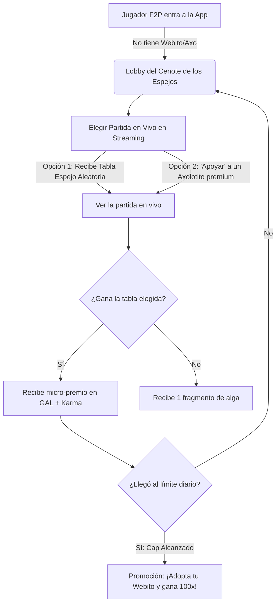

# Plan de Diseño: Modo F2P Espectador ("El Espejo del Cenote")

Este documento detalla el diseño de juego, economía y embudo de conversión para el **Modo Gratuito (F2P)** de **Axolotto**. Para evitar la barrera del "Pay-to-Play" (P2P), los jugadores sin fondos o sin un Axolotito pueden participar como espectadores interactivos de partidas en curso, experimentando la emoción de la Lotería, ganando micro-recompensas y facilitando su transición a jugadores premium.

---

## 1. Crítica y Psicología del Enfoque "Streamer-Staking"

Tu idea de vincular el modo gratuito al streaming de partidas multijugador reales es una **estrategia de marketing brillante**. He aquí por qué funciona psicológicamente:

*   **FOMO Pasivo a Activo (Miedo a perderse algo):** Al ver partidas reales con tableros premium de otros jugadores ganando premios grandes (de 500+ GAL y Jackpots), el jugador gratuito experimenta la emoción en tiempo real. Ve el "premio gordo" a solo un clic de distancia.
*   **Fricción de Entrada Cero:** Cualquier persona con una cuenta social (Privy) puede entrar al juego y empezar a "jugar" en 10 segundos. Esto mejora exponencialmente el CAC (Costo de Adquisición de Clientes).
*   **Mitigación de Granjas de Bots:** Al no permitir que los F2P inyecten tableros activos en los lobbies, evitamos que saturen los servidores con bots gratuitos. Solo observan y "espejean" partidas que ya están ocurriendo gracias a jugadores reales o de pago.

---

## 2. Flujo de Juego: "El Espejo del Cenote"

A continuación se detalla cómo se traduce esta experiencia en la interfaz y el backend:

### Paso 1: El Cenote de los Espejos (The Spectator Hub)
Cuando un jugador entra sin NFTs, se le da la bienvenida en una sala mística llamada **"El Cenote de los Espejos"**.
*   **La Interfaz:** Muestra una lista de las partidas multijugador en vivo ([MultiplayerLobby](file:///home/monotr/axolotto/docs/GDD.md#L154)).
*   **La Elección:** El jugador gratuito tiene dos opciones para participar:
    1.  **Tabla Espejo (Mirror Board):** Se le asigna de forma aleatoria un clon visual de uno de los tableros que está jugando en esa partida.
    2.  **Patrocinar un Axo (Backing a Pet):** El jugador F2P elige a uno de los Axolotitos competidores (viendo sus accesorios y rareza) para "echarle porras" (apoyarlo).

---

### Paso 2: La Experiencia de Visualización (Interactive Streaming)
*   El jugador gratuito ve la Lotería cantarse en tiempo real. Aunque no toma decisiones directas, participa activamente:
    *   **Taps Interactivos:** Puede hacer tap en las cartas de su tabla espejo para ayudar a marcarlas (generando feedback háptico y efectos neón).
    *   **Efecto Barra de Porras:** Hacer tap en la pantalla envía burbujas o emojis flotantes al flujo de la partida real, los cuales son visibles para el jugador premium dueño del Axolotito. Esto conecta a ambas comunidades.

---

### Paso 3: Economía y el Límite de Recompensas (Capped Earnings)
Para evitar la inflación del token soft (GAL) y la creación de granjas automatizadas de F2P:

*   **Micro-Premios:**
    *   Si la tabla espejo o el Axolotito patrocinado gana el **Hito 1 (Línea)**: El jugador F2P recibe **1 GAL**.
    *   Si gana el **Hito 2 (Tabla Llena)**: Recibe **3 GAL**.
    *   Si no gana: Recibe **0.1 GAL** (como premio de consolación o "fragmento de alga").
*   **Límite Diario (Daily Reward Cap):**
    *   El límite máximo diario para un jugador F2P es de **10 GAL**.
    *   Una vez alcanzado el cap, el jugador puede seguir viendo partidas y participando de forma recreativa, pero un cartel neón le indicará: *"Tu pozo de alga diario se ha agotado. Para desbloquear ganancias ilimitadas y competir de verdad, ¡necesitas tu propio Axolotito!"*

---

## 3. El Embudo de Conversión (De F2P a Comprador de Webito)

Este modo gratuito está diseñado como un embudo de ventas orgánico:

1.  **La Revelación del Contraste:** Mientras el F2P gana 1 o 2 GAL en su espejo, la interfaz muestra notificaciones gigantes de lo que gana el jugador premium: *"¡El Axolotito de @Juan ganó 150 GAL y un Accesorio Épico!"*. El contraste psicológico incita al deseo de compra.
2.  **El Álbum de Fragmentos de Huevo (The Free Hatch Loop):**
    *   Cada partida que ve un F2P le otorga un "Fragmento Astral de Webito" (un coleccionable no transferible).
    *   Al juntar 100 fragmentos (lo cual toma unos 5-7 días de visualización constante), el jugador F2P puede forjar un **"Webito Común de Iniciación"** de forma 100% gratuita.
    *   Esto premia la lealtad y retención del usuario gratuito y lo convierte en poseedor de un NFT sin costo inicial.
3.  **El "Call to Action" en Momentos Clave:**
    *   Cuando el jugador hace una racha de victorias en modo espectador: *"¡Estás en racha! Si este hubiera sido tu Axolotito, habrías ganado 250 GAL. Adopta tu primer Webito por solo X AXG y entra a las ligas reales."*

---

## 4. Ideas Adicionales para Potenciar la Experiencia

*   **Los "Eventos de Porras" (Cheer Events):**
    *   Si 10 espectadores F2P apoyan al mismo Axolotito premium en una sala, se activa un "Buff de Aura". Visualmente el Axolotito brilla en la mesa. Esto no afecta la aleatoriedad de las cartas, pero otorga un bonus de XP de +5% al jugador premium al terminar la partida. Así, los jugadores premium aprecian y quieren espectadores en sus partidas.
*   **Apuestas de Predicción con GAL F2P:**
    *   Permitir que el F2P apueste su pequeño saldo de GAL (ej. apostar 1 GAL a que el Axolotito rosa queda en top 3). Esto les enseña la mecánica de riesgo/recompensa del juego de forma interactiva y acelera su ciclo de aprendizaje.

---

## 5. Arquitectura e Implementación Técnica

### Backend (FastAPI / SQLModel)
*   **Modificación del Ledger:** El [TransactionLedger](file:///home/monotr/axolotto/backend/app/api/v1/endpoints/incubation.py#L441) debe registrar las micro-transacciones F2P bajo un nuevo `TransactionType.F2P_REWARD`.
*   **Control del Límite Diario:** Endpoint en `GET /user/f2p-status` que verifique la suma de `amount` del ledger en las últimas 24 horas para bloquear nuevas recompensas F2P.

### Comunicación en Tiempo Real (WebSockets)
*   El backend ya simula partidas en background. Debemos crear un canal de WebSocket para espectar salas activas: `ws://api.axolotto/rooms/{room_id}/spectate`.
*   Este socket retransmite los eventos de cartas cantadas y marcadas a todos los espectadores F2P conectados de forma ligera, sin sobrecargar la base de datos PostgreSQL.
