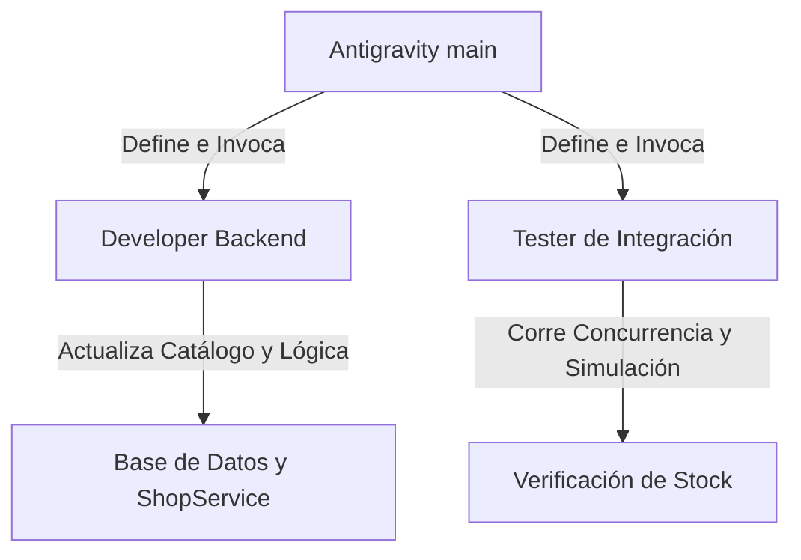

# 🎴 Plan de Reestructuración de Boosters, Fases y Prevención de Sobreventa

Este plan detalla las mejoras y cambios necesarios para estructurar las ventas de boosters en tres fases secuenciales (con diferentes precios y suministros), limitar estrictamente el Booster Brillante a 100 unidades mensuales globales y solucionar el error de concurrencia que provoca sobreventas (ej. stock negativo como `-198/1000`) en simulaciones de alto volumen.

---

## 🎯 Objetivos del Plan

1. **Eliminar la Sobreventa Concurrente (Race Conditions)**:
   - Implementar un bloqueo pesimista (`SELECT FOR UPDATE`) en el catálogo del ítem (`ItemCatalog`) al iniciar el flujo de compra. Esto serializa las solicitudes y garantiza que los límites globales se respeten rigurosamente, evitando stocks negativos.
2. **Dividir los Boosters en 3 Fases Dinámicas**:
   - **Fase 1 (Primera Edición)**: Pocas unidades, precio barato. Las cartas obtenidas tienen el tag `is_first_edition = True`.
   - **Fase 2 (Segunda Edición / Unlimited)**: Más unidades, precio medio. Las cartas no tienen tag de primera edición.
   - **Fase 3 (Tercera Edición / Retail)**: Muchas unidades, precio de mercado (estándar). Las cartas no tienen tag de primera edición.
3. **Limitar Estrictamente el Booster Brillante (Foil)**:
   - Mantener el límite global de **100 unidades al mes** garantizando con bloqueos a nivel de base de datos que ninguna transacción concurrente rompa esta regla.
4. **Validación Mediante Pruebas de Simulación Concurrente**:
   - Ajustar y ejecutar las simulaciones para verificar el comportamiento de transición de fases bajo tráfico concurrente y certificar que no haya sobreventas.

---

## 💡 Ideas y Mejoras Propuestas

### 1. Bloqueo Pesimista en `ItemCatalog` (`SELECT FOR UPDATE`)
En [shop_service.py](file:///home/monotr/axolotto/backend/app/services/shop_service.py), la función `buy_item` realiza la siguiente validación de stock:
```python
total_sold = session.exec(...)
if total_sold >= item.max_supply:
    ...
```
Si múltiples peticiones llegan simultáneamente, todas leen la misma cantidad vendida antes de insertar las nuevas filas en `TransactionLedger`. Al finalizar e insertar los ledgers, se supera el stock máximo de forma ilegal.
* **Mejora**: Buscar el ítem en la base de datos aplicando `.with_for_update()` justo al inicio de la transacción de compra:
  ```python
  item = session.exec(
      select(ItemCatalog)
      .where(ItemCatalog.id == item_id)
      .with_for_update()
  ).first()
  ```
  Esto detiene temporalmente las transacciones concurrentes del mismo booster. Cuando la primera transacción termina (hace commit de sus ledgers y actualiza `is_active = False` si es necesario), la siguiente transacción lee el estado actualizado de `is_active` y la cantidad correcta de `total_sold`, abortando con un error de "Sold Out" de forma limpia.

### 2. Estructura de Precios y Suministros por Fase
Proponemos la siguiente tabla de distribución para los boosters temáticos (Fiesta, Nido, Cosmos) y el booster Mezclado:

| Tipo de Booster | Fase | Edición | Suministro Máximo | Precio AXG | Precio GAL | Cartas 1ra Ed. |
| :--- | :---: | :---: | :---: | :---: | :---: | :---: |
| **Fiesta / Nido / Cosmos** | 1 | 1ra Ed. | **200 unidades** | **100.0 AXG** | **1300.0 GAL** | **Sí** |
| **Fiesta / Nido / Cosmos** | 2 | Segunda | **2,000 unidades** | **150.0 AXG** | **2000.0 GAL** | No |
| **Fiesta / Nido / Cosmos** | 3 | Retail | **5,000 unidades** | **200.0 AXG** | **2600.0 GAL** | No |
| **Mezclado** | 1 | 1ra Ed. | **300 unidades** | **60.0 AXG** | **800.0 GAL** | **Sí** |
| **Mezclado** | 2 | Segunda | **2,000 unidades** | **100.0 AXG** | **1300.0 GAL** | No |
| **Mezclado** | 3 | Retail | **5,000 unidades** | **150.0 AXG** | **2000.0 GAL** | No |

* **Mejora en la Transición**: Al agotarse la Fase 1 de un booster (por ejemplo, `Booster Fiesta`), la base de datos debe desactivar automáticamente la Fase 1 (`is_active = False`) y activar la Fase 2 (`is_active = True`). Al agotarse la Fase 2, activa la Fase 3. Esto ya existe de forma parcial en `shop_service.py`, pero debe protegerse contra race conditions usando el lock anterior.

### 3. Sincronización del Booster Brillante
El `Booster Brillante (Foil)` comparte el mismo catálogo pero su stock mensual se reinicia.
* **Mejora**: En lugar de consultar `total_sold` globalmente, aplicar el bloqueo `with_for_update()` sobre el ítem y verificar las ventas del mes en `TransactionLedger`. Si supera las 100 unidades, lanzar excepción de forma inmediata.

---

## 📋 Checklist de Tareas

### Backend
- [ ] **Modificar Seeding de Base de Datos** ([seed_catalog.py](file:///home/monotr/axolotto/backend/app/scripts/seed_catalog.py))
  - [ ] Actualizar suministros y precios de Fase 1, Fase 2 y Fase 3 para Fiesta, Nido, Cosmos y Mezclado según la tabla propuesta.
  - [ ] Asegurar que solo la Fase 1 inicie activa (`is_active = True`) y que las Fases 2 y 3 comiencen inactivas (`is_active = False`).
- [ ] **Corregir Race Condition y Sobreventa** ([shop_service.py](file:///home/monotr/axolotto/backend/app/services/shop_service.py))
  - [ ] Añadir `.with_for_update()` en la consulta inicial de `ItemCatalog` en `buy_item`.
  - [ ] Colocar una validación inmediata post-bloqueo: `if not item.is_active: raise HTTPException(400, "Sold out o inactivo")`.
  - [ ] Asegurar que la lógica de cálculo de `total_sold` y `monthly_sold` se ejecute dentro del bloque bloqueado para contar correctamente.
  - [ ] Modificar la lógica de transición proactiva para que no cause bloqueos mutuos o commits parciales problemáticos antes de escribir el ledger.
- [ ] **Asegurar Lógica de Apertura y Edición de Cartas** ([shop_service.py](file:///home/monotr/axolotto/backend/app/services/shop_service.py))
  - [ ] Validar que al abrir un booster, la propiedad `is_first_edition` de las cartas resultantes dependa estrictamente de que la fase del booster sea la `1`.

### Pruebas y Validación
- [ ] **Crear/Actualizar Test de Concurrencia de Tienda**
  - [ ] Escribir una prueba unitaria concurrente (ej. usando threads) para simular 10 compras simultáneas del último sobre restante de un booster.
  - [ ] Confirmar que el stock restante final sea exactamente `0` y que se hayan rechazado exactamente 9 transacciones con error de `Sold Out`.
- [ ] **Ajustar y Ejecutar el Simulador**
  - [ ] Ejecutar el simulador de universo (`simulate_universe.py`) y revisar el archivo `simulation_report.txt` para asegurar que el stock final de ningún booster quede negativo.

---

## 🤖 Plan de Multiagente

Para llevar a cabo este plan de manera estructurada y minimizando la posibilidad de bugs en el flujo económico, utilizaremos subagentes especializados:



### 1. Subagente: `booster-backend-developer`
* **Rol**: Desarrollador Backend enfocado en base de datos y servicios de tienda.
* **Responsabilidad**:
  - Modificar [seed_catalog.py](file:///home/monotr/axolotto/backend/app/scripts/seed_catalog.py) con la nueva estructura de precios/suministros en 3 fases.
  - Modificar [shop_service.py](file:///home/monotr/axolotto/backend/app/services/shop_service.py) para implementar el bloqueo de fila en `ItemCatalog` y corregir la carrera de concurrencia.
  - Asegurar la asignación correcta de `is_first_edition` en cartas provenientes únicamente de la Fase 1.

### 2. Subagente: `booster-concurrency-tester`
* **Rol**: Analista de Calidad y Pruebas Concurrentes.
* **Responsabilidad**:
  - Crear o actualizar pruebas de race conditions específicas en `backend/tests/unit/test_concurrency_race_conditions.py`.
  - Correr e inspeccionar la simulación principal (`simulate_universe.py`) para confirmar que ningún booster termine con stock negativo.
  - Verificar que el límite de 100 sobres de Foil al mes funcione perfectamente sin fugas concurrentes.
