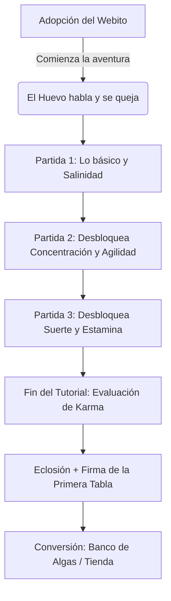

# Plan de Rediseño de Webitos: De Cuidado Pasivo a Tutorial Narrativo e Interactivo

Este documento detalla el plan de diseño y marketing para transformar el flujo de incubación de **Webitos** (huevos) en **Axolotto** en el tutorial interactivo principal del juego. En lugar de esperar pasivamente, el jugador juega Lotería con su huevo, moldeando y conociendo su personalidad y estadísticas antes de nacer.

---

## 1. Crítica y Validación del Enfoque del Usuario

Tu enfoque de convertir la incubación en el tutorial es una **excelente decisión de Game Design**. Resuelve de golpe los tres peores problemas del diseño anterior:

*   **Fricción de Onboarding:** La regla de *"comprar 1 Webito y empezar a jugar de inmediato"* crea un flujo directo hacia la acción. El jugador no tiene tiempo de aburrirse o dudar; entra en modo aventura instantáneamente.
*   **Enseñanza Orgánica:** Las estadísticas en juegos tipo RPG o Lotería compleja suelen abrumar. Explicar Salinidad, Suerte, Estamina o Agilidad de golpe confunde. Revelarlas una por una mientras juegas y ver sus efectos prácticos en partidas simuladas es el estándar de oro en tutoriales modernos.
*   **Lore y Conexión Emocional:** Que el huevo hable y tenga personalidad propia desde antes de nacer activa de inmediato el apego emocional. Ya no es una transacción Web3 fría; es una mascota divertida con la que interactúas desde el día cero.

---

## 2. Flujo Completo del "Ritual del Cenote" (El Tutorial del Huevo)

A continuación se detalla paso a paso el nuevo flujo propuesto para el onboarding del jugador.

### Paso 1: La Adopción y la "Queja" del Huevo
*   **Narrativa:** Al comprar tu primer Webito, la interfaz cambia al Cenote subacuático 2.5D. El huevo empieza a temblar en su nido de forma graciosa.
*   **Diálogo:** El huevo ruge: *"¡Oye! ¡Siento cartas cantándose afuera! Las vibraciones del gritón de Lotería me están volviendo loco aquí dentro. Los Axolotitos nacemos jugando. ¡Llévame a una mesa antes de que me congele de aburrimiento!"*
*   **Acta de Nacimiento:** Se le explica al jugador que el DNA del huevo está intrínsecamente ligado a su primera tabla de Lotería (la cual será su "Acta de Nacimiento").

---

## Paso 2: Partida 1 - Las Reglas Básicas y la Salinidad (`salinity`)
*   **Mecánica:** Partida rápida simulada contra un Bot de entrenamiento. El juego va cantando cartas a velocidad media y el Webito las marca de forma automática en su tabla temporal.
*   **El Desbloqueo del Stat:** El Webito desbloquea el stat **Salinidad** ([salinity](file:///home/monotr/axolotto/backend/app/api/v1/endpoints/incubation.py#L703)).
*   **Simulación Práctica:**
    *   *Webito:* *"¡Rayos! Mi nivel de salinidad está alto hoy, la mala suerte me persigue y por eso las cartas correctas no salen en mi cuadrícula. ¡Mira cómo el oponente tiene menos salinidad y sus cartas se marcan más rápido!"*
    *   Te enseña la importancia de mantener la salinidad baja y cómo influye en la probabilidad de mala racha.

---

## Paso 3: Partida 2 - Concentración (`focus`) y Agilidad (`agility`)
*   **Mecánica:** El bot oponente se vuelve más rápido. El gritón empieza a cantar a mayor velocidad.
*   **El Desbloqueo del Stat:** El Webito desbloquea **Concentración** y **Agilidad**.
*   **Simulación Práctica:**
    *   *Concentración:* El Webito "pierde de vista" una carta que se cantó. Aparece una alerta visual y el huevo te dice: *"¡Ups! Me distraje. Si tuviera más Focus, nunca se me pasaría marcar una carta cantada. ¡Toca la carta tú mismo para ayudarme!"* (El jugador interactúa y la marca).
    *   *Agilidad:* Te muestra cómo el Webito reacciona más rápido que el bot al marcar las cartas en el tablero (evitando penalizaciones de delay).

---

## Paso 4: Partida 3 - Suerte (`luck`) y Estamina (`stamina`)
*   **Mecánica:** Partida final para ganar. El Webito está a punto de eclosionar del calor acumulado por jugar.
*   **El Desbloqueo del Stat:** Se desbloquean **Suerte** (probabilidad de golpes críticos y multiplicadores de premio) y **Estamina** (capacidad de energía por partida).
*   **Simulación Práctica:**
    *   El Webito logra un "Crítico" al marcar la carta ganadora.
    *   *Webito:* *"¡Boom! ¡Un golpe de Suerte! Mi DNA tiene un buen factor de Luck, lo que significa que cuando gano, ¡las gemas de alga caen a montones! Pero jugar me agota... cada partida consume mi Stamina. Cuando sea adulto, ¡tendré que dormir para recuperarme!"*

---

## Paso 5: La Evaluación del Karma y la Naturaleza (`nature`)
Con cada partida del tutorial, se mide el rendimiento de suerte y victorias del jugador:

*   **Karma de Suerte (Ganaste la mayoría):** El Webito nace con el gen **Suertudo** (`lucky`) o **Hiperactivo** (`hyperactive`). Te otorgan un pequeño bonus de bienvenida de **+50 GAL** adicionales por *"Haber nacido bajo una estrella brillante"*.
*   **Karma de Sal (Perdiste la mayoría o tuviste mala racha):** El Webito nace con el gen **Metódico** (`methodical`) o **Tímido** (`shy`). El huevo te consuela con humor: *"Bueno... el agua estaba un poco salada hoy. ¡Pero no pasa nada! Los Axolotitos salados somos más resistentes."* Te regalan un consumible de compensación ([Gotas Anti-Escarcha](file:///home/monotr/axolotto/backend/app/api/v1/endpoints/incubation.py#L353)) como "seguro de mala suerte" (Pity System).

---

## Paso 6: Eclosión y Sellado de la Primera Tabla
*   **La Animación:** El huevo se agrieta en un estallido bioluminiscente con confeti neón.
*   **El Nacimiento:** Nace tu Axolotito en base a los stats moldeados en el tutorial ([map_stats_to_traits](file:///home/monotr/axolotto/backend/app/api/v1/endpoints/incubation.py#L591)).
*   **El Sello:** Tu primera tabla de Lotería (la que usaste en el tutorial) es firmada y sellada oficialmente como tu **"Tabla Ancestral NFT"** de manera gratuita para empezar a jugar partidas reales.

---

## Paso 7: La Conversión (Marketing y Monetización)
Una vez que el jugador tiene a su Axolotito adulto y su tabla inicial:
*   *Axolotito:* *"¡Por fin tengo patitas y branquias! Pero tengo hambre y quiero competir de verdad en las Salas Multijugador para ganar Gemas de Alga (GAL). Para empezar, ¡vamos al Banco a conseguir combustible!"*
*   El juego te guía con un spotlight visual hacia el **Banco de Algas / Tienda** enseñándote los paquetes de intercambio de AXG a GAL y cómo recargar tu saldo para las partidas de verdad.

---

## 3. Mejoras e Ideas Adicionales Exclusivas

1.  **Visuales Progresivos en el Huevo:**
    *   A medida que juegas las 3 partidas del tutorial, el sprite del huevo en el Cenote debe agrietarse y dejar ver partes del Axolotito (por ejemplo, branquias flotantes o bracitos transparentes según su DNA real). Esto genera expectación visual directa.
2.  **El "Modo Espectador Interactivo":**
    *   Dado que las partidas de lotería se simulan automáticamente por bots, en el tutorial debemos habilitar un botón de **"Forzar Carta" (Cheat Astral)**.
    *   Por ejemplo, para explicar la *Suerte*, el Webito te dice: *"¡Rápido, frota el cascarón con tu dedo para invocar mi aura de la suerte!"*. El jugador frota la pantalla y la siguiente carta cantada es exactamente una que necesitaba para su línea. Esto hace que el jugador entienda la mecánica de forma activa.
3.  **Diálogos con Humor Mexicano:**
    *   Para encajar con la temática de Lotería Mexicana, el huevo debe usar modismos graciosos y dinámicos: *"¡Ay caramba, esa carta era mía!"*, *"¡Casi cantamos Lotería, se me subió la sal al cascarón!"*, o *"¡Eso es, soplame un poquito de alga!"*.

---

## 4. Plan de Implementación Técnica

### Fase 1: Creación de la Tabla de Tutorial
*   Crear una bandera `is_tutorial` en la tabla `User` o `WebitoIncubation`.
*   Si `is_tutorial` es `True`, las llamadas a `/incubation/user/{user_id}` inician automáticamente el flujo simulado de 3 fases en el frontend.

### Fase 2: Simulación del Servidor para Tutorial
*   Desarrollar un endpoint mock en [incubation.py](file:///home/monotr/axolotto/backend/app/api/v1/endpoints/incubation.py) como `POST /incubation/tutorial/next-step`.
*   Este endpoint simula los pasos sin requerir llamadas reales a la cola de salas multijugador ni transacciones de blockchain on-chain, protegiendo la economía del juego durante la fase de onboarding.

### Fase 3: Integración de Eclosión Express
*   Asegurar que al completar el tutorial, la llamada a [hatch_webito](file:///home/monotr/axolotto/backend/app/api/v1/endpoints/incubation.py#L658) se dispare inmediatamente, transformando el `WebitoIncubation` en un `Axolotito` adulto y acuñando su primera tabla asociada.
