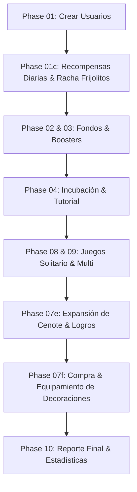

# Plan Extremo de Simulación del Universo Axolotto (Task-1780835457-47)

Este documento contiene el plan de diseño e implementación para agregar las mecánicas faltantes de juego en el **Simulador del Universo Axolotto v3**, permitiendo probar el flujo de punta a punta del ecosistema (economía, progresión del cenote, apadrinamiento y coleccionables) en cuestión de segundos.

---

## 🎯 Objetivos de la Tarea

1. **Simulación Completa de la Expansión del Cenote (Cueva)**:
   - Integrar los endpoints `/api/v1/cave/status`, `/api/v1/cave/expand`, y `/api/v1/cave/expand/accelerate`.
   - Permitir a los jugadores (bots) expandir sus cuevas a niveles superiores (niveles 2 a 8).
   - Validar la lógica de costos en Frijolitos (FRJ), tiempo de excavación en horas y los logros requeridos por cada nivel.
   - Implementar el 50% de descuento en costo y tiempo para miembros VIP.

2. **Simulación de Reclamo Diario (Daily Claim) y Rachas**:
   - Integrar los endpoints `/api/v1/daily-claim` y `/api/v1/daily-claim/status`.
   - Crear un mecanismo para simular acumulaciones de racha consecutiva (de 1 a 7 días) de forma **instantánea** modificando retrospectivamente los timestamps de la base de datos sin esperas físicas.

3. **Simulación de Racha de Juegos Jugados (daily_play_streak)**:
   - Modificar las fechas de finalización de partidas de los bots para simular que jugaron partidas consecutivas en días separados, acumulando la racha de 3 días requerida para la cueva de Nivel 3.

4. **Simulación de Decoración de Cueva (Cave Items)**:
   - Permitir la compra o adquisición de decoraciones (`ItemType.CAVE_ITEM`).
   - Integrar el endpoint `/api/v1/cave/decorations/update` para equipar decoraciones en los slots del Cenote.
   - Validar que los slots coincidan con las subcategorías de los ítems (`FLOOR`, `WALL`, `WATER`, `SPECIAL`) y respetar el límite de slots por nivel.

5. **Apadrinamiento Masivo y Eclosión de Webitos**:
   - Integrar pruebas de apadrinamiento masivo, validando el límite estricto de 3 mentorías por Axolotito adulto.
   - Probar que los stats del padrino aumentan de nivel y experiencia al completarse el imprinting.

---

## 🔍 Análisis Técnico y "Gotchas" Detectados

Al revisar minuciosamente la arquitectura actual, se encontraron los siguientes puntos críticos que requieren atención inmediata:

### 1. Error de Firma en `phase_04_incubation.py`
En el archivo [phase_04_incubation.py](file:///D:/Axolotto_2026/axolotto/backend/app/scripts/simulation/phase_04_incubation.py#L392), se realiza la siguiente invocación:
```python
res = start_expansion(
    path="pago",
    session=session,
    verified_user_id=user_id
)
```
**Error**: El método `start_expansion` definido en [cave_expansion.py](file:///D:/Axolotto_2026/axolotto/backend/app/api/v1/endpoints/cave_expansion.py#L541) **no acepta ningún argumento `path`**.
```python
@router.post("/expand")
def start_expansion(
    session: Session = Depends(get_session),
    verified_user_id: str = Depends(get_verified_user_id),
):
```
Esto provoca un error `TypeError` que rompe el flujo del simulador. La expansión debe llamarse sin `path` y la lógica de excavación debe completarse/acelerarse usando el endpoint de aceleración.

### 2. Zona Horaria del Daily Claim (America/Mexico_City)
El servicio [DailyRewardService](file:///D:/Axolotto_2026/axolotto/backend/app/services/daily_reward_service.py#L61) calcula el día en la zona horaria de la Ciudad de México (UTC-6). Si modificamos el timestamp `user.last_f2p_daily_claim_at` retrospectivamente restando exactamente 1 día UTC, debemos asegurarnos de que cae en la fecha local del día anterior en UTC-6 para que la lógica de racha lo detecte como consecutivo (ni el mismo día, ni un día posterior con hueco).
- **Fórmula de retroceso seguro**:
  ```python
  from datetime import timedelta
  user.last_f2p_daily_claim_at = user.last_f2p_daily_claim_at - timedelta(hours=25)
  ```
  Al restar 25 horas nos aseguramos de cruzar el límite diario en la zona horaria correspondiente sin saltarnos un día completo.

### 3. Logros Complejos por Nivel de Cueva
Para expandir el Cenote del nivel 3 en adelante, se validan estadísticas complejas del usuario en `_get_user_stats()`:
- **Nivel 3**: Racha de juego (`daily_play_streak`) >= 3.
- **Nivel 4**: Jackpots ganados (`jackpots_won`) >= 1.
- **Nivel 5**: Nivel de Axolotito principal (`main_axo_level`) >= 15.
- **Nivel 6**: Juegos jugados >= 50 + alimentaciones >= 100 (o VIP Coral+).
- **Nivel 7**: Juegos jugados >= 100 + victorias >= 15 (o VIP Dorado+).
- **Nivel 8**: Juegos jugados >= 200 + Axolotito Épico/Legendario (o VIP Axolite).

**Estrategia de Simulación**:
Para probar todos los niveles, los bots de personalidad **Whales** y **VIPs** utilizarán sus beneficios de nivel para saltarse los logros más exigentes (Niveles 6, 7 y 8 permiten la validación vía VIP tier). Sin embargo, para los Niveles 3, 4 y 5, debemos asegurar que las estadísticas se simulen o alteren artificialmente en la base de datos o durante el ciclo de juego:
- **Racha de Juego**: Modificar retrospectivamente `user.last_play_date` en la fase de juegos individuales.
- **Jackpots**: En la simulación de juegos individuales, podemos forzar que al menos un juego de las ballenas sea marcado como Jackpot para cumplir el logro del nivel 4.
- **Nivel de Axolotito**: Aumentar la experiencia/nivel del Axolotito principal de los bots agresivos y whales mediante batallas o inyectando XP directamente en la base de datos de simulación para alcanzar nivel 15.

---

## 🛠️ Arquitectura del Super Plan de Simulación

El plan estructurará la simulación en **4 fases nuevas y modificadas**, agregando cobertura completa:



### Detalle de las Nuevas Fases

#### Fase 1: `phase_01c_daily_rewards.py` (Nueva)
*   **Propósito**: Simular la acumulación de frijolitos diarios y testear el backend de recompensas.
*   **Acciones**:
    1.  Cada bot inicia con racha 0.
    2.  Se realiza una petición de claim diaria (`DailyRewardService().claim_daily_reward`).
    3.  Se retrocede el campo `user.last_f2p_daily_claim_at` por 25 horas.
    4.  Se repite el paso 2 y 3 consecutivamente hasta 3 veces (para bots normales) y 7 veces (para whales) para probar el tope de la recompensa.
    5.  Se registran las estadísticas de frijolitos acumulados en `stats`.

#### Fase 2: `phase_04_incubation.py` (Modificaciones)
*   **Propósito**: Corregir errores de firma de funciones e integrar el sistema de apadrinamiento masivo.
*   **Acciones**:
    1.  Corregir la llamada incorrecta a `start_expansion` quitando el argumento `path="pago"`.
    2.  Para la incubación del primer huevo de onboarding, simular el flujo del tutorial.
    3.  Introducir un bot especial **"Hatchery Whale"** que compre e incube hasta 10 huevos adicionales.
    4.  Asignar padrinos rotativos de la lista de axolotitos del jugador.
    5.  Verificar que si un axolotito intenta apadrinar un 4to huevo, el endpoint lance un error HTTP 400 (mentorship limits) y el simulador capture el error como un test exitoso de validación de reglas.

#### Fase 3: `phase_07e_cave_expansion.py` (Nueva)
*   **Propósito**: Simular el crecimiento del Cenote de nivel 1 al 8.
*   **Acciones**:
    1.  Para cada bot, verificar su estado de cueva (`/cave/status`).
    2.  Simular racha de juego diaria retrospectiva en la BD:
        - Para bots que jugaron partidas individuales, iterar sobre sus registros e ir restando 1 día a `user.last_play_date` secuencialmente entre juegos para elevar `user.daily_play_streak` a 3.
    3.  Llamar a `/cave/expand` para iniciar la excavación. Se deduce la cantidad de FRJ adecuada (aplicando 50% de descuento si es VIP).
    4.  Para evitar la espera del timer de excavación (que va de 2h a 72h), llamar inmediatamente a `/cave/expand/accelerate`. Se deduce AXF del monedero del jugador y se finaliza la excavación instantáneamente.
    5.  Registrar el nivel alcanzado y el huevo otorgado de recompensa en el inventario.

#### Fase 4: `phase_07f_cave_decor.py` (Nueva)
*   **Propósito**: Probar la lógica de compra y colocación de decoraciones de cueva (`ItemType.CAVE_ITEM`).
*   **Acciones**:
    1.  Hacer que los bots compren decoraciones en la tienda usando Frijolitos (`ShopService.buy_item`).
    2.  Obtener la lista de decoraciones del inventario del usuario.
    3.  Llamar a `/api/v1/cave/decorations/update` pasando un slot válido (`FLOOR_1`, `WALL_1`, `WATER_1` o `SPECIAL_1`) y el ID de la decoración que coincida con la subcategoría correspondiente.
    4.  Intentar colocar una decoración en un slot del tipo incorrecto (ej. colocar `WALL` en slot `FLOOR_1`) para validar que el backend rechaza la colocación.
    5.  Intentar exceder el límite de slots permitidos por el nivel actual de la cueva para validar el bloqueo de seguridad.

---

## 📈 Métricas y Reportes Adicionales

Se agregarán las siguientes variables al reporte final en `simulation_report.txt` para proveer visibilidad sobre el funcionamiento de estas nuevas mecánicas:
- **`daily_claims_total`**: Reclamaciones de recompensas diarias ejecutadas.
- **`max_daily_streak_reached`**: Racha máxima de claim diario lograda en simulación.
- **`cave_expansions_total`**: Total de expansiones de cueva realizadas.
- **`cave_expansion_axf_spent`**: Total de AXF gastados en acelerar la excavación.
- **`max_cave_level_reached`**: El nivel máximo de Cenote alcanzado por algún bot (esperado: 8 para la Ballena).
- **`cave_items_equipped`**: Cantidad de decoraciones equipadas con éxito en los Cenotes de los bots.
- **`padrino_mentorship_errors_checked`**: Número de bloqueos exitosos capturados al intentar exceder el límite de 3 mentorías.

---

## 🚀 Plan de Ejecución de Tareas

| Paso | Actividad | Archivos Involucrados | Responsable |
| :--- | :--- | :--- | :--- |
| **1** | Mover la tarea a `planning` (Completado) | `taskboard.db` | Antigravity |
| **2** | Crear la fase `phase_01c_daily_rewards.py` y agregarla al runner | `phase_01c_daily_rewards.py`, `runner.py` | Antigravity |
| **3** | Corregir bug de firma en `phase_04_incubation.py` y robustecer apadrinamientos | `phase_04_incubation.py` | Antigravity |
| **4** | Crear la fase de expansión de cueva con aceleración `phase_07e_cave_expansion.py` | `phase_07e_cave_expansion.py`, `runner.py` | Antigravity |
| **5** | Crear la fase de decoraciones `phase_07f_cave_decor.py` | `phase_07f_cave_decor.py`, `runner.py` | Antigravity |
| **6** | Actualizar `runner.py` para reportar las nuevas estadísticas | `runner.py` | Antigravity |
| **7** | Ejecutar pruebas del simulador completo y verificar logs | `simulation.log`, `simulation_report.txt` | Antigravity |

---

## 🔄 Correcciones Durante Implementación (2026-06-08)

### 1. Daily Claim → Ciclo Lunar
El endpoint `/api/v1/daily-claim` y `DailyRewardService` fueron **deprecados** (retornan HTTP 410 Gone). El sistema actual es:
- **Endpoint**: `POST /api/v1/rewards/lunar/claim` + `GET /api/v1/rewards/lunar/status`
- **Servicio**: `lunar_streak_service.py` → `claim(db, user)`
- **Diferencias clave**:
  - Ciclo de 7 días → día 7 da cápsulas (según la Luna actual 1-6)
  - 6 Lunas por ciclo completo
  - Inactividad >7 días resetea todo
  - Día omitido (gap >1 día) resetea racha semanal sin resetear Luna
  - El campo `user.lunar_last_claim_at` reemplaza a `user.last_f2p_daily_claim_at`

### 2. Bug de firma corregido (sin `path`)
`start_expansion()` en `cave_expansion.py` **no acepta** argumento `path`. La firma es:
```python
def start_expansion(
    session: Session = Depends(get_session),
    verified_user_id: str = Depends(get_verified_user_id),
):
```
Se corrigió la llamada en `phase_04_incubation.py` eliminando `path="pago"`.

### 3. Expansión ahora usa aceleración real
En lugar de intentar pagar con AXF directamente (que no es soportado por el endpoint), la simulación ahora:
1. Asegura FRJ y AXF en el wallet
2. Llama `start_expansion()` (deduce FRJ, aplica descuento VIP 50%)
3. Llama `accelerate_expansion()` inmediatamente (deduce AXF a 4 AXF/hora)
4. Registra ambas métricas por separado

---

## 🎛️ Inputs Recomendados para Panel Admin del Simulador

Estos parámetros permitirían a un admin controlar la simulación desde el taskboard sin tocar código:

| Parámetro | Tipo | Default | Descripción |
|:---|:---|:---|:---|
| `--lunar-days` | int | 3 | Días del Ciclo Lunar a simular por bot (1-7) |
| `--target-cave-level` | int | 0 | Forzar nivel de cueva objetivo (0 = según personalidad) |
| `--skip-cave-expansion` | flag | false | Omitir fase de expansión de cueva |
| `--skip-cave-decor` | flag | false | Omitir fase de decoración |
| `--skip-daily-rewards` | flag | false | Omitir fase de Ciclo Lunar |
| `--test-mentorship-limit` | flag | true | Ejecutar test de límite de 3 mentorías por axolotito |
| `--cave-decor-items` | int | 0 | Número de decoraciones a comprar (0 = según personalidad) |

**Métricas adicionales para monitorear en panel**:
- `cave_expansion_axf_spent` — AXF total gastado en aceleración
- `cave_expansion_frj_spent` — FRJ total gastado en excavación
- `max_cave_level_reached` — Nivel máximo de Cenote por algún bot
- `padrino_mentorship_errors_checked` — Validaciones de límite de mentoría
- `cave_decor_slot_mismatch_checked` — Tests de seguridad de slots
- `daily_capsules_won` — Cápsulas recibidas en día 7 del Ciclo Lunar
- `lunar_cycles_completed` — Ciclos lunares completados
