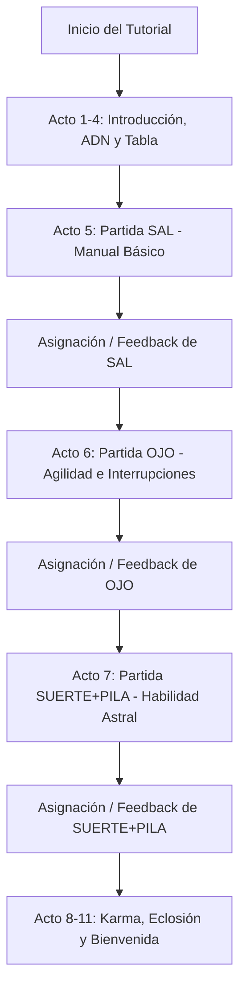

# Plan de Diseño: Tutorial Interactivo en Modo Manual vs CPU (Imprinting del Webito)

Este documento detalla la planificación, el diseño de juego y la arquitectura técnica para cambiar el flujo de partidas del tutorial del Axolotito. Actualmente, el jugador observa una simulación 100% automatizada. La propuesta es que **el jugador juegue manualmente** contra una CPU (el Webito/Rookie Bot) para que el "imprinting" (lógica de transmisión de personalidad y estadísticas) se sienta directo, inmersivo y dependa de la destreza del usuario, tal como dicta el lore del Padrino.

---

## 1. Justificación y Lore (Game Design)

En la narrativa de **Axolotto**, el jugador realiza un pacto con el Padrino en el Cenote. Para que el Webito adopte las características y el alma del jugador, este debe jugar las partidas de lotería. El imprinting no puede ser pasivo; el Webito aprende observando tus reflejos, tu suerte y tu concentración.

*   **Estado actual (Malo):** El jugador hace clic en "Jugar" y observa cómo las cartas se marcan solas en `CpuSimScreen.tsx` hasta que sale "Victoria" o "Derrota". Se siente aburrido y desconectado.
*   **Estado propuesto (Bueno):** El jugador escucha las cartas cantadas por el dealer en tiempo real, busca en su tabla de $4 \times 4$ y presiona la carta correspondiente para marcarla. Si completa la línea, debe gritar **¡LOTERÍA!** para reclamar la victoria frente al bot CPU, que juega a su propio ritmo.

---

## 2. Flujo del Juego Manual del Tutorial

El tutorial mantendrá su estructura simplificada de **3 partidas de imprinting**, correspondientes a los 3 actos de juego:



### A. Acto 5: Partida SAL (Introducción al Marcado Manual)
*   **Objetivo de Lore:** Enseñar al jugador la resistencia al agua salada (SAL).
*   **Dificultad de la CPU:** Extremadamente baja (Rookie). El bot tiene una tasa de acierto del $75\%$ y un tiempo de reacción lento ($2.0\text{s}$).
*   **Mecánica:** El dealer canta una carta cada $2.0\text{s}$. El jugador pulsa en su tabla de lotería cuando aparece la carta cantada.
*   **Resultado esperado:** Victoria fácil para dar confianza inicial.

### B. Acto 6: Partida OJO (Concentración y Distracciones)
*   **Objetivo de Lore:** Moldeado del Focus y la Agilidad.
*   **Dificultad de la CPU:** Media ($85\%$ de acierto del bot, velocidad de cartas $1.5\text{s}$).
*   **Mecánica Especial (Distracción):** A mitad de la partida, si el huevo tiene bajo Focus, se gatilla una interrupción. El juego se pausa visualmente, el Webito habla asustado ("¡Me distraje con una burbuja!") y el jugador debe pulsar rápidamente una carta resaltada para recuperar la concentración y reanudar la partida.
*   **Resultado esperado:** El jugador experimenta directamente el impacto de la concentración (Focus).

### C. Acto 7: Partida SUERTE + PILA (Destreza y Cheat Astral)
*   **Objetivo de Lore:** Moldeado de la Suerte (Luck) y la Energía (Stamina).
*   **Dificultad de la CPU:** Alta-Desafiante ($90\%$ de acierto del bot, velocidad de cartas $1.2\text{s}$).
*   **Mecánica Especial (Cheat Astral / Suerte):** El bot tiene una ventaja inicial o va ganando. En un momento de tensión, el Webito te incita a usar una **Pista** (revela una carta en el tablero) o te ayuda a marcar la línea. Si el jugador completa la línea, el botón **¡LOTERÍA!** destella en dorado y el jugador debe presionarlo antes de que el CPU declare la victoria.

---

## 3. Arquitectura Técnica

Para implementar este cambio de forma limpia y reutilizable sin alterar el multijugador ni el backend complejo:

```
┌─────────────────────────────────────────────────────────────┐
│                       FRONTEND                              │
│                                                             │
│  [ActGame.tsx]                                              │
│         │                                                   │
│         ├─► Renderiza [GameScreen.tsx] (mode="manual")      │
│         │                                                   │
│         └─► Controlador local [useTutorialManualGame.ts]    │
│                    │                                        │
│                    ├─► Consume mazo y tableros de /play-game│
│                    ├─► Maneja interval local (tick de cartas)│
│                    ├─► Registra clicks en celdas (onCellTap)│
│                    └─► Controla marcas automáticas del Bot  │
│                                                             │
└──────────────────────────────┬──────────────────────────────┘
                               │
                               │ POST /tutorial/next-step/{id}
                               │ Body: { won: true/false }
                               ▼
┌─────────────────────────────────────────────────────────────┐
│                       BACKEND                               │
│                                                             │
│  [tutorial.py]                                              │
│         │                                                   │
│         └─► [tutorial_service.py] (advance_phase)           │
│                    │                                        │
│                    └─► Aplica ±10 de stats según "won"      │
│                                                             │
└─────────────────────────────────────────────────────────────┘
```

1.  **Reutilización de Pantallas Interactivas:**
    En lugar de usar `CpuSimScreen.tsx` (que es automático), usaremos `GameScreen.tsx` en `ActGame.tsx` con el prop `mode="manual"`.
2.  **Hook de Simulación Manual Local (`useTutorialManualGame.ts`):**
    Crearemos un hook específico para el tutorial que:
    *   Llamará a `POST /api/v1/tutorial/play-game` al inicio para obtener la baraja de cartas cantadas (`drawn_cards_sample`), la tabla del bot (`bot_board_nums`) y la del jugador (`player_board_nums`).
    *   Llevará el ciclo de turnos locales con un `setInterval` de velocidad variable (según el acto).
    *   Habilitará `interactive={true}` en la tabla del jugador. En `onCellTap`, verificará si la carta seleccionada coincide con la carta actualmente cantada o con las anteriores no marcadas.
    *   Simulará los aciertos de la CPU en su propio tablero de forma progresiva basándose en su probabilidad de acierto o en los datos precalculados del bot.
    *   Detectará la condición de victoria/derrota. Al terminar, el jugador presionará "Siguiente Partida", lo que llamará a `POST /api/v1/tutorial/next-step/{id}` enviando el parámetro `{ won: true/false }` determinado por el juego manual real.
3.  **Independencia de Red:**
    Esto encapsula toda la interacción manual localmente en el cliente, evitando tener que simular tiempos de respuesta del jugador y clics en un servidor WebSocket o de base de datos para el tutorial.

---

## 4. Consideración de Riesgos y Mitigaciones (Auditoría de Game Design)

| Riesgo / Problema | Impacto | Mitigación Propuesta |
| :--- | :--- | :--- |
| **Duración excesiva del onboarding** | Alto. Un tutorial de 3 partidas manuales completas puede ser tedioso ($3 \times 1.5\text{ minutos} = 4.5\text{ minutos}$). | 1. **Mazo corto:** El backend puede retornar mazos más cortos o configurados para ganar rápido.<br>2. **Ganancia veloz:** Diseñar las tablas para que tengan alta probabilidad de completar líneas en los primeros 10-15 turnos.<br>3. **Velocidad dinámica:** Permitir aumentar la velocidad si el usuario mantiene presionada la pantalla. |
| **Frustración por derrotas continuas** | Medio. Si el CPU es muy rápido y el jugador pierde todas las partidas, el Webito nacerá "débil". | 1. **Dificultad progresiva:** El acto 5 (SAL) debe estar prácticamente garantizado para el jugador.<br>2. **Ajuste de velocidad de CPU:** Si el jugador va perdiendo por mucho, la probabilidad de acierto de la CPU disminuye dinámicamente.<br>3. **Soporte de Pistas:** Habilitar el botón "💡 Pista" para marcar automáticamente cartas que el jugador pasó por alto. |
| **Desincronización de estadísticas** | Bajo. Que los datos visuales de deltas no coincidan con lo guardado en base de datos. | El frontend calculará visualmente los deltas basados estrictamente en la constante `STAT_DELTA = 10` que ya está alineada con `tutorial_service.py` ($10.0$ puntos por victoria/derrota). El resultado final se reporta por `/next-step`. |
| **Abuso de clics rápidos (Spam)** | Bajo. El jugador pulsa todas las celdas rápidamente para marcar antes de que salgan las cartas. | Penalizar clics erróneos en celdas que no corresponden a la carta actual con una breve vibración visual (rojo) y deshabilitar marcas incorrectas. |

---

## 5. Plan de Tareas Técnicas (Roadmap de Trabajo)

*   **Paso 1:** Crear el hook `frontend/hooks/useTutorialManualGame.ts` que implemente el bucle de juego manual local contra la CPU basándose en el mazo de cartas y los tableros cargados.
*   **Paso 2:** Modificar `frontend/components/tutorial/acts/ActGame.tsx` para:
    *   Reemplazar `CpuSimScreen` por `GameScreen`.
    *   Conectar el hook `useTutorialManualGame` para alimentar a `GameScreen`.
    *   Ajustar los diálogos de las fases pre-game y post-game para adaptarlos a la interactividad manual.
*   **Paso 3:** Adaptar los eventos del tutorial en los actos 5, 6 y 7 en el frontend:
    *   Acto 5: Velocidad moderada, feedback guiado.
    *   Acto 6: Manejar la pausa de la "Distracción" en el flujo del hook y requerir que el usuario la resuelva para despausar el juego manual.
    *   Acto 7: Facilitar el final con pistas y el Cheat Astral.
*   **Paso 4:** Probar el flujo completo reiniciando el tutorial con el botón dev `/reset-tutorial` y validar el envío del resultado al backend.
