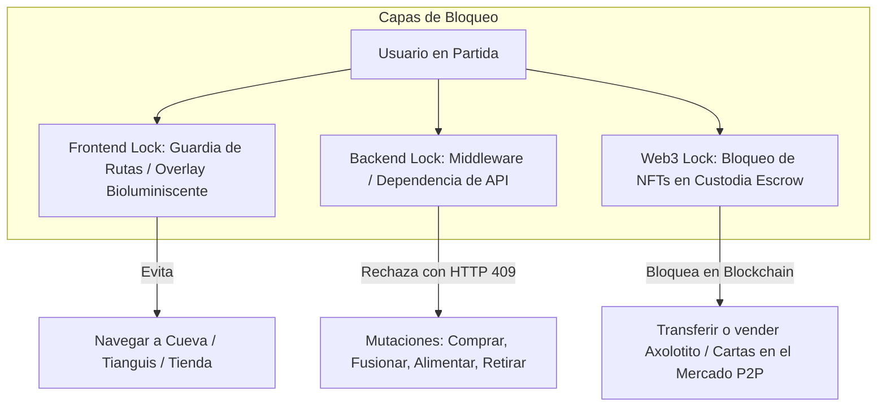

# Plan de Diseño y Seguridad: In-Game Locking, Control de Rage-Quit y Sistema AFK

Este documento detalla la arquitectura, el diseño de UX y el plan de implementación para abordar la tarea **task-1781172052-88** en el tablero Kanban. El objetivo es bloquear el acceso a cualquier otra sección o acción dentro del sistema mientras un jugador se encuentra en una partida activa (evitando que intente realizar otras operaciones paralelas), mitigar el abandono de partidas ("rage-quitting"), establecer un sistema de expulsión por inactividad (AFK), y notificar de manera diferida los resultados de juegos finalizados en ausencia del usuario.

---

## 1. Bloqueo de Acciones en Partida (In-Game Lock)

Para asegurar que un jugador no pueda realizar ninguna acción secundaria (como comprar boosters en el Tianguis, editar tableros, alimentar Axolotitos o transferir tokens) mientras está jugando, implementaremos una protección en tres capas: Backend, Frontend y Contratos.



### 1.1. Backend Lock (Guardia de Endpoints)
Implementaremos una dependencia reutilizable en FastAPI para validar que el usuario no tiene partidas en curso antes de procesar llamadas que muten el estado de su cuenta.

*   **Lógica de Comprobación:**
    Antes de procesar mutaciones en módulos clave (`bank`, `shop`, `incubation`, `cave`, `market`), se consulta si el `verified_user_id` posee un registro activo en `RoomRegistration` dentro de una sala con `GameRoom.status == "playing"`.
*   **Código de Excepción:**
    Si el chequeo falla, se lanza una excepción `HTTP 409 Conflict` (o `HTTP 423 Locked`) con el código de error correspondiente:
    ```json
    {
      "detail": "IN_GAME_LOCK: Tienes una partida activa en curso. Completa el juego actual para interactuar con el resto del sistema."
    }
    ```
*   **Rutas Excluidas:**
    Quedan excluidas las consultas puras de datos (`GET` general de inventario, balances) y los endpoints del propio módulo multijugador (`/multiplayer/*` para WebSockets, marcar cartas, enviar chat).

### 1.2. Frontend Lock (Guardia de Navegación y Overlay)
En el frontend (Next.js/React con Zustand), controlaremos que el usuario permanezca en la pantalla de la partida si esta se encuentra activa.

*   **Ruta Guardia (Route Guard):**
    Si el estado global de la partida del usuario es activo (`RoomRegistration.status == "playing"`), cualquier intento de cambiar la ruta en el navegador a otra sección (e.g. `/tianguis`, `/cueva`) redirigirá de inmediato a la URL de la sala `/multiplayer/room/[room_id]`.
*   **Overlay de Bloqueo Persistente:**
    Para evitar el "cliqueo rápido" o bypass visual, se desplegará un overlay bioluminiscente de pantalla completa no descartable si el usuario tiene una partida activa. Este overlay mostrará el estado de la partida y un mensaje: *"¡Partida en Progreso! Tu Axolotito está compitiendo en el Tianguis Submarino. Enfócate en tu tabla para cantar Lotería."*
*   **Deshabilitación Global de UI:**
    Los menús de navegación superior, lateral y la mochila/inventario rápido quedarán completamente bloqueados o invisibles mientras dure la partida.

### 1.3. Smart Contracts & Web3 Lock
En el plano de blockchain:
*   **Custodia Automática (Escrow):** Al unirse a la sala multijugador, tanto el Axolotito NFT como las tablas registradas son retenidos bajo custodia (escrow) en el backend (y opcionalmente a nivel de contrato en `TablasLoteria.sol`). Mientras estén en este estado, el contrato inteligente impedirá cualquier intento de transferencia o venta P2P.
*   **Guardia de Firmas:** El backend rechazará la generación de firmas de validación y la aprobación de vouchers Web3 para el usuario si este tiene un bloqueo de juego activo.

---

## 2. Mitigación de Abandonos (Rage-Quit) y Notificación Diferida

### 2.1. El Juego Sigue en el Servidor
Un problema común en juegos Web3 es que los jugadores cierren la ventana o pierdan la conexión intencionadamente cuando ven que van perdiendo para intentar congelar el juego o evadir la transacción económica.

*   **Ejecución Autoritativa en Servidor:**
    La partida de Lotería corre de forma asíncrona en el backend (`multiplayer_service.py`). Si un jugador humano cierra su pestaña o se desconecta de los WebSockets, la partida **no se detiene**. El Gritón continúa cantando cartas a los intervalos definidos y los demás jugadores/bots siguen jugando.
*   **Pérdida Inmediata del Buy-in (Costo de Entrada):**
    El buy-in del jugador se retira de su saldo de custodia (escrow) al iniciar el juego. Si decide desconectarse o no marcar sus cartas, su entrada se conserva en el pozo de premios de la sala, por lo que el rage-quitting no les ahorra monedas y beneficia a los jugadores honestos.

### 2.2. Reconexión si la Partida Sigue Activa
Si el usuario cierra la ventana o pierde la conexión pero regresa **mientras la partida aún está en curso** en el servidor:
*   **Redirección Automática Obligatoria:** El frontend (a través del Route Guard) detecta de inmediato que la partida sigue activa y lo redirige automáticamente de vuelta a la pantalla de la sala de juego.
*   **Determinación del Modo de Juego (Manual vs Auto):**
    *   **Retorno en Modo Manual:** Si el jugador estuvo desconectado o inactivo por **menos de 3 turnos** de cartas cantadas, la conexión WebSocket se restablece, el estado de la partida se sincroniza y el jugador **retoma el control manual** de su tabla para seguir marcando.
    *   **Permanencia en Modo Auto (Espectador):** Si el jugador estuvo desconectado o inactivo por **3 o más turnos**, el backend ya habrá cambiado su estado a `"auto"` (Auto-Play) de forma permanente para esa partida. Al reconectar, la interfaz se cargará en **modo espectador**, permitiéndole ver el desarrollo y desenlace de la partida en tiempo real pero sin poder interactuar ni marcar cartas manualmente. Se mostrará un aviso inline: *"El bot de tu Axolotito ha asumido el control debido a inactividad prolongada (+3 turnos perdidos). Estás en modo espectador."*

### 2.3. Notificación del Resultado si la Partida ya Finalizó
Si el usuario desconectó la ventana y el juego terminó en su ausencia, el sistema debe registrar lo sucedido y mostrárselo prominentemente cuando vuelva a ingresar a Axolotto.

*   **Caché de Resultados No Leídos:**
    La base de datos almacena el resultado en `MultiplayerGameLog` con el flag `notified = False`.
*   **Flujo de Re-Ingreso:**
    Cuando el usuario inicia sesión y accede al lobby principal:
    1. El frontend consulta el endpoint `/api/v1/multiplayer/unread-logs`.
    2. Si detecta un registro sin notificar, bloquea la vista del lobby y despliega un modal interactivo con temática de **"Papel Picado del Destino"**.
    3. El modal muestra el resultado detallado:
        *   **Posición y Logro:** Posición final (ej. 3er lugar), tablas jugadas y qué cartas faltaban para completar el patrón ganador.
        *   **Recompensas Obtenidas:** FRJ ganados, XP acumulada por el Axolotito, y consumibles obtenidos.
        *   **Advertencia por Abandono:** Si el usuario se desconectó y el bot tuvo que tomar el control en modo auto, se muestra una advertencia amistosa pero firme: *"Te desconectaste de la partida. Tu Axolotito continuó jugando en modo automático pero su enfoque disminuyó, afectando el resultado."*
    4. Al cerrar el modal, el frontend marca el log como leído en el backend para que no vuelva a aparecer.


---

## 3. Detección de Inactividad (AFK Kick) y Penalizaciones

Para mantener el dinamismo en el modo interactivo (donde los jugadores deben hacer clic manualmente en sus cartas para marcarlas), definimos reglas estrictas de inactividad.

```
                   ¿Jugador inactivo por 3 turnos seguidos?
                                     │
                  ┌──────────────────┴──────────────────┐
                  ▼ SÍ                                  ▼ NO
       [Cambio automático a AUTO-PLAY]           [Continúa manual]
                  │
       ┌──────────┴──────────┐
       ▼                     ▼
[Impuesto AFK: -30% Premio]   [Penalización: XP = 0 y -5 Lealtad]
```

### 3.1. Inactividad en el Lobby (Pre-Partida)
*   **Timeout de Listo (2 Minutos):**
    Una vez que una sala hospedada por un jugador alcanza el mínimo de jugadores o el anfitrión inicia la cuenta regresiva, todos los jugadores tienen un límite de 2 minutos para pulsar "Listo" (Ready). Si un jugador no responde en ese tiempo, el sistema lo expulsa (Kick) de la sala para liberar el espacio.
*   **Disolución Automática (5 Minutos):**
    Si el anfitrión de una sala hosted permanece inactivo en el lobby por más de 5 minutos sin lanzar la partida, la sala se disuelve automáticamente para no bloquear las tablas y fondos en custodia de los otros jugadores inscritos.

### 3.2. Inactividad en la Partida (In-Game)
*   **Detección de Turno Perdido (Missed Mark):**
    El Gritón de la sala multijugador emite cartas cada $N$ segundos (ej. 4 segundos). Si el backend detecta que una carta cantada estaba en la tabla de un jugador y este no la marca antes del siguiente turno, se registra un turno perdido.
*   **Conversión de Modo a los 3 Turnos (Auto-Play de Emergencia):**
    Si el jugador acumula **3 turnos seguidos sin marcar ninguna carta válida** estando conectado (o desconectado), el backend asume que está AFK. Para no congelar la sala, el servidor actualiza su `RoomRegistration.play_mode` de `"manual"` a `"auto"` (el bot asume el control del marcado automático basado en sus estadísticas).
*   **Penalizaciones Económicas y de Experiencia:**
    Al finalizar la partida en modo Auto-Play forzado por AFK:
    1.  **Pérdida total de Experiencia:** El Axolotito recibe **0 XP** por la partida.
    2.  **Impuesto por Abandono (AFJ Tax):** Si el Axolotito termina ganando alguna de las bolsas de premios bajo el control del bot, se aplica un **30% de penalización** sobre la recompensa. Este porcentaje se quema o se redirige directamente a la bóveda del Jackpot de la comunidad (`JackpotVault`).
    3.  **Reducción de Lealtad/Afecto:** Se restan **5 puntos de lealtad** (`loyalty_points`) al Axolotito por abandono de su dueño, reduciendo su rendimiento físico general.

---

## 4. Plan de Implementación por Fases

### Fase 1: Guardia del Backend y Base de Datos (Seguridad)
- [ ] **DB Update:** Validar que los modelos de `RoomRegistration` y `MultiplayerGameLog` soportan las variables de desconexión y penalización.
- [ ] **Endpoint Active-Check:** Crear la ruta rápida `/api/v1/multiplayer/active-check` para validar si un usuario tiene un bloqueo in-game vigente.
- [ ] **Dependencia de Bloqueo:** Implementar la función de dependencia global `verify_no_active_game` en `backend/app/api/v1/deps.py` y vincularla a los endpoints de mutación económica y de ítems.

### Fase 2: Lógica de Inactividad y Penalizaciones en Servidor (Game Design)
- [ ] **Contador AFK en Loop de Juego:** Modificar el bucle de simulación en `backend/app/services/multiplayer_service.py` para verificar las marcas del usuario. Si pasan 3 turnos sin interacción, actualizar el modo de juego de la inscripción a `"auto"`.
- [ ] **Cálculo de Sanción Financiera:** En `simulate_multiplayer_match`, aplicar la penalización del 30% en las ganancias si el modo de juego fue alterado a `"auto"` por AFK. Transferir dicho impuesto a la bóveda común.
- [ ] **Desconexión por WebSocket:** En `ws_manager.py`, cuando la conexión WebSocket de una partida manual se rompa, esperar una ventana de gracia de 15 segundos antes de cambiar al jugador a modo auto-play de emergencia.

### Fase 3: Frontend Guards y Notificación (UX/UI)
- [ ] **Route Guard Global:** Crear una validación en Next.js utilizando Zustand para monitorizar el estado de juego activo. Bloquear el enrutador si está activo y redirigir a `/multiplayer/room/[id]`.
- [ ] **Overlay Bioluminiscente:** Diseñar la vista de pantalla completa Bioluminiscente no descartable que sirva como bloqueo visual de UI.
- [ ] **Modal de Resultados Pendientes:** Implementar el modal de resultados con el reporte visual de Lotería y alertas de rage-quit en caso de abandono.
