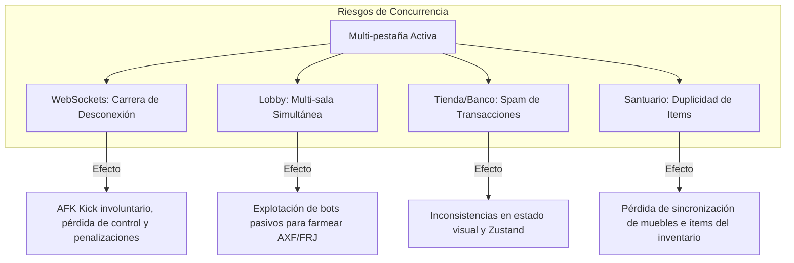

# Plan de Diseño y Seguridad: Concurrencia Multi-Ventana y Control de Sesión (Session Splitting)

Este documento detalla la arquitectura, el análisis de impacto y el plan de implementación para resolver la tarea **task-1781174918-89** del taskboard. El objetivo es mitigar y gestionar de manera segura los comportamientos concurrentes cuando un usuario abre múltiples ventanas o pestañas del navegador en Axolotto, protegiendo los flujos de juego, la economía dual y la consistencia del inventario.

---

## 1. Análisis de Impacto por Flujo de Juego

Cuando un usuario abre dos o más pestañas del juego con la misma cuenta, cada flujo reacciona de manera distinta, presentando riesgos de seguridad, exploits económicos o problemas severos de experiencia de usuario (UX).



### 1.1. Flujo de Juego Multijugador (WebSockets)
*   **Problema de Reemplazo Silencioso**: En `ws_manager.py`, cuando la pestaña B inicia sesión en la misma sala, se ejecuta `connect` y sobreescribe `session.players[user_id]` con el nuevo WebSocket. El WebSocket de la pestaña A queda huérfano.
*   **Bug de Carrera en Desconexión**: Cuando la pestaña A se desconecta (debido al reemplazo o al cerrar la ventana), el hook de FastAPI detecta la desconexión y llama a `ws_manager.disconnect(room_id, user_id)`. Como esta función no valida qué WebSocket físico se desconectó, marca al jugador como desconectado (`player.connected = False`, `player.ws = None`), rompiendo la conexión activa de la pestaña B.
*   **Paso AFK Involuntario**: 15 segundos después, la tarea de gracia de desconexión cambia al jugador a modo `"auto"` (bot) y penaliza al usuario (0 XP, -30% ganancias, -5 lealtad), arruinando la experiencia del usuario legítimo que seguía jugando en la pestaña B.

### 1.2. Flujo de Lobbies y Matchmaking
*   **Multi-registro Activo**: Si un usuario puede registrarse en múltiples salas simultáneamente desde diferentes pestañas, podría automatizar múltiples partidas de lotería a la vez. Al pasar a modo Auto-Play por inactividad, el usuario genera un vector de ataque para farmear recompensas de forma pasiva, saturando el backend.

### 1.3. Flujo de Tienda, Gashapon y Banco
*   **Double-Spending y Concurrencia**: Aunque el backend protege el balance usando `SELECT FOR UPDATE` en las tablas de wallet e inventario antes de las mutaciones, si el cliente hace clic concurrentemente en "Comprar sobrecito" en dos pestañas diferentes, una de las transacciones fallará limpiamente en la base de datos pero dejará el estado local de Zustand del frontend desincronizado, forzando una recarga manual o mostrando errores no amigables.

### 1.4. Flujo de Cueva y Decoración (Santuario)
*   **Colocación/Venta Concurrente**: Un usuario podría tener la pestaña A abierta en el modo edición de cueva y la pestaña B abierta en el inventario o mercado P2P. Si intenta vender un mueble en B al mismo tiempo que lo posiciona en A, se podrían generar conflictos de llaves en la base de datos o en Zustand si no se valida atómicamente el estado "colocado" del ítem.

---

## 2. Estrategia de Mitigación y Propuesta Técnica

Proponemos una solución coordinada en tres niveles: **Backend (WebSocket management)**, **Middleware (In-Game Lock)** y **Frontend (Sesión única y sincronización)**.

### 2.1. Nivel 1: Resolución del Bug de WebSocket (Backend)
Modificaremos el ciclo de vida de la conexión y desconexión en `ws_manager.py` para:
1.  **Diferenciar los WebSockets por conexión física**: La desconexión solo debe surtir efecto si el WebSocket que se desconecta coincide con el WebSocket activo registrado actualmente para el usuario.
2.  **Política de Desplazamiento Limpio (Kick de sesión anterior)**: Si se detecta una nueva conexión WebSocket para el mismo usuario y sala, notificaremos explícitamente a la conexión vieja y la cerraremos con un código personalizado (`4008_SESSION_REPLACED`).

#### Código Conceptual de Modificación en `ws_manager.py`:

```python
# En ws_manager.py

async def connect(self, room_id: int, user_id: str, ws: WebSocket, ...) -> None:
    await ws.accept()
    async with self._lock:
        if room_id not in self.sessions:
            self.sessions[room_id] = GameSession(room_id=room_id)
        
        session = self.sessions[room_id]
        
        # 1. Detectar si ya existe una conexión activa para este usuario
        existing_player = session.players.get(user_id)
        if existing_player and existing_player.ws and existing_player.connected:
            try:
                # Notificar a la pestaña antigua que ha sido desplazada
                await existing_player.ws.send_json({
                    "type": "session_replaced",
                    "message": "Se ha iniciado sesión desde otra ventana. Esta sesión ha sido desconectada."
                })
                # Cerrar la conexión antigua con código personalizado
                await existing_player.ws.close(code=4008, reason="session_replaced")
            except Exception:
                pass

        # 2. Registrar la nueva conexión
        player = PlayerState(
            user_id=user_id,
            ws=ws,
            connected=True,
            # Mantener el estado de juego anterior (marcas, pistas) si reconecta
            marked_indices=existing_player.marked_indices if existing_player else {},
            missed_turns_count=0, 
            play_mode=existing_player.play_mode if existing_player else play_mode,
            ...
        )
        session.players[user_id] = player

async def disconnect(self, room_id: int, user_id: str, ws: WebSocket) -> None:
    session = self.sessions.get(room_id)
    if not session:
        return
    
    player = session.players.get(user_id)
    # 3. Validar que la desconexión proviene del WebSocket activo actualmente
    if player and player.ws == ws:
        player.connected = False
        player.ws = None
        
        await self.broadcast(room_id, {
            "type": "player_left",
            "axo_name": player.axo_name,
            "player_count": sum(1 for p in session.players.values() if p.connected),
        })

        if player.play_mode == "manual":
            asyncio.create_task(self._disconnect_grace_period(room_id, user_id))
    else:
        # Es una desconexión de una pestaña vieja desplazada, ignorar
        logger.info(f"Desconexión obsoleta ignorada para el usuario {user_id} en sala {room_id}")
```

### 2.2. Nivel 2: Control de Rutas y Redirección (In-Game Lock Middleware)
Para evitar que el usuario participe en múltiples salas o inicie partidas clásico/hard concurrentes:
*   El endpoint para unirse a salas (`POST /api/v1/multiplayer/rooms/join`) o crear salas debe implementar la dependencia `verify_no_active_game` (desarrollada en la tarea 88).
*   Si el usuario ya está jugando o esperando en una sala activa, el backend responderá con `HTTP 409 Conflict`.
*   El frontend capturará este error 409 y forzará la redirección de la pestaña B a la sala que está activa (`/multiplayer/room/[active_room_id]`).

### 2.3. Nivel 3: Gestión de Pestañas en el Frontend (UX/UI)
*   **Captura de Cierre de Sesión por Reemplazo**:
    En la conexión de WebSocket de Next.js, si se recibe un cierre con código `4008` (o el mensaje `"session_replaced"`), el frontend no debe reintentar la conexión de forma automática (evitando bucles de ping-pong de reconexión).
    En su lugar, el frontend mostrará un **Modal Overlay Bloqueante** con el tema visual de Papel Picado:
    > ⚠️ **Sesión Activa en otra Ventana**
    >
    > Hemos detectado que abriste Axolotto en otra pestaña o dispositivo. 
    > Para continuar jugando aquí, refresca esta página (esto desconectará las otras ventanas).
*   **BroadcastChannel API (Opcional pero Recomendado)**:
    Implementar una comunicación ligera en el navegador utilizando `BroadcastChannel` para notificar a otras pestañas sobre transacciones de tienda o cambios de inventario:
    ```javascript
    const channel = new BroadcastChannel('axolotto_session');
    
    // Al comprar o editar la cueva
    channel.postMessage({ type: 'INVENTORY_UPDATED' });
    
    // Escuchar en las otras pestañas para forzar la actualización de Zustand
    channel.onmessage = (event) => {
        if (event.data.type === 'INVENTORY_UPDATED') {
            useInventory.getState().fetchInventory(); // refrescar estado
        }
    };
    ```

---

## 3. Plan de Implementación por Fases

### Fase 1: Corrección de Carrera en WebSockets (Backend)
- [ ] **Modificación de WS Connection & Disconnect**: Actualizar `game_ws.py` y `ws_manager.py` para pasar y comparar la instancia física de `WebSocket` en los métodos de desconexión.
- [ ] **Implementación de Reemplazo Activo**: Añadir lógica en `connect` para enviar un mensaje `"session_replaced"`, cerrar el WebSocket antiguo con código `4008` y evitar la fuga de estado.
- [ ] **Tests de Integración de Concurrencia**: Crear un script de pruebas simuladas para verificar que la desconexión de una pestaña obsoleta no anule la reconexión de una pestaña nueva.

### Fase 2: Robustez de Guardia a Nivel de Endpoints (Backend)
- [ ] **Protección de Registro en Salas**: Asegurar que `/api/v1/multiplayer/rooms/join` y `/api/v1/multiplayer/rooms/create` verifiquen la existencia de bloqueos activos.
- [ ] **Protección de Partidas Clásicas**: Validar en `/api/v1/game/start` que el usuario no tiene bloqueos activos del modo multijugador para evitar la duplicidad de apuestas.

### Fase 3: Interfaz y Control de Reconexiones (Frontend)
- [ ] **Detector de Código 4008**: Configurar el hook de WebSocket en el cliente React para capturar cierres con código `4008` y desactivar la reconexión automática en Zustand.
- [ ] **Modal de Sesión Reemplazada**: Diseñar el overlay no descartable de "Sesión Activa en otra Ventana" con un botón prominente para "Tomar el control aquí" (que refresca la pestaña).
- [ ] **Sincronización Inter-Pestañas**: Configurar `BroadcastChannel` para propagar eventos de mutación financiera y cambios de inventario hacia otras pestañas abiertas.
