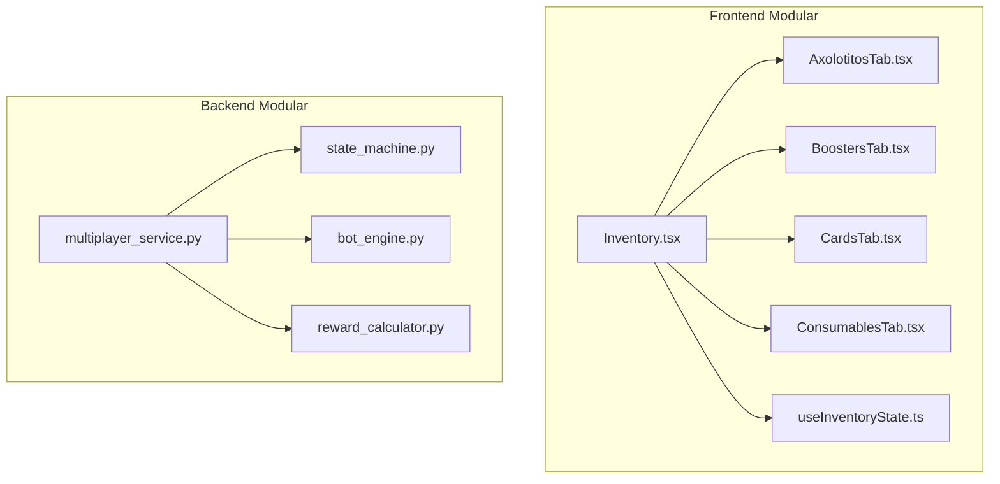

# Plan: Reporte Exhaustivo de Flujos, Economía y Modularización de Código

> Generado por **antigravity** · tarea `task-1781194038-91` · 2026-06-11

Este documento presenta una auditoría exhaustiva y un análisis de arquitectura para el ecosistema **Axolotto**. Cubre los flujos de jugabilidad, las dinámicas de tokenomics/fintech, la reconciliación P2P, y ofrece propuestas concretas para refactorizar y desarticular códigos monolíticos desordenados tanto en el backend como en el frontend.

---

## 1. Auditoría de Jugabilidad y Reglas del Juego (Gameplay)

El análisis de las especificaciones y el código del motor de juego de Lotería revela las siguientes dinámicas de juego, desafíos y áreas de oportunidad:

### A. Catálogo de Patrones de Victoria
El juego opera en tableros de $4 \times 4$ indexados de la siguiente manera:
```
 0  1  2  3
 4  5  6  7
 8  9 10 11
12 13 14 15
```
Se definen patrones rápidos (de 4 celdas, como Líneas, Esquinas, Pocito y Cuadritos) y complejos (de 7 a 10 celdas, como Cruz Recta, Cruz Diagonal/X, L-Shape, y Z-Shape).
*   **Ajuste Dinámico del Jackpot**: Actualmente, el jackpot global multijugador requiere cantar "Lotería" en los turnos 4, 5 o 6. 
    *   *Faltante detectado*: Esto es físicamente imposible para patrones complejos (ej. La Cruz requiere 7 celdas y la Z requiere 10).
    *   *Solución*: Implementar un mapeo dinámico del rango elegible del Jackpot según el tamaño mínimo del patrón activo:
        - Patrones de 4 celdas: Turnos 4 a 6.
        - Patrones de 7 celdas (Línea L, Cruz): Turnos 7 a 9.
        - Patrones de 8 celdas (La X): Turnos 8 a 10.
        - Patrones de 10 celdas (La Z): Turnos 10 a 12.
        - Tabla Llena (16 celdas): Turnos 16 a 20.

### B. Dinámica de Doble Ganador (Premio 1 + Premio 2)
Para contrarrestar la deserción de jugadores al cantar el primer "Lotería", el multijugador utiliza un flujo secuencial:
1.  **Premio 1 (Patrón, 40% de la bolsa)**: Se le otorga al primero que complete el patrón rápido o complejo activo.
2.  **Premio 2 (Tabla Llena, 60% de la bolsa)**: La partida continúa inmediatamente con el gritón cantando cartas. El primer jugador en completar su Tabla Llena gana esta fracción.
3.  **Doble Corona**: Si el mismo jugador obtiene ambos premios, se adjudica el 100% de la bolsa.
*   *Recomendación de jugabilidad*: Debe asegurarse en UI y WebSocket que el estado visual cambie claramente de "Buscando Patrón" a "Buscando Tabla Llena" para que los jugadores entiendan que siguen compitiendo por el premio mayor (60%) y no abandonen.

### C. El Ritual del "Saladito" (Lotería Invertida)
Este modo nocturno (03:00 - 04:00 AM o salas privadas) invierte la suerte del juego:
*   La partida termina cuando un jugador "detonador" completa el patrón objetivo normal.
*   El pozo lo gana el jugador con **menor número de casillas marcadas** (el más salado).
*   **Interacción de Atributos**: En el modo regular, un Axolotito con Salinidad (`stat_salinity`) alta tiene una probabilidad de escape de marcas (`sal_slip_chance`), lo cual es un perjuicio. En el *Saladito*, este escape de marcas se convierte en un buff estratégico masivo, revalorizando Axolotitos que en otras condiciones no se venderían en el mercado.
*   *Faltante en el flujo*: Si el jugador marca manualmente en modo manual, ¿puede decidir "no marcar" intencionalmente en el Saladito? Sí, pero esto anularía el juego. El Saladito debe obligar a que el gritón o el motor registre los aciertos si el jugador interactúa, o que los escapes sean puramente probabilísticos en función del atributo de Salinidad y Focus, impidiendo que el usuario "haga trampa" simplemente decidiendo no presionar la carta.

### D. Gaps de Experiencia y Sincronización (UX/UI & Concurrencia)
*   **Navegación Accidental (wizard perjudicial)**: Si el usuario presiona el botón "Atrás" del navegador o realiza un gesto lateral en el móvil durante una partida vs CPU o multijugador, el estado se pierde, bloqueando su participación y quemando sus fichas de entrada.
    *   *Solución*: Implementar un handler global de `popstate` y `beforeunload` que solicite confirmación explícita (modal de abandono) y retenga al usuario dentro del juego.
*   **Concurrencia Multi-pestaña**: Si el usuario abre dos pestañas con la misma sesión, se generan llamadas duplicadas y desincronizaciones en la base de datos para compras, reclamos diarios o apuestas.
    *   *Solución*: Sincronizar el estado del cliente mediante un broadcast a través de `BroadcastChannel` en el frontend, bloqueando interacciones si se detecta otra pestaña activa en primer plano.

---

## 2. Auditoría del Movimiento de Tokens y Economía (Fintech)

El diseño económico de Axolotto se rige por la división estricta entre **Azar** (Frijolitos - FRJ) y **Destreza/Comercio** (Axofichas - AXF / NFTs). Esto evita consideraciones regulatorias de apuestas.

### A. Estructura de Conversión e Intercambios
*   **Anclaje Fijo**: $1 \text{ AXF} = \$2.00 \text{ MXN}$. Esto elimina la volatilidad.
*   **Fondo de Reserva y Regla 80/20**: Toda compra de AXF se deposita desglosando el 16% de IVA. Del monto neto de comisiones y cobros, el **80% se segrega en una reserva líquida** (stablecoins o cuenta de inversión protegida) destinada únicamente a cubrir retiros de creadores (DevEx). El **20% restante financia la tesorería** y costos operativos.
*   **Spread de Retiro (Roblox Model)**: Para amortiguar la especulación, el retiro (DevEx) opera con un spread del ~50%. Un usuario retira AXG/AXF acumulado legítimamente por comercio a una tasa reducida, lo cual financia los fondos de Jackpots y de mitigación de fraude.
*   **Separación de Balances (`Purchased` vs `Earned`)**: 
    - `AXF_Purchased`: Tokens comprados directamente en tienda. **No retirables** (non-cashable).
    - `AXF_Earned`: Tokens ganados mediante ventas P2P a otros jugadores. **Retirables**.
    - *Decisión limpia de código*: No duplicar columnas en la tabla `Wallet` (`wallet.axg_purchased`, `wallet.axg_earned`), sino calcular el saldo retirable de manera dinámica sumando los registros consolidados en la tabla `EarnedBalanceLock` que estén en estado `"available"`.

### B. Inconsistencias Críticas Detectadas (Gaps Económicos)

#### 1. Cuarentena P2P: ¿72 Horas o 14 Días?
*   *Discrepancia*: El `plan_economia_devex_fintech.md` define que el AXF ganado por venta P2P entra en una cuarentena de **72 horas** antes de liberarse como elegible para retiro. Sin embargo, el `000_PLAN_GLOBAL_PENDIENTES.md` y el `GDD.md` estipulan una retención anti-fraude de **14 días naturales** para mitigar contracargos de tarjetas de crédito.
*   *Sugerencia de unificación*: Implementar un **modelo híbrido de dos niveles**:
    - **Cuarentena del Balance Interno (72 Horas)**: El AXF ganado se libera para uso dentro del juego (comprar otros ítems, abrir boosters, etc.) a las 72 horas de completarse la venta. Esto fomenta el flujo comercial interno rápido.
    - **Holding Period de Retiro (14 Días)**: El AXF ganado no puede ser retirado físicamente (DevEx a cuenta bancaria o wallet crypto) hasta transcurrir **14 días naturales** desde la transacción original. Esto cubre el periodo de riesgo estándar de contracargos en pasarelas fíat.

#### 2. Doble Gasto y Replay Attacks en Blockchain Escrow
*   El smart contract `MarketEscrow.sol` es de control operativo (operator-driven). Las transacciones en cadena las firma el backend a través de la cuenta de la Tesorería.
*   *Peligro*: Si un usuario simula pagos con webhooks manipulados o inyecta transacciones simultáneas, se pueden generar condiciones de carrera.
*   *Corrección*: El backend debe insertar la firma del webhook en la tabla idempotente `ProcessedTransaction` (clave UNIQUE) bajo una transacción atómica de base de datos antes de mandar la orden al worker de la cadena de bloques (`ChainOutbox`). Esto blinda al sistema contra webhooks repetidos o duplicados.

#### 3. Cuestión Fiscal: Emisión de CFDI en México
*   El retiro bancario en pesos mexicanos (MXN) tributa en el **Régimen de Premios** en la legislación del SAT, aplicando retenciones del 7% (~1% ISR federal y ~6% local/estatal).
*   *Gap de flujo*: Al procesar un retiro, el backend calcula el 7% de retención y debe emitir un CFDI de retenciones en XML/PDF. La integración con la API de **Facturapi** o similar debe ser síncrona en el procesamiento administrativo de retiros, asociando el `cfdi_uuid` al registro `WithdrawalRequest`.

---

## 3. Propuesta de Refactorización y Limpieza de Código

Actualmente, el codebase posee múltiples archivos monolíticos ("code smells") de gran tamaño que mezclan responsabilidades, lo que dificulta el mantenimiento e incrementa la posibilidad de bugs en producción.

### A. Refactorización en el Backend (Python / FastAPI)

#### 1. Desarticular `multiplayer_service.py` (70 KB · ~1400 líneas)
Este archivo maneja el lobby, la orquestación del WebSocket, la física del juego, las recompensas de red y la IA de los bots.
*   **Propuesta de Diseño**: Aplicar el **State Pattern** y separar responsabilidades en submódulos dentro de una carpeta `app/services/multiplayer/`:
    - `state_machine.py`: Control de la máquina de estados del juego (Waiting, Playing, CalledCard, RewardDistribution).
    - `bot_engine.py`: Simulación exclusiva de las decisiones de los bots NPC, graduación y selección de tableros.
    - `reward_calculator.py`: Cálculo matemático de XP, distribución de la bolsa de FRJ entre ganadores (incluyendo empates) y lógica de Jackpot.
    - `multiplayer_service.py` (Orquestador): Archivo limpio de entrada que delega la lógica de negocio a los submódulos.

#### 2. Modularizar `board_service.py` (59 KB · >1100 líneas)
Se encarga de la generación del pool de cartas, las matemáticas de validación de tableros, el desarmado seguro y el staking pasivo de tableros.
*   **Propuesta de Diseño**:
    - `board_generator.py`: Generación y validación de matrices de tableros $4\times 4$.
    - `deconstruct_service.py`: Lógica para el desarmado seguro y quema de cartas, cobros y retornos de consumibles.
    - `staking_service.py`: Mover por completo las fórmulas de Wisdom y rendimiento pasivo diario a este servicio independiente.

#### 3. Regla de Oro para Controladores (`api/v1/endpoints/`)
*   *Problema*: Archivos como `multiplayer.py` (44KB) y `cave_expansion.py` (34KB) contienen lógica de negocio directa (consultas a base de datos, mutación de estados y validaciones complejas de saldo).
*   *Regla*: Los controladores deben ser **declarativos**. Solo deben:
    1. Validar el body/query con Pydantic.
    2. Comprobar la autenticación Privy JWT en el request context.
    3. Llamar al servicio correspondiente (ej. `multiplayer_service.create_room`).
    4. Retornar la respuesta HTTP.
    *Toda lógica de negocio o transaccional de base de datos debe ser expulsada del endpoint hacia los servicios.*

---

### B. Refactorización en el Frontend (Next.js / React)

#### 1. Dividir el Gigante `Inventory.tsx` (62 KB · >1800 líneas)
El inventario renderiza todo lo que posee el jugador: Axolotitos, boosters, cartas individuales, consumibles y equipamiento. Esto provoca rerenders pesados y código difícil de auditar.
*   **Propuesta de Diseño**: Modularizar en pestañas independientes dentro de `frontend/components/inventory/`:
    - `InventoryTabs.tsx`: Componente contenedor principal.
    - `AxolotitosTab.tsx`: Renderiza y filtra los Axolotitos con sus naturalezas y estados.
    - `BoostersTab.tsx`: Apertura interactiva de sobres.
    - `CardsTab.tsx`: Listado de cartas y acceso al Card Melter.
    - `ConsumablesTab.tsx`: Gestión y aplicación de pociones y comida.
    - `useInventoryState.ts`: Custom hook de React o Zustand para centralizar el fetch y la mutación de items.

#### 2. Canvas y render en `Santuario.tsx` (42 KB)
Santuario renderiza la cueva y la piscina submarina en 2.5D, calculando la física de flotación y el nado de los Axolotitos directamente dentro del ciclo de React.
*   **Propuesta de Diseño**:
    - Extraer la simulación física y animación de nado a un custom hook: `hooks/useAxoSwimming.ts`.
    - Crear un subcomponente `AxoSprite.tsx` que reciba los parámetros de DNA y aplique las animaciones de CSS de forma aislada, evitando recargar el componente padre.



---

## 4. Plan de Acción y Prioridades

Para llevar a cabo las correcciones y la refactorización recomendada sin interrumpir el desarrollo de features, se propone el siguiente cronograma:

### Fase 1: Saneamiento de Base de Datos y Seguridad (Pre-Mainnet)
*   **DB Constraints**: Inyectar las restricciones `CHECK (gemas_alga >= 0)` y `CHECK (axogema >= 0)` en PostgreSQL.
*   **Tx Hash Safe check**: Implementar la expresión regular en endpoints que reciben hashes Web3.
*   **Rotación de LLaves**: Configurar e integrar la private key corporativa de producción fuera del alcance del código git.

### Fase 2: Unificación de Reglas Económicas (Fintech)
*   **Conciliación del Webhook**: Programar el validador atómico en `reconciliation_service.py` con inserciones en `ProcessedTransaction`.
*   **Holding Period**: Implementar en base de datos la fecha de elegibilidad de retiros (14 días) y la de balance interno (72 horas) para las ventas del Tianguis.

### Fase 3: Modularización Crítica (Refactoring)
*   **Backend**: Dividir `multiplayer_service.py` en submódulos (Lobby, Máquina de Estados, Calculadora de Premios).
*   **Frontend**: Trocear `Inventory.tsx` y `Santuario.tsx` en componentes reutilizables y hooks específicos.
