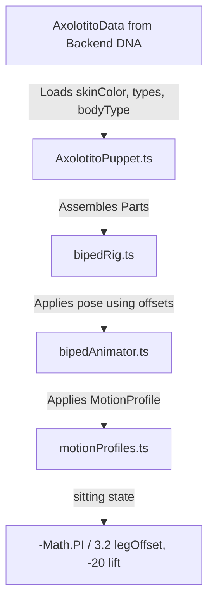

# Axolotito Puppet Design Adaptations (Tianguis Scenario 2.5D)

We have successfully reviewed the conceptual design from [Gemini_Generated_Image_ (1).png](file:///C:/Users/imzet/Downloads/Gemini_Generated_Image_%20(1).png) and adapted the [AxolotitoPuppet](file:///D:/Axolotto_2026/axolotto/frontend/components/world/puppet/AxolotitoPuppet.ts) skeleton, animations, DNA-based custom parts, and scene integrations to match.

---

## Summary of Adaptations

### 1. Longer Limbs & Scaled Proportion Constants
To match the proportions in the conceptual art, we updated the skeletal hierarchy in [bipedRig.ts](file:///D:/Axolotto_2026/axolotto/frontend/components/world/puppet/bipedRig.ts). The limbs are longer, and the torso's anchoring points are scaled up proportionally so that feet continue to rest exactly at ground level (`y = 0`) when standing:
- **`LEG_LENGTH`**: Increased from `36` to `48` px.
- **`ARM_LENGTH`**: Increased from `26` to `36` px.
- **`RIG_CENTER_Y`** (Torso Center/Pivot): Shifted up from `-72` to `-84` px.
- **`HIP_Y`**: Shifted from `-36` to `-48` px.
- **`SHOULDER_Y`**: Shifted from `-94` to `-106` px.
- **`tail` position**: Re-anchored from `-48` to `-60` px to remain aligned with the new hips.

---

### 2. Sitting State & Procedural Limb Offsets
We implemented a sitting pose that allows axolotitos to sit on stools, logs, or seats:
- Added `"sitting"` to [PuppetState](file:///D:/Axolotto_2026/axolotto/frontend/components/world/puppet/motionProfiles.ts#L7) in [motionProfiles.ts](file:///D:/Axolotto_2026/axolotto/frontend/components/world/puppet/motionProfiles.ts) and [AxolotitoData](file:///D:/Axolotto_2026/axolotto/frontend/components/world/entities/AxolotitoSprite.ts#L8) in [AxolotitoSprite.ts](file:///D:/Axolotto_2026/axolotto/frontend/components/world/entities/AxolotitoSprite.ts).
- Added `legOffset` and `armOffset` to [MotionProfile](file:///D:/Axolotto_2026/axolotto/frontend/components/world/puppet/motionProfiles.ts#L9). These properties default to `0` for active/sleeping profiles, but are configured for `"sitting"` to bend the limbs:
  - **`legOffset`**: `-Math.PI / 3.2` (rotates the single-segment leg forward and slightly down, mimicking knee/thigh projection).
  - **`armOffset`**: `-Math.PI / 3.0` (rests arms forward-down, pointing toward a table or lap).
  - **`lift`**: Set to `-20` to drop the torso/hips lower than standing height.
- Updated the procedural animator in [bipedAnimator.ts](file:///D:/Axolotto_2026/axolotto/frontend/components/world/puppet/bipedAnimator.ts) to apply these offset angles:
  ```typescript
  const legOff = p.legOffset ?? 0;
  const armOff = p.armOffset ?? 0;
  rig.legFront.rotation = legOff + Math.sin(phase) * p.legSwing;
  rig.legBack.rotation = legOff + Math.sin(phase + Math.PI) * p.legSwing;
  rig.armFront.rotation = armOff + Math.sin(phase + Math.PI) * p.armSwing;
  rig.armBack.rotation = armOff + Math.sin(phase) * p.armSwing;
  ```
- Adjusted the swimming profile `lift` from `46` to `56` to ensure the longer limbs stay clear of the floor/riverbed during horizontal nado.

---

### 3. DNA mutations & Sprite Replacements (Modular Rig)
To allow easy replacement of any body part sprite based on DNA or rare mutations, we've extended the asset resolving system:
- **DNA compatibility**: Added `bodyType?: string` and `headType?: string` to [AxolotitoData](file:///D:/Axolotto_2026/axolotto/frontend/components/world/entities/AxolotitoSprite.ts#L8) to match the existing types (`gillType`, `eyeType`, etc.).
- **Part Resolution**: Updated [drawBody](file:///D:/Axolotto_2026/axolotto/frontend/components/world/puppet/paperParts.ts#L49) and [drawHead](file:///D:/Axolotto_2026/axolotto/frontend/components/world/puppet/paperParts.ts#L58) in [paperParts.ts](file:///D:/Axolotto_2026/axolotto/frontend/components/world/puppet/paperParts.ts) to accept variant parameters and query the atlas cache using naming conventions:
  - `"body"` or `"body_${bodyType}"`
  - `"head"` or `"head_${headType}"`
- **Asset Fallback**:
  - The rig uses [getTextureOrFallback](file:///D:/Axolotto_2026/axolotto/frontend/components/world/puppet/paperParts.ts#L31). If the asset is registered/cached in Pixi's `Assets` (e.g. from an atlas file), it resolves to a `Sprite` automatically.
  - If a texture is missing from the cache, it falls back to the procedural SVG/Graphics outline drawings (e.g. `.ellipse()` or `.circle()`), ensuring the UI never breaks.

---

### 4. Tianguis Social Table Integration
To showcase the new sitting pose and match the diorama feel of the concept art, we added an interactive card-playing/social area to [TianguisScene.ts](file:///D:/Axolotto_2026/axolotto/frontend/components/world/zones/tianguis/TianguisScene.ts):
- Added `spawnSittingNpcs()` to construct a wooden lottery table (`tableX = PX + PW - 260`) and two wooden stools on the muelle boardwalk.
- Spawned two static NPCs configured in the `"sitting"` state facing each other across the table.
- Handled stationary NPCs by safely bypassing walking/dust loops if `wander` is undefined.


